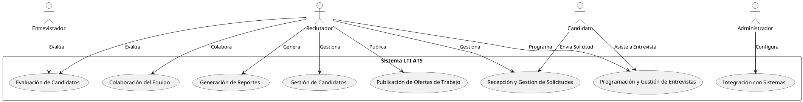
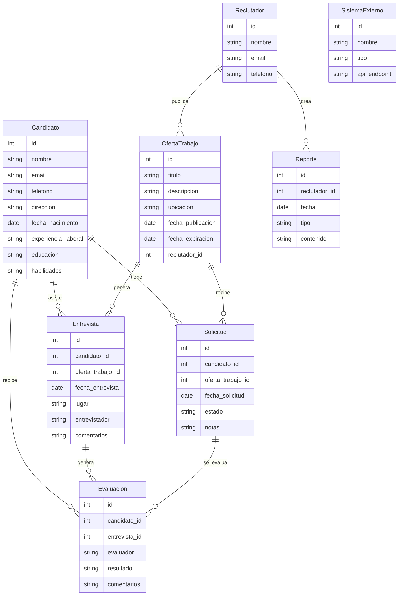
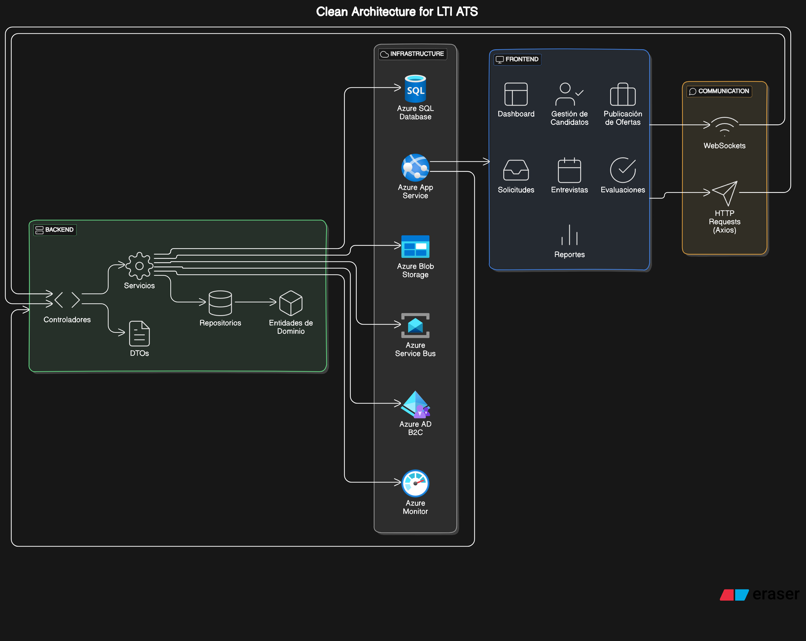

# Documento de Producto: LTI ATS

## Descripción Breve del Software LTI

LTI ATS es un sistema de seguimiento de candidatos (Applicant-Tracking System) de última generación diseñado para optimizar y modernizar los procesos de reclutamiento. Con un enfoque en la automatización inteligente, la analítica avanzada y una experiencia de usuario intuitiva, LTI ATS facilita a los reclutadores la gestión completa del ciclo de vida del candidato, desde la solicitud hasta la contratación.

## Valor Añadido y Ventajas Competitivas

### Valor Añadido

- **Automatización Inteligente:** Reducción de tareas repetitivas y administración manual mediante el uso de algoritmos avanzados y aprendizaje automático.
- **Analítica Avanzada:** Herramientas de análisis que proporcionan insights profundos sobre el proceso de reclutamiento, ayudando a tomar decisiones informadas.
- **Experiencia de Usuario Intuitiva:** Interfaz amigable y fácil de usar que mejora la productividad de los reclutadores y la satisfacción de los candidatos.
- **Integración Sencilla:** Conexión fluida con otras herramientas y plataformas de recursos humanos para una gestión centralizada.

### Ventajas Competitivas

- **Tecnología de IA Avanzada:** Uso de inteligencia artificial para mejorar la precisión en la selección de candidatos y optimizar los procesos de reclutamiento.
- **Customización y Flexibilidad:** Adaptación del software a las necesidades específicas de cada empresa, permitiendo configuraciones personalizadas.
- **Seguridad y Cumplimiento:** Enfoque robusto en la protección de datos y cumplimiento con normativas internacionales de privacidad y seguridad.
- **Soporte y Asesoría Especializada:** Equipo de soporte altamente capacitado y asesoría continua para maximizar el uso del sistema.

## Funciones Principales

1. **Gestión de Candidatos:**
   - Almacenamiento centralizado de perfiles de candidatos.
   - Búsqueda y filtrado avanzado de candidatos.
   - Seguimiento de las etapas del proceso de reclutamiento.

2. **Publicación de Ofertas:**
   - Publicación automática de ofertas de empleo en múltiples portales y redes sociales.
   - Plantillas personalizables para anuncios de empleo.

3. **Evaluación de Candidatos:**
   - Herramientas de evaluación en línea.
   - Programación y seguimiento de entrevistas.
   - Integración de pruebas psicométricas y técnicas.

4. **Colaboración del Equipo:**
   - Paneles de control para seguimiento del desempeño del equipo de reclutamiento.
   - Comunicación interna y asignación de tareas.

5. **Reportes y Analítica:**
   - Generación de informes detallados sobre el proceso de reclutamiento.
   - Analítica en tiempo real para medir KPIs y optimizar procesos.

6. **Integraciones:**
   - Integración con sistemas de gestión de recursos humanos (HRIS).
   - Conexión con plataformas de entrevistas en línea y software de pruebas.

## Lean Canvas

| **Aspecto**              | **Descripción**                                                        |
|--------------------------|------------------------------------------------------------------------|
| **Problema**             | - Procesos de reclutamiento ineficientes y manuales. <br> - Falta de insights basados en datos. <br> - Experiencia de usuario deficiente para candidatos y reclutadores. |
| **Segmentos de Clientes**| - Empresas de tamaño mediano a grande. <br> - Agencias de reclutamiento. <br> - Startups en crecimiento. |
| **Propuesta de Valor**   | - Automatización y optimización del proceso de reclutamiento. <br> - Análisis avanzado para decisiones informadas. <br> - Interfaz intuitiva y experiencia de usuario mejorada. |
| **Solución**             | - Plataforma basada en IA para automatizar tareas repetitivas. <br> - Herramientas de analítica avanzada. <br> - Integración con sistemas existentes y experiencia de usuario mejorada. |
| **Canales**              | - Venta directa a través del equipo comercial. <br> - Alianzas estratégicas con consultoras de recursos humanos. <br> - Marketing digital y presencia en ferias y eventos del sector. |
| **Ingresos**             | - Suscripciones mensuales/anuales. <br> - Tarifas por usuario/empresa. <br> - Servicios adicionales de soporte y consultoría. |
| **Estructura de Costos** | - Desarrollo y mantenimiento del software. <br> - Costos de infraestructura y servidores. <br> - Marketing y ventas. <br> - Soporte y servicio al cliente. |
| **Métricas Clave**       | - Tasa de conversión de candidatos a contrataciones. <br> - Tiempo medio de contratación. <br> - Satisfacción del usuario. |
| **Ventaja Competitiva**  | - Tecnología avanzada de IA y analítica. <br> - Alta personalización y flexibilidad. <br> - Soporte y asesoría especializada. |

---

# Casos de Uso del Sistema LTI ATS

Para lograr una funcionalidad básica del sistema LTI ATS, es crucial implementar varios casos de uso clave que aborden los aspectos fundamentales del proceso de reclutamiento. A continuación, se enumeran y describen brevemente los casos de uso más importantes:

## 1. Gestión de Candidatos

### Descripción
Permite a los reclutadores almacenar, buscar, y gestionar la información de los candidatos de manera eficiente.

### Funcionalidades Clave
- **Creación y Edición de Perfiles de Candidatos:** Permite agregar nuevos candidatos y actualizar información existente.
- **Búsqueda y Filtrado:** Herramientas avanzadas para buscar candidatos por varios criterios como habilidades, experiencia y ubicación.
- **Seguimiento del Progreso:** Registro de la evolución del candidato a través de las distintas etapas del proceso de reclutamiento.

## 2. Publicación de Ofertas de Trabajo

### Descripción
Facilita la creación y distribución de ofertas de empleo en múltiples plataformas.

### Funcionalidades Clave
- **Creación de Anuncios de Trabajo:** Formularios intuitivos para crear ofertas de empleo detalladas.
- **Distribución Automática:** Publicación automática de ofertas en portales de empleo, redes sociales y la propia web de la empresa.
- **Gestión de Publicaciones:** Seguimiento y gestión de las publicaciones realizadas en diversas plataformas.

## 3. Recepción y Gestión de Solicitudes

### Descripción
Manejo eficiente de las solicitudes de empleo recibidas, permitiendo una fácil organización y seguimiento.

### Funcionalidades Clave
- **Recepción Automática de Solicitudes:** Captura automática de solicitudes de múltiples fuentes.
- **Organización y Priorización:** Clasificación y priorización de solicitudes según criterios predefinidos.
- **Notificaciones:** Alertas y notificaciones automáticas a los reclutadores sobre nuevas solicitudes.

## 4. Programación y Gestión de Entrevistas

### Descripción
Facilita la planificación, coordinación y seguimiento de las entrevistas con los candidatos.

### Funcionalidades Clave
- **Calendario Integrado:** Integración con calendarios para agendar entrevistas fácilmente.
- **Invitaciones y Confirmaciones:** Envío automático de invitaciones y confirmaciones a candidatos y entrevistadores.
- **Seguimiento y Recordatorios:** Recordatorios automáticos para próximas entrevistas y seguimiento post-entrevista.

## 5. Evaluación de Candidatos

### Descripción
Proporciona herramientas para evaluar a los candidatos de manera justa y uniforme.

### Funcionalidades Clave
- **Pruebas en Línea:** Implementación de pruebas técnicas y psicométricas.
- **Evaluaciones Estructuradas:** Formularios de evaluación estandarizados para entrevistas.
- **Comentarios y Notas:** Registro de comentarios y notas de los entrevistadores en un lugar centralizado.

## 6. Colaboración del Equipo de Reclutamiento

### Descripción
Permite la colaboración efectiva entre los miembros del equipo de reclutamiento.

### Funcionalidades Clave
- **Panel de Control del Equipo:** Vista centralizada del estado de las contrataciones y tareas asignadas.
- **Asignación de Tareas:** Capacidad para asignar candidatos y tareas específicas a miembros del equipo.
- **Comentarios y Comunicación Interna:** Herramientas para la comunicación interna y comentarios sobre candidatos y procesos.

## 7. Generación de Reportes y Analítica

### Descripción
Proporciona informes y análisis detallados sobre el proceso de reclutamiento.

### Funcionalidades Clave
- **Reportes Personalizables:** Creación de informes personalizados sobre diversos aspectos del reclutamiento.
- **Analítica en Tiempo Real:** Herramientas de analítica que proporcionan insights en tiempo real.
- **KPIs de Reclutamiento:** Seguimiento de indicadores clave de rendimiento como tiempo de contratación, tasa de conversión y fuentes de candidatos.

## 8. Integración con Sistemas Externos

### Descripción
Permite la integración con otros sistemas y herramientas de recursos humanos.

### Funcionalidades Clave
- **API y Webhooks:** Interfaces para la integración con sistemas de gestión de recursos humanos (HRIS), plataformas de entrevistas en línea y otros servicios.
- **Sincronización de Datos:** Sincronización automática de datos entre sistemas para mantener la coherencia y la integridad de la información.
- **Autenticación y Seguridad:** Implementación de estándares de seguridad y autenticación para proteger los datos compartidos.

Implementar estos casos de uso proporcionará una base sólida para el funcionamiento del sistema LTI ATS, garantizando que las funciones esenciales de gestión de candidatos, publicación de ofertas, evaluación, colaboración, y análisis estén bien cubiertas.



### Descripción de los Casos de Uso

1. **Gestión de Candidatos (GC):**
   - **Actor Principal:** Reclutador
   - **Descripción:** Permite a los reclutadores almacenar, buscar y gestionar la información de los candidatos de manera eficiente.

2. **Publicación de Ofertas de Trabajo (POT):**
   - **Actor Principal:** Reclutador
   - **Descripción:** Facilita la creación y distribución de ofertas de empleo en múltiples plataformas.

3. **Recepción y Gestión de Solicitudes (RGS):**
   - **Actores Principales:** Reclutador, Candidato
   - **Descripción:** Manejo eficiente de las solicitudes de empleo recibidas, permitiendo una fácil organización y seguimiento.

4. **Programación y Gestión de Entrevistas (PGE):**
   - **Actores Principales:** Reclutador, Candidato
   - **Descripción:** Facilita la planificación, coordinación y seguimiento de las entrevistas con los candidatos.

5. **Evaluación de Candidatos (EC):**
   - **Actores Principales:** Reclutador, Entrevistador
   - **Descripción:** Proporciona herramientas para evaluar a los candidatos de manera justa y uniforme.

6. **Colaboración del Equipo (CE):**
   - **Actor Principal:** Reclutador
   - **Descripción:** Permite la colaboración efectiva entre los miembros del equipo de reclutamiento.

7. **Generación de Reportes (GR):**
   - **Actor Principal:** Reclutador
   - **Descripción:** Proporciona informes y análisis detallados sobre el proceso de reclutamiento.

8. **Integración con Sistemas (IS):**
   - **Actor Principal:** Administrador
   - **Descripción:** Permite la integración con otros sistemas y herramientas de recursos humanos.

Este diagrama UML y las descripciones asociadas proporcionan una visión clara de los principales casos de uso del sistema LTI ATS, destacando los actores involucrados y sus interacciones con el sistema.

# Modelo de datos del Sistema LTI ATS



### Descripción de Entidades y Relaciones

1. **Candidato:**
   - **Campos:** `id`, `nombre`, `email`, `telefono`, `direccion`, `fecha_nacimiento`, `experiencia_laboral`, `educacion`, `habilidades`
   - **Relaciones:**
     - Tiene muchas **Solicitudes**.
     - Asiste a muchas **Entrevistas**.
     - Recibe muchas **Evaluaciones**.

2. **OfertaTrabajo:**
   - **Campos:** `id`, `titulo`, `descripcion`, `ubicacion`, `fecha_publicacion`, `fecha_expiracion`, `reclutador_id`
   - **Relaciones:**
     - Recibe muchas **Solicitudes**.
     - Genera muchas **Entrevistas**.
     - Publicada por un **Reclutador**.

3. **Solicitud:**
   - **Campos:** `id`, `candidato_id`, `oferta_trabajo_id`, `fecha_solicitud`, `estado`, `notas`
   - **Relaciones:**
     - Pertenece a un **Candidato**.
     - Pertenece a una **OfertaTrabajo**.
     - Se evalúa en muchas **Evaluaciones**.

4. **Entrevista:**
   - **Campos:** `id`, `candidato_id`, `oferta_trabajo_id`, `fecha_entrevista`, `lugar`, `entrevistador`, `comentarios`
   - **Relaciones:**
     - Pertenece a un **Candidato**.
     - Pertenece a una **OfertaTrabajo**.
     - Genera muchas **Evaluaciones**.

5. **Reclutador:**
   - **Campos:** `id`, `nombre`, `email`, `telefono`
   - **Relaciones:**
     - Publica muchas **OfertaTrabajo**.
     - Crea muchos **Reportes**.

6. **Evaluacion:**
   - **Campos:** `id`, `candidato_id`, `entrevista_id`, `evaluador`, `resultado`, `comentarios`
   - **Relaciones:**
     - Pertenece a un **Candidato**.
     - Pertenece a una **Entrevista**.
     - Generada por una **Solicitud**.

7. **Reporte:**
   - **Campos:** `id`, `reclutador_id`, `fecha`, `tipo`, `contenido`
   - **Relaciones:**
     - Creado por un **Reclutador**.

8. **SistemaExterno:**
   - **Campos:** `id`, `nombre`, `tipo`, `api_endpoint`
   - **Relaciones:** No tiene relaciones directas en este diagrama básico, pero puede estar integrado para intercambiar datos con otros sistemas.

Este diagrama ER y las descripciones asociadas proporcionan una visión clara de las entidades clave y sus relaciones dentro del sistema LTI ATS.

# Documento de Diseño de Alto Nivel: Sistema LTI ATS

## Introducción

El sistema LTI ATS (Applicant-Tracking System) es una solución integral para gestionar el ciclo de vida del reclutamiento, desde la publicación de ofertas hasta la contratación. Este documento de diseño de alto nivel describe los componentes necesarios tanto para el frontend como para el backend, cómo se comunicarán entre ellos y la implementación en Microsoft Azure siguiendo las prácticas de Clean Architecture.

## Arquitectura General

### Clean Architecture

La arquitectura del sistema LTI ATS seguirá el principio de Clean Architecture, asegurando la separación de responsabilidades, mantenibilidad y escalabilidad del sistema. La arquitectura se dividirá en las siguientes capas:

1. **Presentación (Frontend)**
2. **Aplicación**
3. **Dominio**
4. **Infraestructura (Backend)**

## Componentes del Frontend

### Tecnologías
- **Framework:** React
- **Estado de la Aplicación:** Redux
- **Routing:** React Router
- **Estilos:** CSS/Sass, Material-UI

### Componentes Principales
1. **Dashboard:** 
   - Panel principal que muestra la vista general de las actividades de reclutamiento.
2. **Gestión de Candidatos:**
   - Interfaz para la creación, edición y visualización de perfiles de candidatos.
3. **Publicación de Ofertas:**
   - Formulario y vista para publicar y gestionar ofertas de trabajo.
4. **Solicitudes:**
   - Vista para recibir y gestionar solicitudes de empleo.
5. **Entrevistas:**
   - Interfaz para programar y gestionar entrevistas.
6. **Evaluaciones:**
   - Herramientas para evaluar candidatos y registrar comentarios.
7. **Reportes:**
   - Generación y visualización de reportes de reclutamiento.

### Comunicación con Backend
- **HTTP Requests:** Axios para realizar solicitudes HTTP a la API del backend.
- **WebSockets:** Para actualizaciones en tiempo real (e.g., nuevas solicitudes).

## Componentes del Backend

### Tecnologías
- **Lenguaje:** C# 
- **Framework:** ASP.NET Core
- **API:** RESTful API
- **Base de Datos:** Azure SQL Database
- **Autenticación y Autorización:** Azure AD B2C
- **Mensajería:** Azure Service Bus
- **Almacenamiento de Archivos:** Azure Blob Storage

### Componentes Principales
1. **Controladores (Controllers):**
   - Gestionan las solicitudes HTTP y coordinan la lógica de la aplicación.
2. **Servicios (Services):**
   - Contienen la lógica de negocio.
3. **Repositorios (Repositories):**
   - Encapsulan la lógica de acceso a la base de datos.
4. **Entidades de Dominio (Domain Entities):**
   - Representan las entidades clave del negocio (e.g., Candidato, OfertaTrabajo).
5. **DTOs (Data Transfer Objects):**
   - Objetos utilizados para transferir datos entre el frontend y el backend.

### Comunicación con Frontend
- **REST API:** Proporciona endpoints para que el frontend interactúe con el sistema.
- **WebSockets:** Implementación para actualizaciones en tiempo real.

## Implementación en Microsoft Azure

### Servicios Azure Utilizados
1. **Azure App Service:**
   - Para alojar el frontend (React) y el backend (ASP.NET Core).
2. **Azure SQL Database:**
   - Base de datos relacional para almacenar datos del sistema.
3. **Azure Blob Storage:**
   - Almacenamiento de archivos como currículos y documentos.
4. **Azure Service Bus:**
   - Mensajería para comunicación asíncrona y desacoplamiento de componentes.
5. **Azure AD B2C:**
   - Servicio de autenticación y autorización para usuarios.
6. **Azure Monitor:**
   - Supervisión y análisis de la aplicación para garantizar su rendimiento y disponibilidad.

### Diagrama de Arquitectura



### Descripción del Flujo de Datos

1. **Interacción Usuario-Frontend:**
   - Los usuarios interactúan con la aplicación React (F1), que envía solicitudes HTTP a la API del backend (B1) o se comunica mediante WebSockets para actualizaciones en tiempo real.
2. **Procesamiento en Backend:**
   - La API del backend (B1) recibe las solicitudes y las pasa a la capa de servicios (S1).
   - La capa de servicios ejecuta la lógica de negocio, accediendo a los datos mediante la capa de repositorios (R1).
   - Los datos se almacenan y recuperan desde Azure SQL Database (D1) y Azure Blob Storage (F2).
   - Azure Service Bus (Q1) maneja la mensajería asíncrona entre servicios.
3. **Autenticación y Autorización:**
   - Azure AD B2C (A1) gestiona la autenticación y autorización de los usuarios.

### Consideraciones de Seguridad

- **Autenticación y Autorización:** Implementación de OAuth 2.0 y OpenID Connect con Azure AD B2C.
- **Encriptación:** Todos los datos sensibles en tránsito y en reposo deben estar encriptados.
- **Firewalls y Redes Virtuales:** Configuración de Azure App Service Environment (ASE) para mayor seguridad.

### Monitoreo y Escalabilidad

- **Azure Monitor:** Supervisión de la aplicación para detectar y solucionar problemas de rendimiento.
- **Autoscaling:** Configuración de reglas de escalabilidad automática para manejar variaciones en la carga de trabajo.

Este documento proporciona una visión clara y detallada de la arquitectura de alto nivel del sistema LTI ATS, asegurando una implementación eficiente y escalable en Microsoft Azure siguiendo las prácticas de Clean Architecture.

# Diagrama C4

```plantuml
@startuml
!include https://raw.githubusercontent.com/plantuml-stdlib/C4-PlantUML/master/C4_Context.puml
!include https://raw.githubusercontent.com/plantuml-stdlib/C4-PlantUML/master/C4_Container.puml
!include https://raw.githubusercontent.com/plantuml-stdlib/C4-PlantUML/master/C4_Component.puml

title C4 Diagram - Component Level for LTI ATS API

Person(admin, "Administrador", "Configura y mantiene el sistema LTI ATS")
Person(recruiter, "Reclutador", "Publica ofertas y gestiona el proceso de reclutamiento")
Person(candidate, "Candidato", "Aplica a las ofertas de trabajo y participa en el proceso de selección")
Person(interviewer, "Entrevistador", "Realiza entrevistas y evalúa candidatos")

System_Boundary(ltiATS, "Sistema LTI ATS") {
    System(frontend, "Frontend", "Interfaz de usuario para reclutadores y candidatos")
    
    Container_Boundary(backend, "Backend") {
        Container_Boundary(api, "API", "ASP.NET Core", "Proporciona servicios y lógica de negocio a través de endpoints REST") {
            Component(authController, "AuthController", "C#", "Gestiona autenticación y autorización")
            Component(candidateController, "CandidateController", "C#", "Gestiona operaciones de candidatos")
            Component(jobController, "JobController", "C#", "Gestiona operaciones de ofertas de trabajo")
            Component(applicationController, "ApplicationController", "C#", "Gestiona operaciones de solicitudes de empleo")
            Component(interviewController, "InterviewController", "C#", "Gestiona operaciones de entrevistas")
            Component(evaluationController, "EvaluationController", "C#", "Gestiona operaciones de evaluaciones")
            Component(reportController, "ReportController", "C#", "Gestiona generación de reportes")
            
            Component(authService, "AuthService", "C#", "Lógica de negocio para autenticación y autorización")
            Component(candidateService, "CandidateService", "C#", "Lógica de negocio para gestión de candidatos")
            Component(jobService, "JobService", "C#", "Lógica de negocio para gestión de ofertas de trabajo")
            Component(applicationService, "ApplicationService", "C#", "Lógica de negocio para gestión de solicitudes")
            Component(interviewService, "InterviewService", "C#", "Lógica de negocio para gestión de entrevistas")
            Component(evaluationService, "EvaluationService", "C#", "Lógica de negocio para gestión de evaluaciones")
            Component(reportService, "ReportService", "C#", "Lógica de negocio para generación de reportes")
        }
        
        Container(serviceLayer, "Service Layer", "C#", "Contiene la lógica de negocio")
        Container(repository, "Repository Layer", "C#", "Encapsula el acceso a la base de datos")
        Container(backgroundServices, "Background Services", "C#", "Procesos en segundo plano para tareas asíncronas")
    }
    
    System_Ext(azureAD, "Azure AD B2C", "Servicio de autenticación y autorización")
    System_Ext(serviceBus, "Azure Service Bus", "Sistema de mensajería para comunicación asíncrona")
    System_Ext(sqlDatabase, "Azure SQL Database", "Base de datos relacional para almacenamiento de datos")
    System_Ext(blobStorage, "Azure Blob Storage", "Almacenamiento de archivos y documentos")
}

Rel(admin, backend, "Configura y mantiene")
Rel(recruiter, frontend, "Gestiona ofertas y candidatos")
Rel(candidate, frontend, "Aplica a ofertas y sigue su proceso")
Rel(interviewer, frontend, "Realiza evaluaciones")
Rel(frontend, api, "Solicitudes y datos")
Rel(api, serviceLayer, "Delegates calls to")
Rel(serviceLayer, repository, "Uses")
Rel(serviceLayer, backgroundServices, "Uses for async tasks")
Rel(repository, sqlDatabase, "Almacena y recupera datos")
Rel(backgroundServices, serviceBus, "Procesa mensajes")
Rel(api, azureAD, "Autenticación y autorización")
Rel(serviceLayer, blobStorage, "Almacena documentos")

Rel(authController, authService, "Uses")
Rel(candidateController, candidateService, "Uses")
Rel(jobController, jobService, "Uses")
Rel(applicationController, applicationService, "Uses")
Rel(interviewController, interviewService, "Uses")
Rel(evaluationController, evaluationService, "Uses")
Rel(reportController, reportService, "Uses")

@enduml
```

### Descripción de los Componentes de la API

1. **AuthController:**
   - **Descripción:** Gestiona las operaciones de autenticación y autorización de los usuarios.
   - **Relaciones:** 
     - Usa `AuthService` para la lógica de negocio relacionada con la autenticación.

2. **CandidateController:**
   - **Descripción:** Gestiona las operaciones relacionadas con los candidatos.
   - **Relaciones:** 
     - Usa `CandidateService` para la lógica de negocio relacionada con la gestión de candidatos.

3. **JobController:**
   - **Descripción:** Gestiona las operaciones relacionadas con las ofertas de trabajo.
   - **Relaciones:** 
     - Usa `JobService` para la lógica de negocio relacionada con la gestión de ofertas de trabajo.

4. **ApplicationController:**
   - **Descripción:** Gestiona las operaciones relacionadas con las solicitudes de empleo.
   - **Relaciones:** 
     - Usa `ApplicationService` para la lógica de negocio relacionada con la gestión de solicitudes de empleo.

5. **InterviewController:**
   - **Descripción:** Gestiona las operaciones relacionadas con las entrevistas.
   - **Relaciones:** 
     - Usa `InterviewService` para la lógica de negocio relacionada con la gestión de entrevistas.

6. **EvaluationController:**
   - **Descripción:** Gestiona las operaciones relacionadas con las evaluaciones.
   - **Relaciones:** 
     - Usa `EvaluationService` para la lógica de negocio relacionada con la gestión de evaluaciones.

7. **ReportController:**
   - **Descripción:** Gestiona la generación de reportes de reclutamiento.
   - **Relaciones:** 
     - Usa `ReportService` para la lógica de negocio relacionada con la generación de reportes.

Este diagrama proporciona una visión detallada de los componentes dentro de la API del sistema LTI ATS, mostrando cómo cada controlador se comunica con su respectivo servicio para manejar la lógica de negocio.