# LTI-JACA

## Description

LTI-ATS-JACA is a cutting-edge Applicant Tracking System designed to streamline and optimize the recruitment process for organizations of all sizes. This comprehensive solution combines intuitive user interface with powerful automation features to help HR professionals and hiring managers efficiently manage their talent acquisition pipeline. LTI-ATS-JACA aims to reduce time-to-hire, improve candidate experience, and provide valuable insights to make data-driven hiring decisions.
Basic functionalities of an ATS, listed and described in order of priority:

1. Job Posting and Distribution:
   - Create and publish job listings across multiple platforms.
   - Integrate with job boards and career sites.
   - Manage internal job postings.

2. Resume Parsing and Candidate Profile :Creation
   - Automatically extract information from resumes.
   - Create standardized candidate profiles.
   - Enable keyword search and filtering.

3. Applicant Tracking and Workflow Management:
   - Track candidate progress through hiring stages.
   - Customize hiring workflows for different positions.
   - Automate status updates and notifications.

4. Communication Tools:
   - Send automated emails to candidates.
   - Schedule interviews and send reminders.
   - Facilitate internal communication between hiring team members.

5. Interview Management:
   - Schedule and track interviews.
   - Provide interview guides and scorecards.
   - Collect and organize feedback from interviewers.

6. Candidate Evaluation and Scoring:
   - Create customizable evaluation criteria.
   - Enable collaborative scoring and ranking.
   - Generate comparison reports for decision-making.

7. Reporting and Analytics:
   - Track key recruitment metrics (e.g., time-to-hire, source of hire).
   - Generate customizable reports.
   - Provide data-driven insights for process improvement.

8. Compliance and Equal Employment :Opportunity (EEO) Tracking
   - Ensure compliance with labor laws and regulations.
   - Track and report on diversity metrics.
   - Manage required documentation for audits.

9. Integration Capabilities:
   - Connect with HRIS, payroll, and onboarding systems.
   - Integrate with background check services.
   - Enable single sign-on (SSO) for seamless user experience.

10. Mobile Accessibility:
    - Provide mobile-friendly interface for candidates and hiring managers.
    - Enable on-the-go application reviews and approvals.
    - Facilitate mobile communication and notifications.

## Added Value
1. Improved Efficiency
   - Streamlined recruitment process
   - Reduced time-to-hire
   - Automation of repetitive tasks

2. Cost Reduction
   - Lower recruitment advertising costs
   - Decreased reliance on external recruiters
   - Optimized use of HR resources

3. Enhanced Candidate Experience
   - User-friendly application process
   - Timely communication and updates
   - Mobile accessibility for on-the-go applications

4. Better Quality of Hires
   - Standardized evaluation criteria
   - Data-driven decision making
   - Improved candidate matching through AI-powered screening

5. Increased Collaboration
   - Centralized communication for hiring teams
   - Easy sharing of candidate information and feedback
   - Improved alignment between HR and hiring managers

6. Compliance and Risk Mitigation
   - Ensure adherence to labor laws and regulations
   - Standardized processes to reduce bias
   - Proper documentation for potential audits

7. Data-Driven Insights
   - Comprehensive recruitment analytics
   - Identification of best-performing sourcing channels
   - Metrics to continuously improve hiring processes

8. Scalability
   - Ability to handle high-volume recruiting
   - Adaptable to company growth and changing needs
   - Support for multiple locations or departments

9. Improved Employer Branding
   - Professional and consistent candidate communication
   - Showcase company culture through customized career pages
   - Positive candidate experience leading to better company reviews

10. Time Savings
    - Faster resume screening and shortlisting
    - Automated interview scheduling
    - Quick generation of offer letters and contracts

11. Enhanced Talent Pool Management
    - Build and maintain a database of potential candidates
    - Easy retrieval of past applicants for new positions
    - Nurture relationships with passive candidates

12. Integration Capabilities
    - Seamless connection with existing HR systems
    - Unified data flow from recruitment to onboarding
    - Reduced manual data entry and potential errors

13. Customization and Flexibility
    - Tailored workflows for different positions or departments
    - Customizable evaluation forms and interview guides
    - Adaptable reporting to meet specific organizational needs

14. Improved Decision Making
    - Side-by-side candidate comparisons
    - Historical data to inform hiring strategies
    - Predictive analytics for future hiring needs

15. Global Recruiting Support
    - Multi-language capabilities
    - Compliance with international hiring regulations
    - Support for diverse hiring practices across regions

## Targets

1. Company Size:
   a) Small Businesses (1-50 employees)
   b) Mid-size Companies (51-500 employees)
   c) Large Enterprises (500+ employees)

2. Industry Sectors:
   a) Technology and IT
   b) Healthcare and Pharmaceuticals
   c) Financial Services and Banking
   d) Retail and E-commerce
   e) Manufacturing
   f) Education
   g) Professional Services (Consulting, Legal, etc.)
   h) Non-profit Organizations

3. Geographical Regions:
   a) North America
   b) Europe
   c) Asia-Pacific
   d) Latin America
   e) Middle East and Africa

4. Hiring Volume:
   a) Low-volume recruiters (1-10 hires per month)
   b) Medium-volume recruiters (11-50 hires per month)
   c) High-volume recruiters (50+ hires per month)

5. Organizational Structure:
   a) Centralized HR departments
   b) Decentralized hiring (department-led recruitment)
   c) Staffing and recruitment agencies

6. Technology Adoption Level:
   a) Early adopters (tech-savvy organizations)
   b) Mainstream users (average technology adoption)
   c) Late adopters (traditional or risk-averse organizations)

7. Specific Hiring Needs:
   a) High-skill technical positions
   b) Executive and leadership roles
   c) Entry-level and internship programs
   d) Seasonal or temporary workforce
   e) Remote and distributed teams

8. Budget Constraints:
   a) Cost-sensitive organizations
   b) Value-oriented buyers
   c) Premium feature seekers

9. Compliance Requirements:
   a) Highly regulated industries (e.g., government, healthcare)
   b) Companies with strict data privacy needs
   c) Organizations with specific diversity and inclusion goals

10. Current ATS Status:
    a) First-time ATS buyers
    b) Organizations looking to switch from existing ATS
    c) Companies seeking to upgrade or consolidate multiple systems

## Competitors

1. Workday Recruiting

   Strengths:
   - Comprehensive HR suite integration
   - Strong analytics and reporting capabilities
   - User-friendly interface

   Weaknesses:
   - Can be complex for smaller organizations
   - Higher price point
   - May have longer implementation times

2. Greenhouse

   Strengths:
   - Excellent user experience
   - Strong focus on promoting diversity in hiring
   - Extensive integration options

   Weaknesses:
   - Can be expensive for smaller companies
   - Some users report limitations in customization
   - May lack some advanced features for enterprise-level needs

3. Lever

   Strengths:
   - Modern, intuitive interface
   - Strong collaboration tools
   - Good candidate relationship management features

   Weaknesses:
   - Limited reporting capabilities compared to some competitors
   - May lack some features for very large enterprises
   - Pricing can be high for smaller organizations

4. Taleo (Oracle)

   Strengths:
   - Robust features for large enterprises
   - Strong compliance tools
   - Extensive customization options

   Weaknesses:
   - User interface often criticized as outdated
   - Can be complex to use and set up
   - May be overkill for smaller organizations

5. SmartRecruiters

   Strengths:
   - AI-powered candidate matching
   - Strong marketplace for third-party integrations
   - Good scalability for growing companies

   Weaknesses:
   - Some users report occasional performance issues
   - Advanced features may require higher-tier plans
   - Customer support responsiveness has been criticized

6. iCIMS

   Strengths:
   - Comprehensive recruitment marketing tools
   - Strong compliance features
   - Good for high-volume recruiting

   Weaknesses:
   - Interface can be less intuitive than some competitors
   - Implementation can be complex
   - Some users report issues with system speed

7. Jobvite

   Strengths:
   - Strong social recruiting features
   - Good candidate relationship management
   - User-friendly interface

   Weaknesses:
   - Reporting capabilities may be limited for some users
   - Some advanced features only available in higher-tier plans
   - Integration with some third-party tools can be challenging

## Competitive Advantages

1. Adaptive AI-Powered Matching:
   - Advanced AI that learns from each organization's hiring patterns.
   - Continuously improving candidate matching and ranking.

2. Seamless Scalability:
   - Easily adapts from small business to enterprise-level needs.
   - No need to switch systems as the company grows.

3. Intuitive Customization Engine:
   - User-friendly interface for creating custom workflows and forms.
   - No coding required for advanced customizations.

4. Rapid Implementation Program:
   - Streamlined setup process with intelligent data migration.
   - Get up and running in days, not months.

5. Unified Communication Hub:
   - Centralized platform for all recruitment communications.
   - Integrates email, messaging, and video interviews.

6. Compliance Assurance System:
   - Built-in compliance checks for various global regulations.
   - Automatic updates to stay current with changing laws.

7. Predictive Analytics Dashboard:
   - Forecast hiring needs based on historical data and market trends.
   - Provide actionable insights to improve recruitment strategies.

8. Candidate Experience Optimizer:
   - Personalized candidate portals with real-time status updates.
   - Automated feedback collection to continuously enhance the process.

9. Flexible Pricing Model:
   - Pay-per-use option for smaller organizations or seasonal hiring.
   - Customizable feature sets to avoid overpaying for unused tools.

10. Seamless Integration Ecosystem:
    - One-click integrations with popular HR tools and job boards.
    - Open API for easy custom integrations.

11. Mobile-First Design:
    - Fully functional mobile app for both recruiters and candidates.
    - Optimized for on-the-go hiring and applying.

12. Automated Bias Detection:
    - AI-powered tools to identify and mitigate unconscious bias in job descriptions and screening processes.
    - Promote diversity and inclusion throughout the hiring process.

13. Continuous Learning Platform:
    - Built-in tutorials and best practices updated in real-time.
    - Personalized system suggestions based on user behavior.

14. Global Talent Pool Network:
    - Shared, anonymized database of candidates across LTI-ATS-JACA users.
    - Respect privacy while expanding reach for hard-to-fill positions.

15. Proactive Customer Success Program:
    - Dedicated success managers for all account tiers.
    - Regular check-ins and personalized optimization recommendations.

## Lean Canvas Diagram

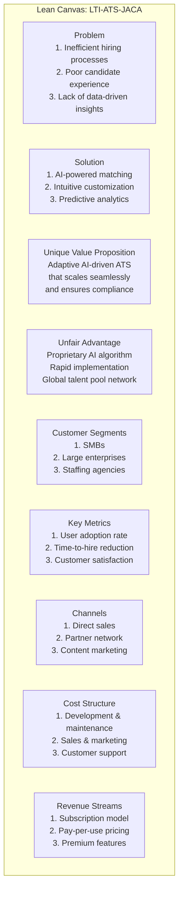

<div hidden>
```plantuml
@startuml leanCanvasDiagram
skinparam rectangle {
    RoundCorner 25
    BackgroundColor white
    BorderColor black
}
</div>


rectangle "Problem\n--\n• Inefficient hiring processes\n• Poor candidate experience\n• Lack of data-driven insights\n• Difficulty in scaling recruitment" as Problem

rectangle "Solution\n--\n• AI-powered matching\n• Intuitive customization\n• Unified communication hub\n• Predictive analytics" as Solution

rectangle "Unique Value Proposition\n--\n• Adaptive AI for smarter hiring\n• Seamless scalability\n• Rapid implementation\n• Compliance assurance" as UVP

rectangle "Unfair Advantage\n--\n• Proprietary AI algorithms\n• Global talent pool network\n• Continuous learning platform" as Advantage

rectangle "Customer Segments\n--\n• SMBs to Enterprises\n• High-growth tech companies\n• Staffing agencies\n• Global organizations" as Segments

rectangle "Key Metrics\n--\n• User adoption rate\n• Time-to-hire reduction\n• Customer satisfaction score\n• Revenue growth" as Metrics

rectangle "Channels\n--\n• Direct sales\n• Partner network\n• Content marketing\n• Industry events" as Channels

rectangle "Cost Structure\n--\n• Software development\n• AI research & maintenance\n• Sales & marketing\n• Customer support" as Costs

rectangle "Revenue Streams\n--\n• Subscription model\n• Pay-per-use option\n• Premium features\n• Implementation services" as Revenue

Problem -[hidden]right- Solution
Solution -[hidden]right- UVP
UVP -[hidden]right- Advantage

Segments -[hidden]down- Metrics
Metrics -[hidden]down- Channels

Costs -[hidden]up- Revenue

@enduml
```

## Functional Requirements

1. User Management
   - User registration and authentication
   - Role-based access control (e.g., admin, recruiter, hiring manager)
   - Password reset and account recovery

2. Job Requisition Management
   - Create, edit, and delete job requisitions
   - Approval workflow for job postings
   - Job template creation and management

3. Candidate Management
   - Candidate profile creation and editing
   - Resume parsing and data extraction
   - Candidate search and filtering
   - Candidate status tracking and updates

4. Application Process
   - Online job application form creation
   - Document upload (resumes, cover letters, portfolios)
   - Application status tracking for candidates

5. Screening and Assessment
   - Customizable screening questions
   - Skills assessment integration
   - AI-powered candidate ranking and matching

6. Interview Management
   - Interview scheduling and calendar integration
   - Video interview capability
   - Interview feedback collection and scoring

7. Communication
   - Email templates and bulk emailing
   - In-app messaging system
   - Automated notifications and reminders

8. Reporting and Analytics
   - Standard and custom report generation
   - Real-time dashboard with key metrics
   - Data export functionality

9. Integration Capabilities
   - API for third-party integrations
   - Job board posting integration
   - HRIS and payroll system integration

10. Compliance and EEO
    - EEO data collection and reporting
    - Compliance checklist for job postings
    - Audit trail for all system actions

11. Offer Management
    - Offer letter generation and tracking
    - E-signature integration for offer acceptance
    - Offer approval workflow

12. Career Site Management
    - Customizable career site builder
    - Job search and filtering for candidates
    - Mobile-responsive design

## Non-Functional Requirements

1. Performance
   - Page load time under 2 seconds for 95% of requests
   - Support for at least 10,000 concurrent users
   - Ability to handle 1 million job applications per month

2. Scalability
   - Horizontal scaling to accommodate growing user base
   - Ability to add new features without major system overhaul

3. Availability
   - 99.9% uptime guarantee
   - Scheduled maintenance windows with minimal disruption

4. Security
   - Data encryption at rest and in transit (minimum AES-256)
   - Regular security audits and penetration testing
   - Multi-factor authentication support

5. Compliance
   - GDPR, CCPA, and other relevant data protection regulations compliance
   - SOC 2 Type II certification
   - Regular compliance updates to meet changing regulations

6. Usability
   - Intuitive user interface requiring minimal training
   - Accessibility compliance (WCAG 2.1 level AA)
   - Support for multiple languages and locales

7. Reliability
   - Automated backups with point-in-time recovery
   - Fault-tolerant architecture with no single point of failure

8. Compatibility
   - Cross-browser support (Chrome, Firefox, Safari, Edge)
   - Mobile responsiveness for all major functions

9. Data Integrity
   - Data validation to ensure accuracy and consistency
   - Audit logs for all data changes

10. Maintainability
    - Modular architecture for easy updates and maintenance
    - Comprehensive system documentation
    - Automated testing with minimum 80% code coverage

11. Disaster Recovery
    - Recovery Time Objective (RTO) of 4 hours
    - Recovery Point Objective (RPO) of 1 hour

12. Performance Monitoring
    - Real-time system health monitoring
    - Automated alerts for performance issues

13. Interoperability
    - Support for standard data exchange formats (JSON, XML)
    - OAuth 2.0 support for secure API access

14. Customization
    - Ability to customize workflows without code changes
    - User-defined fields and forms

15. Data Retention and Archiving
    - Configurable data retention policies
    - Secure data archiving and retrieval system

## Main Use Cases

### Must Have (Critical features for launch)

1. User Management
   - Basic user registration and authentication
   - Role-based access control

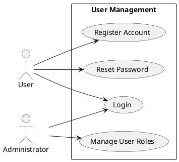

Users can register accounts, login, and reset passwords. Administrators have additional capabilities to manage user roles and also need to login to access these functions.

2. Job Requisition Management
   - Create, edit, and post job requisitions
   - Basic approval workflow

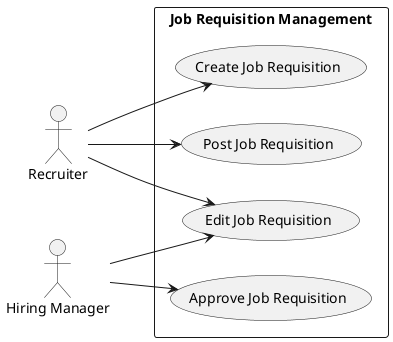

Recruiters can create, edit, and post job requisitions, while Hiring Managers can approve requisitions and also have the ability to edit them if necessary.

3. Candidate Management
   - Candidate profile creation
   - Resume parsing and data extraction
   - Basic candidate search and filtering

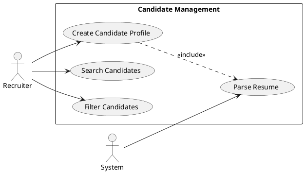

Recruiters can create candidate profiles, search, and filter candidates. The system automatically parses resumes when a candidate profile is created.

4. Application Process
   - Online job application form
   - Document upload (resumes, cover letters)

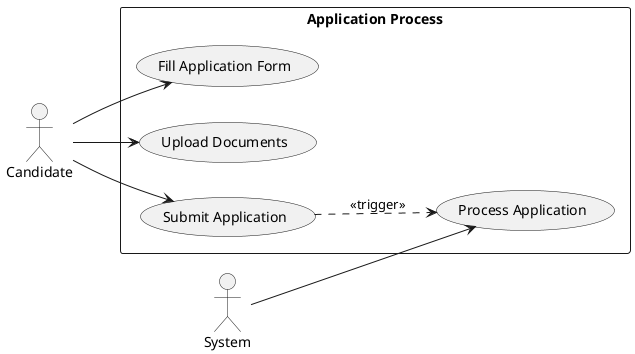

Candidates can fill out application forms, upload documents, and submit applications. Once submitted, the system processes the application automatically.

5. Screening and Assessment
   - Basic screening questions
   - AI-powered candidate ranking

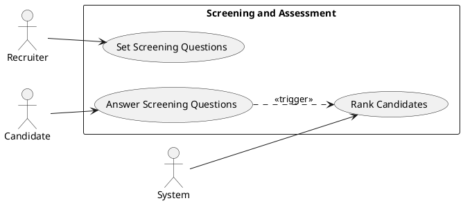

Recruiters set screening questions, candidates answer them, and the system automatically ranks candidates based on their responses.

6. Interview Management
   - Interview scheduling
   - Basic feedback collection

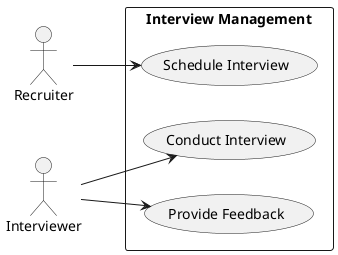

Recruiters schedule interviews, while interviewers conduct interviews and provide feedback.

7. Communication
   - Email templates and notifications
   - Automated status updates

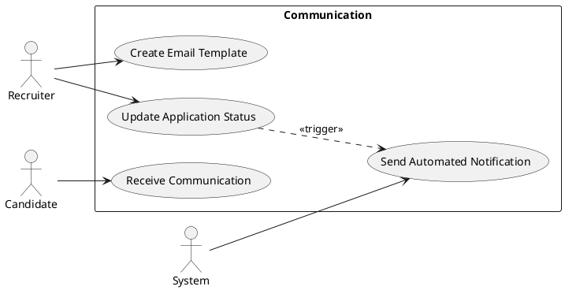

Recruiters can create email templates and update application statuses. The system sends automated notifications, which are received by candidates.

8. Reporting and Analytics
   - Standard reports on key metrics
   - Basic dashboard

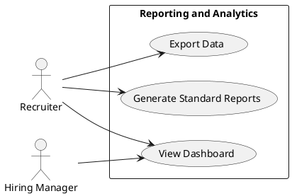

Both recruiters and hiring managers can view dashboards, while recruiters can also generate standard reports and export data.

9. Compliance and EEO
   - EEO data collection
   - Basic compliance checklist

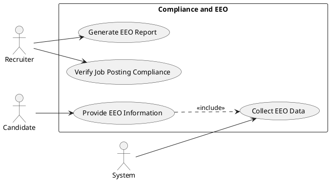

The system collects EEO data from candidates, recruiters can generate EEO reports and verify job posting compliance.

10. Security and Data Protection
    - Data encryption
    - Compliance with basic data protection regulations

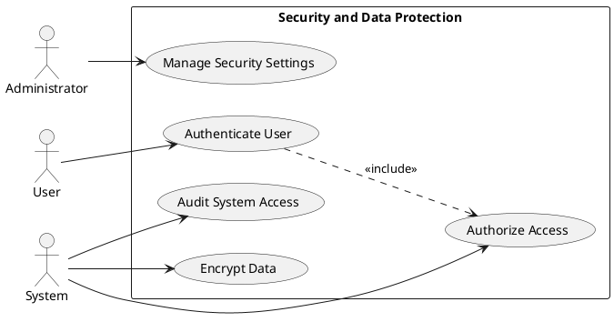

The system encrypts data, authenticates users, authorizes access, and audits system access. Administrators can manage security settings.

### Should Have (Important features for competitive advantage)

1. Integration Capabilities
   - API for third-party integrations
   - Job board posting integration

2. Career Site Management
   - Basic customizable career site

3. Offer Management
   - Offer letter generation and tracking

4. Advanced Screening and Assessment
   - Skills assessment integration
   - More advanced AI matching algorithms

5. Video Interview Capability

6. Mobile-Responsive Design

7. Customizable Workflows

8. Advanced Search and Filtering Options

9. Candidate Status Tracking and Updates

10. Bulk Actions for Candidate Management

### Could Have (Desirable features to enhance the product)

1. Advanced Reporting and Analytics
   - Custom report generation
   - Predictive analytics

2. Talent Pool Management

3. Employee Referral Management

4. Advanced Career Site Builder

5. Automated Reference Checking

6. Social Media Integration for Candidate Sourcing

7. Customizable Onboarding Checklist

8. Candidate Relationship Management (CRM) Features

9. Advanced Compliance Tools
   - Global compliance support
   - Audit trail for all actions

10. AI-Powered Chatbot for Candidate Queries

### Won't Have (for initial release, may consider for future versions)

1. Full HRIS Integration

2. Payroll System Integration

3. Advanced Succession Planning Tools

4. Employee Performance Management

5. Learning Management System (LMS) Integration

6. Advanced Employer Branding Tools

7. Recruitment Marketing Automation

8. Vendor Management System for Staffing Agencies

9. Internal Mobility and Career Pathing Tools

10. AI-Powered Interview Scheduling and Optimization

## Data Model

### Diagram

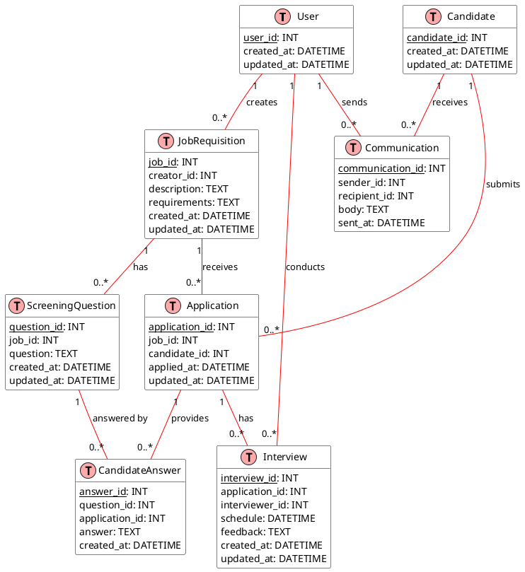

### Description

1. User: Represents system users (admins, recruiters, hiring managers).
2. JobRequisition: Stores job posting details.
3. Candidate: Contains candidate information.
4. Application: Represents a candidate's application for a specific job.
5. Interview: Stores interview details for applications.
6. ScreeningQuestion: Contains screening questions for job requisitions.
7. CandidateAnswer: Stores candidate responses to screening questions.
8. Communication: Represents emails and notifications sent within the system.

### Relationships

- Users create job requisitions and conduct interviews.
- Job requisitions receive multiple applications.
- Candidates submit multiple applications.
- Applications have multiple interviews and candidate answers.
- Job requisitions have multiple screening questions.
- Users send communications, and candidates receive them.

## Architecture

### Tech Stack

1. Frontend: React.js with TypeScript
2. Backend: Node.js with Express.js
3. Database: PostgreSQL
4. Caching: Redis
5. Search Engine: Elasticsearch
6. Message Queue: RabbitMQ
7. Container Orchestration: Kubernetes
8. CI/CD: GitLab CI/CD
9. Monitoring: Prometheus and Grafana
10. Logging: ELK Stack (Elasticsearch, Logstash, Kibana)
11. API Gateway: Kong
12. Authentication: OAuth 2.0 with JSON Web Tokens (JWT)
13. Cloud Provider: AWS

### Diagram

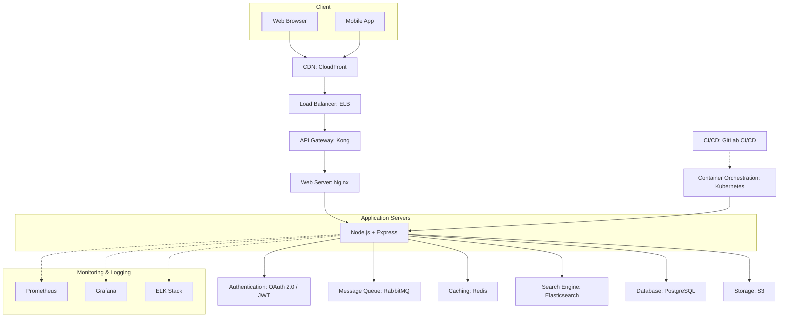

### Description

1. Client Layer: Users interact with the system through web browsers or mobile apps. The frontend is built with React.js and TypeScript for a responsive and type-safe user interface.
2. Content Delivery Network (CDN): AWS CloudFront is used to serve static assets globally, reducing latency for users.
3. Load Balancer: AWS Elastic Load Balancing distributes incoming traffic across multiple instances of the application servers.
4. API Gateway: Kong serves as the API gateway, handling routing, rate limiting, and API versioning.
5. Web Server: Nginx acts as a reverse proxy and handles SSL termination.
6. Application Servers: Node.js with Express.js powers the backend, running in containers orchestrated by Kubernetes for scalability and easy management.
7. Authentication: OAuth 2.0 with JWT is used for secure authentication and authorization.
8. Message Queue: RabbitMQ handles asynchronous tasks and ensures system resilience.
9. Caching: Redis is used for caching frequently accessed data, improving performance.
10. Search Engine: Elasticsearch provides fast and efficient full-text search capabilities.
11. Databases: PostgreSQL serves as the primary relational database for structured data storage.
12. Storage: AWS S3 is used for storing files such as resumes and other documents.
13. Monitoring & Logging: Prometheus and Grafana are used for real-time monitoring and visualization of system metrics. The ELK Stack (Elasticsearch, Logstash, Kibana) is used for centralized logging and log analysis.
14. CI/CD: GitLab CI/CD is used for continuous integration and deployment, automating the build, test, and deployment processes.
15. Container Orchestration: Kubernetes manages the deployment, scaling, and operations of application containers across clusters of hosts.

This architecture is designed to be scalable, resilient, and maintainable. It leverages cloud services (AWS) for infrastructure, uses containers for consistency across environments, and implements modern DevOps practices for efficient development and operations.

The system is built with microservices architecture in mind, allowing for independent scaling and development of different components. The use of message queues and caching helps in handling high loads and improving response times. The inclusion of monitoring and logging systems ensures that the operations team can quickly identify and resolve any issues that arise.

## C4

### Context

```plantuml
@startuml C4_Context
!include https://raw.githubusercontent.com/plantuml-stdlib/C4-PlantUML/master/C4_Context.puml

LAYOUT_WITH_LEGEND()

Person(candidate, "Candidate", "A person applying for a job")
Person(recruiter, "Recruiter", "A person managing the recruitment process")
Person(hiringManager, "Hiring Manager", "A person involved in hiring decisions")

System(ltiAtsJaca, "LTI-ATS-JACA", "Applicant Tracking System")

System_Ext(emailSystem, "Email System", "External email service")
System_Ext(jobBoards, "Job Boards", "External job posting platforms")

Rel(candidate, ltiAtsJaca, "Submits applications, views job listings")
Rel(recruiter, ltiAtsJaca, "Manages job postings, reviews applications, schedules interviews")
Rel(hiringManager, ltiAtsJaca, "Reviews candidates, provides feedback")
Rel(ltiAtsJaca, emailSystem, "Sends notifications")
Rel(ltiAtsJaca, jobBoards, "Posts job listings")

@enduml
```

### Container

```plantuml
@startuml C4_Container
!include https://raw.githubusercontent.com/plantuml-stdlib/C4-PlantUML/master/C4_Container.puml

LAYOUT_WITH_LEGEND()

Person(candidate, "Candidate", "A person applying for a job")
Person(recruiter, "Recruiter", "A person managing the recruitment process")
Person(hiringManager, "Hiring Manager", "A person involved in hiring decisions")

System_Boundary(ltiAtsJaca, "LTI-ATS-JACA") {
    Container(webApp, "Web Application", "React, TypeScript", "Provides all ATS functionality via web browser")
    Container(mobileApp, "Mobile App", "React Native", "Provides limited ATS functionality via mobile")
    Container(apiGateway, "API Gateway", "Kong", "Routes API requests")
    Container(appServer, "Application Server", "Node.js, Express", "Handles business logic")
    ContainerDb(database, "Database", "PostgreSQL", "Stores user, job, and application data")
    Container(searchEngine, "Search Engine", "Elasticsearch", "Provides fast search capabilities")
    Container(cacheLayer, "Cache", "Redis", "Caches frequently accessed data")
    Container(messageQueue, "Message Queue", "RabbitMQ", "Handles asynchronous tasks")
}

System_Ext(emailSystem, "Email System", "External email service")
System_Ext(jobBoards, "Job Boards", "External job posting platforms")

Rel(candidate, webApp, "Uses", "HTTPS")
Rel(candidate, mobileApp, "Uses", "HTTPS")
Rel(recruiter, webApp, "Uses", "HTTPS")
Rel(hiringManager, webApp, "Uses", "HTTPS")

Rel(webApp, apiGateway, "Makes API calls to", "JSON/HTTPS")
Rel(mobileApp, apiGateway, "Makes API calls to", "JSON/HTTPS")
Rel(apiGateway, appServer, "Routes requests to", "JSON/HTTPS")

Rel(appServer, database, "Reads from and writes to", "SQL/TCP")
Rel(appServer, searchEngine, "Reads from and writes to", "JSON/HTTPS")
Rel(appServer, cacheLayer, "Reads from and writes to", "Redis Protocol")
Rel(appServer, messageQueue, "Publishes messages to", "AMQP")

Rel(appServer, emailSystem, "Sends emails using", "SMTP")
Rel(appServer, jobBoards, "Posts jobs to", "API/HTTPS")

@enduml
```

### Component

#### Application Server

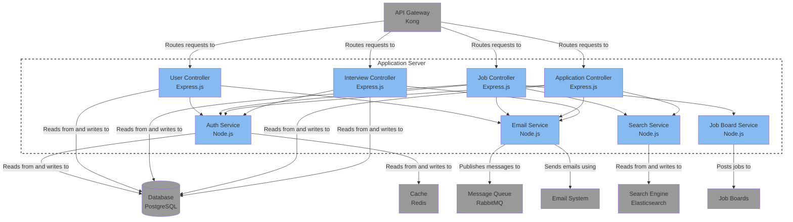

### Code

#### Job Controller

##### Interaction Diagram

```plantuml
@startuml Job Controller Interaction
!include https://raw.githubusercontent.com/plantuml-stdlib/C4-PlantUML/master/C4_Component.puml

Component(jobController, "Job Controller", "Express.js", "Handles job-related operations")
Component(authService, "Auth Service", "Node.js", "Handles authentication")
Component(searchService, "Search Service", "Node.js", "Interfaces with Elasticsearch")
Component(emailService, "Email Service", "Node.js", "Handles email notifications")
Component(jobBoardService, "Job Board Service", "Node.js", "Interfaces with external job boards")
ContainerDb(database, "Database", "PostgreSQL", "Stores job data")

Rel(jobController, authService, "Authenticates requests")
Rel(jobController, searchService, "Searches for jobs")
Rel(jobController, emailService, "Sends job-related emails")
Rel(jobController, jobBoardService, "Posts jobs to external boards")
Rel(jobController, database, "CRUD operations")

@enduml
```

##### Sequence Diagram

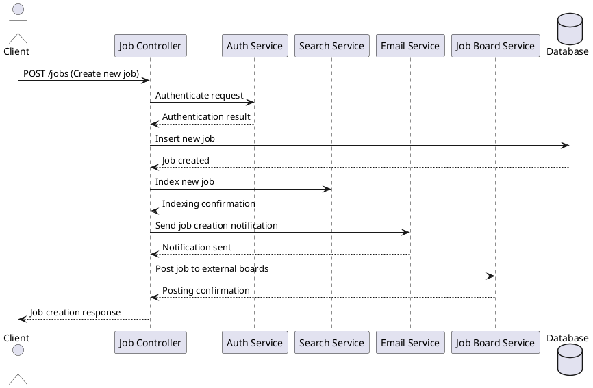

##### Class Diagram

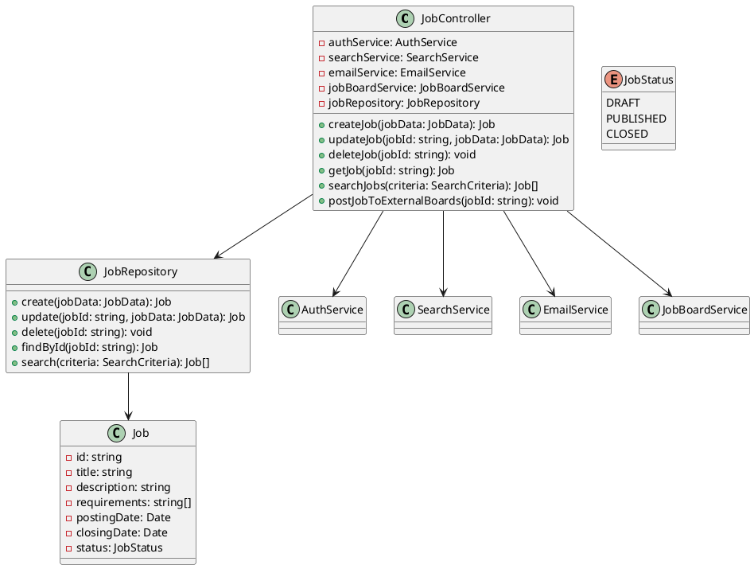

#### Application Controller

##### Interaction Diagram

```plantuml
@startuml Application Controller Interaction
!include https://raw.githubusercontent.com/plantuml-stdlib/C4-PlantUML/master/C4_Component.puml

Component(applicationController, "Application Controller", "Express.js", "Handles application-related operations")
Component(authService, "Auth Service", "Node.js", "Handles authentication")
Component(searchService, "Search Service", "Node.js", "Interfaces with Elasticsearch")
Component(emailService, "Email Service", "Node.js", "Handles email notifications")
ContainerDb(database, "Database", "PostgreSQL", "Stores application data")

Rel(applicationController, authService, "Authenticates requests")
Rel(applicationController, searchService, "Searches for applications")
Rel(applicationController, emailService, "Sends application-related emails")
Rel(applicationController, database, "CRUD operations")

@enduml
```

##### Sequence Diagram

```plantuml
@startuml Application Controller Sequence
actor Candidate
participant "Application Controller" as AC
participant "Auth Service" as AS
participant "Search Service" as SS
participant "Email Service" as ES
database Database

Candidate -> AC: POST /applications (Submit application)
AC -> AS: Authenticate request
AS --> AC: Authentication result
AC -> Database: Insert new application
Database --> AC: Application created
AC -> SS: Index new application
SS --> AC: Indexing confirmation
AC -> ES: Send application confirmation email
ES --> AC: Email sent
AC --> Candidate: Application submission response

@enduml
```

##### Class Diagram

```plantuml
@startuml Application Controller Class
class ApplicationController {
  -authService: AuthService
  -searchService: SearchService
  -emailService: EmailService
  -applicationRepository: ApplicationRepository
  +submitApplication(applicationData: ApplicationData): Application
  +updateApplicationStatus(applicationId: string, status: ApplicationStatus): Application
  +getApplication(applicationId: string): Application
  +searchApplications(criteria: SearchCriteria): Application[]
  +sendApplicationStatusUpdate(applicationId: string): void
}

class ApplicationRepository {
  +create(applicationData: ApplicationData): Application
  +update(applicationId: string, applicationData: ApplicationData): Application
  +findById(applicationId: string): Application
  +search(criteria: SearchCriteria): Application[]
}

class Application {
  -id: string
  -candidateId: string
  -jobId: string
  -resumeUrl: string
  -coverLetter: string
  -status: ApplicationStatus
  -submissionDate: Date
}

enum ApplicationStatus {
  SUBMITTED
  UNDER_REVIEW
  INTERVIEW_SCHEDULED
  REJECTED
  ACCEPTED
}

ApplicationController --> ApplicationRepository
ApplicationController --> AuthService
ApplicationController --> SearchService
ApplicationController --> EmailService
ApplicationRepository --> Application

@enduml
```

#### Interview Controller

##### Interaction Diagram

```plantuml
@startuml Interview Controller Interaction
!include https://raw.githubusercontent.com/plantuml-stdlib/C4-PlantUML/master/C4_Component.puml

Component(interviewController, "Interview Controller", "Express.js", "Handles interview-related operations")
Component(authService, "Auth Service", "Node.js", "Handles authentication")
Component(emailService, "Email Service", "Node.js", "Handles email notifications")
ContainerDb(database, "Database", "PostgreSQL", "Stores interview data")

Rel(interviewController, authService, "Authenticates requests")
Rel(interviewController, emailService, "Sends interview-related emails")
Rel(interviewController, database, "CRUD operations")

@enduml
```

##### Sequence Diagram

```plantuml
@startuml Interview Controller Sequence
actor Recruiter
participant "Interview Controller" as IC
participant "Auth Service" as AS
participant "Email Service" as ES
database Database

Recruiter -> IC: POST /interviews (Schedule interview)
IC -> AS: Authenticate request
AS --> IC: Authentication result
IC -> Database: Insert new interview
Database --> IC: Interview scheduled
IC -> ES: Send interview invitation email
ES --> IC: Email sent
IC --> Recruiter: Interview scheduling response

@enduml
```

##### Class Diagram

```plantuml
@startuml Interview Controller Class
class InterviewController {
  -authService: AuthService
  -emailService: EmailService
  -interviewRepository: InterviewRepository
  +scheduleInterview(interviewData: InterviewData): Interview
  +updateInterviewDetails(interviewId: string, interviewData: InterviewData): Interview
  +cancelInterview(interviewId: string): void
  +getInterview(interviewId: string): Interview
  +getInterviewsForApplication(applicationId: string): Interview[]
  +sendInterviewInvitation(interviewId: string): void
}

class InterviewRepository {
  +create(interviewData: InterviewData): Interview
  +update(interviewId: string, interviewData: InterviewData): Interview
  +delete(interviewId: string): void
  +findById(interviewId: string): Interview
  +findByApplicationId(applicationId: string): Interview[]
}

class Interview {
  -id: string
  -applicationId: string
  -interviewerId: string
  -scheduledDate: Date
  -duration: number
  -type: InterviewType
  -status: InterviewStatus
  -feedback: string
}

enum InterviewType {
  PHONE_SCREEN
  VIDEO_CALL
  ON_SITE
}

enum InterviewStatus {
  SCHEDULED
  COMPLETED
  CANCELED
}

InterviewController --> InterviewRepository
InterviewController --> AuthService
InterviewController --> EmailService
InterviewRepository --> Interview

@enduml
```

#### User Controller

##### Interaction Diagram

```plantuml
@startuml User Controller Interaction
!include https://raw.githubusercontent.com/plantuml-stdlib/C4-PlantUML/master/C4_Component.puml

Component(userController, "User Controller", "Express.js", "Handles user-related operations")
Component(authService, "Auth Service", "Node.js", "Handles authentication")
Component(emailService, "Email Service", "Node.js", "Handles email notifications")
ContainerDb(database, "Database", "PostgreSQL", "Stores user data")

Rel(userController, authService, "Authenticates requests")
Rel(userController, emailService, "Sends user-related emails")
Rel(userController, database, "CRUD operations")

@enduml
```

##### Sequence Diagram

```plantuml
@startuml User Controller Sequence
actor User
participant "User Controller" as UC
participant "Auth Service" as AS
participant "Email Service" as ES
database Database

User -> UC: POST /users (Register new user)
UC -> Database: Check if user exists
Database --> UC: User existence result
UC -> Database: Insert new user
Database --> UC: User created
UC -> AS: Generate authentication token
AS --> UC: Authentication token
UC -> ES: Send welcome email
ES --> UC: Email sent
UC --> User: Registration response with token

@enduml
```

##### Class Diagram

```plantuml
@startuml User Controller Class
class UserController {
  -authService: AuthService
  -emailService: EmailService
  -userRepository: UserRepository
  +registerUser(userData: UserData): User
  +updateUser(userId: string, userData: UserData): User
  +deleteUser(userId: string): void
  +getUser(userId: string): User
  +loginUser(credentials: LoginCredentials): AuthToken
  +resetPassword(userId: string): void
}

class UserRepository {
  +create(userData: UserData): User
  +update(userId: string, userData: UserData): User
  +delete(userId: string): void
  +findById(userId: string): User
  +findByEmail(email: string): User
}

class User {
  -id: string
  -email: string
  -passwordHash: string
  -firstName: string
  -lastName: string
  -role: UserRole
  -createdAt: Date
  -updatedAt: Date
}

enum UserRole {
  ADMIN
  RECRUITER
  HIRING_MANAGER
  CANDIDATE
}

UserController --> UserRepository
UserController --> AuthService
UserController --> EmailService
UserRepository --> User

@enduml
```
