# LTI-JACA (Claude)

```
Act as a Product Expert, with experience in Applicant-Tracking Systems (ATS). What are the basic functionalities of an ATS? List, describe and order them by priority.
```

I'd be happy to act as a Product Expert for Applicant Tracking Systems and help you create LTI-ATS-JACA. Let's start with the tasks you've outlined.

Introductory description of LTI-ATS-JACA:

LTI-ATS-JACA is a cutting-edge Applicant Tracking System designed to streamline and optimize the recruitment process for organizations of all sizes. This comprehensive solution combines intuitive user interface with powerful automation features to help HR professionals and hiring managers efficiently manage their talent acquisition pipeline. LTI-ATS-JACA aims to reduce time-to-hire, improve candidate experience, and provide valuable insights to make data-driven hiring decisions.

Basic functionalities of an ATS, listed and described in order of priority:

1. Job Posting and Distribution
   - Create and publish job listings across multiple platforms
   - Integrate with job boards and career sites
   - Manage internal job postings

2. Resume Parsing and Candidate Profile Creation
   - Automatically extract information from resumes
   - Create standardized candidate profiles
   - Enable keyword search and filtering

3. Applicant Tracking and Workflow Management
   - Track candidate progress through hiring stages
   - Customize hiring workflows for different positions
   - Automate status updates and notifications

4. Communication Tools
   - Send automated emails to candidates
   - Schedule interviews and send reminders
   - Facilitate internal communication between hiring team members

5. Interview Management
   - Schedule and track interviews
   - Provide interview guides and scorecards
   - Collect and organize feedback from interviewers

6. Candidate Evaluation and Scoring
   - Create customizable evaluation criteria
   - Enable collaborative scoring and ranking
   - Generate comparison reports for decision-making

7. Reporting and Analytics
   - Track key recruitment metrics (e.g., time-to-hire, source of hire)
   - Generate customizable reports
   - Provide data-driven insights for process improvement

8. Compliance and Equal Employment Opportunity (EEO) Tracking
   - Ensure compliance with labor laws and regulations
   - Track and report on diversity metrics
   - Manage required documentation for audits

9. Integration Capabilities
   - Connect with HRIS, payroll, and onboarding systems
   - Integrate with background check services
   - Enable single sign-on (SSO) for seamless user experience

10. Mobile Accessibility
    - Provide mobile-friendly interface for candidates and hiring managers
    - Enable on-the-go application reviews and approvals
    - Facilitate mobile communication and notifications

These functionalities are listed in order of priority, with the most critical features at the top. However, the specific priorities may vary depending on your target market and unique selling proposition for LTI-ATS-JACA.

Would you like me to elaborate on any of these functionalities or move on to the next steps in creating your ATS?

```
What would be the next steps in creating LTI-ATS-JACA
```
The next steps in creating LTI-ATS-JACA would involve:

1. Market Research and Competitive Analysis
   - Identify target audience and market segments
   - Analyze competitors' strengths and weaknesses
   - Determine unique selling propositions for LTI-ATS-JACA

2. Requirements Gathering
   - Conduct interviews with potential users (HR professionals, recruiters)
   - Define detailed functional and non-functional requirements
   - Prioritize features based on user needs and market demands

3. System Architecture Design
   - Choose technology stack (e.g., programming languages, databases)
   - Design system architecture (e.g., cloud-based, on-premise, hybrid)
   - Plan for scalability, security, and data privacy

4. User Experience (UX) and User Interface (UI) Design
   - Create user personas and user journey maps
   - Design wireframes and prototypes
   - Conduct usability testing and iterate on designs

5. Development Planning
   - Break down the project into manageable sprints or phases
   - Estimate timelines and resources required
   - Set up development environments and version control

6. Core Feature Development
   - Start with MVP (Minimum Viable Product) features
   - Implement basic functionalities in order of priority
   - Conduct regular code reviews and quality assurance testing

7. Integration and API Development
   - Develop APIs for third-party integrations
   - Implement connections with job boards and HRIS systems
   - Ensure data consistency across integrated platforms

8. Security and Compliance Implementation
   - Implement data encryption and secure authentication
   - Ensure compliance with data protection regulations (e.g., GDPR, CCPA)
   - Conduct security audits and penetration testing

9. Testing and Quality Assurance
   - Perform thorough functional and non-functional testing
   - Conduct user acceptance testing (UAT) with beta customers
   - Address and resolve identified issues and bugs

10. Deployment and Launch Preparation
    - Set up production environments
    - Prepare documentation and user guides
    - Develop a launch strategy and marketing materials

11. Training and Support
    - Create training materials for internal teams and customers
    - Set up customer support channels
    - Develop a knowledge base and FAQ section

12. Continuous Improvement
    - Gather user feedback post-launch
    - Prioritize and implement feature enhancements
    - Monitor system performance and optimize as needed

Would you like me to elaborate on any of these steps or discuss a specific aspect of the development process?

```
Enumerate the benefits or added value for the client of using LTI-ATS-JACA.
```

Here are the key benefits and added value for clients using LTI-ATS-JACA:

1. Improved Efficiency
   - Streamlined recruitment process
   - Reduced time-to-hire
   - Automation of repetitive tasks

2. Cost Reduction
   - Lower recruitment advertising costs
   - Decreased reliance on external recruiters
   - Optimized use of HR resources

3. Enhanced Candidate Experience
   - User-friendly application process
   - Timely communication and updates
   - Mobile accessibility for on-the-go applications

4. Better Quality of Hires
   - Standardized evaluation criteria
   - Data-driven decision making
   - Improved candidate matching through AI-powered screening

5. Increased Collaboration
   - Centralized communication for hiring teams
   - Easy sharing of candidate information and feedback
   - Improved alignment between HR and hiring managers

6. Compliance and Risk Mitigation
   - Ensure adherence to labor laws and regulations
   - Standardized processes to reduce bias
   - Proper documentation for potential audits

7. Data-Driven Insights
   - Comprehensive recruitment analytics
   - Identification of best-performing sourcing channels
   - Metrics to continuously improve hiring processes

8. Scalability
   - Ability to handle high-volume recruiting
   - Adaptable to company growth and changing needs
   - Support for multiple locations or departments

9. Improved Employer Branding
   - Professional and consistent candidate communication
   - Showcase company culture through customized career pages
   - Positive candidate experience leading to better company reviews

10. Time Savings
    - Faster resume screening and shortlisting
    - Automated interview scheduling
    - Quick generation of offer letters and contracts

11. Enhanced Talent Pool Management
    - Build and maintain a database of potential candidates
    - Easy retrieval of past applicants for new positions
    - Nurture relationships with passive candidates

12. Integration Capabilities
    - Seamless connection with existing HR systems
    - Unified data flow from recruitment to onboarding
    - Reduced manual data entry and potential errors

13. Customization and Flexibility
    - Tailored workflows for different positions or departments
    - Customizable evaluation forms and interview guides
    - Adaptable reporting to meet specific organizational needs

14. Improved Decision Making
    - Side-by-side candidate comparisons
    - Historical data to inform hiring strategies
    - Predictive analytics for future hiring needs

15. Global Recruiting Support
    - Multi-language capabilities
    - Compliance with international hiring regulations
    - Support for diverse hiring practices across regions

Would you like me to expand on any of these benefits or discuss how they could be highlighted in marketing materials for LTI-ATS-JACA?

```
Identify target audience and market segments
```

Identifying target audience and market segments for LTI-ATS-JACA:

1. Company Size:
   a) Small Businesses (1-50 employees)
   b) Mid-size Companies (51-500 employees)
   c) Large Enterprises (500+ employees)

2. Industry Sectors:
   a) Technology and IT
   b) Healthcare and Pharmaceuticals
   c) Financial Services and Banking
   d) Retail and E-commerce
   e) Manufacturing
   f) Education
   g) Professional Services (Consulting, Legal, etc.)
   h) Non-profit Organizations

3. Geographical Regions:
   a) North America
   b) Europe
   c) Asia-Pacific
   d) Latin America
   e) Middle East and Africa

4. Hiring Volume:
   a) Low-volume recruiters (1-10 hires per month)
   b) Medium-volume recruiters (11-50 hires per month)
   c) High-volume recruiters (50+ hires per month)

5. Organizational Structure:
   a) Centralized HR departments
   b) Decentralized hiring (department-led recruitment)
   c) Staffing and recruitment agencies

6. Technology Adoption Level:
   a) Early adopters (tech-savvy organizations)
   b) Mainstream users (average technology adoption)
   c) Late adopters (traditional or risk-averse organizations)

7. Specific Hiring Needs:
   a) High-skill technical positions
   b) Executive and leadership roles
   c) Entry-level and internship programs
   d) Seasonal or temporary workforce
   e) Remote and distributed teams

8. Budget Constraints:
   a) Cost-sensitive organizations
   b) Value-oriented buyers
   c) Premium feature seekers

9. Compliance Requirements:
   a) Highly regulated industries (e.g., government, healthcare)
   b) Companies with strict data privacy needs
   c) Organizations with specific diversity and inclusion goals

10. Current ATS Status:
    a) First-time ATS buyers
    b) Organizations looking to switch from existing ATS
    c) Companies seeking to upgrade or consolidate multiple systems

To effectively target these segments, consider:

1. Tailoring marketing messages to address specific pain points of each segment.
2. Developing different pricing tiers or feature sets to cater to various company sizes and needs.
3. Offering industry-specific solutions or templates for key sectors.
4. Ensuring compliance with regional data protection laws for geographical targeting.
5. Highlighting scalability for growing businesses and high-volume recruiters.
6. Emphasizing user-friendliness for late adopters and ease of integration for tech-savvy organizations.
7. Showcasing specialized features for specific hiring needs (e.g., AI-powered screening for technical roles).
8. Demonstrating ROI and cost-saving potential for budget-conscious segments.
9. Highlighting advanced compliance features for highly regulated industries.
10. Offering smooth data migration and onboarding support for those switching from other systems.

Would you like to focus on any particular segment or discuss strategies for reaching these target audiences?

```
Analyze competitors' strengths and weaknesses
```

To analyze competitors' strengths and weaknesses, let's look at some of the major players in the ATS market. This analysis will help position LTI-ATS-JACA effectively. Here's an overview of key competitors:

1. Workday Recruiting

   Strengths:
   - Comprehensive HR suite integration
   - Strong analytics and reporting capabilities
   - User-friendly interface

   Weaknesses:
   - Can be complex for smaller organizations
   - Higher price point
   - May have longer implementation times

2. Greenhouse

   Strengths:
   - Excellent user experience
   - Strong focus on promoting diversity in hiring
   - Extensive integration options

   Weaknesses:
   - Can be expensive for smaller companies
   - Some users report limitations in customization
   - May lack some advanced features for enterprise-level needs

3. Lever

   Strengths:
   - Modern, intuitive interface
   - Strong collaboration tools
   - Good candidate relationship management features

   Weaknesses:
   - Limited reporting capabilities compared to some competitors
   - May lack some features for very large enterprises
   - Pricing can be high for smaller organizations

4. Taleo (Oracle)

   Strengths:
   - Robust features for large enterprises
   - Strong compliance tools
   - Extensive customization options

   Weaknesses:
   - User interface often criticized as outdated
   - Can be complex to use and set up
   - May be overkill for smaller organizations

5. SmartRecruiters

   Strengths:
   - AI-powered candidate matching
   - Strong marketplace for third-party integrations
   - Good scalability for growing companies

   Weaknesses:
   - Some users report occasional performance issues
   - Advanced features may require higher-tier plans
   - Customer support responsiveness has been criticized

6. iCIMS

   Strengths:
   - Comprehensive recruitment marketing tools
   - Strong compliance features
   - Good for high-volume recruiting

   Weaknesses:
   - Interface can be less intuitive than some competitors
   - Implementation can be complex
   - Some users report issues with system speed

7. Jobvite

   Strengths:
   - Strong social recruiting features
   - Good candidate relationship management
   - User-friendly interface

   Weaknesses:
   - Reporting capabilities may be limited for some users
   - Some advanced features only available in higher-tier plans
   - Integration with some third-party tools can be challenging

Based on this analysis, potential opportunities for LTI-ATS-JACA include:

1. Offering a more intuitive user interface that combines power with ease of use
2. Providing flexible pricing models to attract both small and large organizations
3. Focusing on faster implementation and setup processes
4. Developing strong, AI-powered analytics and reporting capabilities
5. Ensuring seamless integration with a wide range of third-party tools
6. Emphasizing excellent customer support and responsiveness
7. Balancing comprehensive features with system performance and speed
8. Offering advanced customization without overwhelming complexity
9. Developing strong compliance tools that are easy to use and understand
10. Focusing on scalability to appeal to growing organizations

Would you like to discuss how to leverage these insights in developing LTI-ATS-JACA's unique selling propositions?

```
Determine unique selling propositions for LTI-ATS-JACA
```

Based on our competitor analysis and market insights, here are potential unique selling propositions (USPs) for LTI-ATS-JACA:

1. Adaptive AI-Powered Matching
   - Advanced AI that learns from each organization's hiring patterns
   - Continuously improving candidate matching and ranking

2. Seamless Scalability
   - Easily adapts from small business to enterprise-level needs
   - No need to switch systems as the company grows

3. Intuitive Customization Engine
   - User-friendly interface for creating custom workflows and forms
   - No coding required for advanced customizations

4. Rapid Implementation Program
   - Streamlined setup process with intelligent data migration
   - Get up and running in days, not months

5. Unified Communication Hub
   - Centralized platform for all recruitment communications
   - Integrates email, messaging, and video interviews

6. Compliance Assurance System
   - Built-in compliance checks for various global regulations
   - Automatic updates to stay current with changing laws

7. Predictive Analytics Dashboard
   - Forecast hiring needs based on historical data and market trends
   - Provide actionable insights to improve recruitment strategies

8. Candidate Experience Optimizer
   - Personalized candidate portals with real-time status updates
   - Automated feedback collection to continuously enhance the process

9. Flexible Pricing Model
   - Pay-per-use option for smaller organizations or seasonal hiring
   - Customizable feature sets to avoid overpaying for unused tools

10. Seamless Integration Ecosystem
    - One-click integrations with popular HR tools and job boards
    - Open API for easy custom integrations

11. Mobile-First Design
    - Fully functional mobile app for both recruiters and candidates
    - Optimized for on-the-go hiring and applying

12. Automated Bias Detection
    - AI-powered tools to identify and mitigate unconscious bias in job descriptions and screening processes
    - Promote diversity and inclusion throughout the hiring process

13. Continuous Learning Platform
    - Built-in tutorials and best practices updated in real-time
    - Personalized system suggestions based on user behavior

14. Global Talent Pool Network
    - Shared, anonymized database of candidates across LTI-ATS-JACA users
    - Respect privacy while expanding reach for hard-to-fill positions

15. Proactive Customer Success Program
    - Dedicated success managers for all account tiers
    - Regular check-ins and personalized optimization recommendations

To effectively leverage these USPs:

1. Prioritize the most compelling propositions based on target market needs.
2. Craft clear, benefit-focused messaging around each USP.
3. Demonstrate the unique features through case studies and demo videos.
4. Align marketing and sales strategies to highlight these differentiators.
5. Continuously gather user feedback to refine and evolve the USPs.

Would you like to discuss how to incorporate these USPs into LTI-ATS-JACA's marketing strategy or product development roadmap?

```
Create a Lean Canvas Diagram in Mermeid code to visualize it in a markdown file in GitHub.
```

Certainly. I'll create a Lean Canvas Diagram for LTI-ATS-JACA using Mermaid code. This diagram will provide a visual overview of the key aspects of the business model. Here's the Mermaid code:

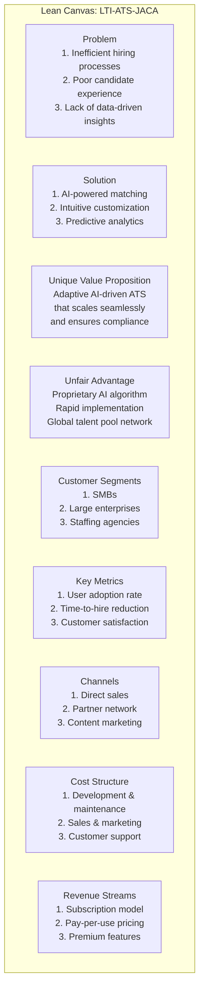

To use this in a GitHub markdown file:

1. Create a new markdown file (e.g., `LTI-ATS-JACA_Lean_Canvas.md`)
2. Copy and paste the entire Mermaid code block into the file
3. Commit the file to your GitHub repository

GitHub will automatically render the Mermaid diagram when viewing the markdown file.

This Lean Canvas provides a concise overview of LTI-ATS-JACA's business model, including:

- The problems it solves
- Its key solutions and unique value proposition
- Customer segments and channels
- Key metrics and unfair advantages
- Cost structure and revenue streams

This visual representation can help in quickly communicating the core aspects of LTI-ATS-JACA to stakeholders and team members. It can also serve as a living document, updated as the business model evolves.

Would you like me to explain any part of the Lean Canvas in more detail or discuss how to use this information in your product development process?

```
Define detailed functional and non-functional requirements
```

Certainly. I'll define detailed functional and non-functional requirements for LTI-ATS-JACA. These requirements will guide the development process and ensure that the system meets user needs and performance standards.

Functional Requirements:

1. User Management
   - User registration and authentication
   - Role-based access control (e.g., admin, recruiter, hiring manager)
   - Password reset and account recovery

2. Job Requisition Management
   - Create, edit, and delete job requisitions
   - Approval workflow for job postings
   - Job template creation and management

3. Candidate Management
   - Candidate profile creation and editing
   - Resume parsing and data extraction
   - Candidate search and filtering
   - Candidate status tracking and updates

4. Application Process
   - Online job application form creation
   - Document upload (resumes, cover letters, portfolios)
   - Application status tracking for candidates

5. Screening and Assessment
   - Customizable screening questions
   - Skills assessment integration
   - AI-powered candidate ranking and matching

6. Interview Management
   - Interview scheduling and calendar integration
   - Video interview capability
   - Interview feedback collection and scoring

7. Communication
   - Email templates and bulk emailing
   - In-app messaging system
   - Automated notifications and reminders

8. Reporting and Analytics
   - Standard and custom report generation
   - Real-time dashboard with key metrics
   - Data export functionality

9. Integration Capabilities
   - API for third-party integrations
   - Job board posting integration
   - HRIS and payroll system integration

10. Compliance and EEO
    - EEO data collection and reporting
    - Compliance checklist for job postings
    - Audit trail for all system actions

11. Offer Management
    - Offer letter generation and tracking
    - E-signature integration for offer acceptance
    - Offer approval workflow

12. Career Site Management
    - Customizable career site builder
    - Job search and filtering for candidates
    - Mobile-responsive design

Non-Functional Requirements:

1. Performance
   - Page load time under 2 seconds for 95% of requests
   - Support for at least 10,000 concurrent users
   - Ability to handle 1 million job applications per month

2. Scalability
   - Horizontal scaling to accommodate growing user base
   - Ability to add new features without major system overhaul

3. Availability
   - 99.9% uptime guarantee
   - Scheduled maintenance windows with minimal disruption

4. Security
   - Data encryption at rest and in transit (minimum AES-256)
   - Regular security audits and penetration testing
   - Multi-factor authentication support

5. Compliance
   - GDPR, CCPA, and other relevant data protection regulations compliance
   - SOC 2 Type II certification
   - Regular compliance updates to meet changing regulations

6. Usability
   - Intuitive user interface requiring minimal training
   - Accessibility compliance (WCAG 2.1 level AA)
   - Support for multiple languages and locales

7. Reliability
   - Automated backups with point-in-time recovery
   - Fault-tolerant architecture with no single point of failure

8. Compatibility
   - Cross-browser support (Chrome, Firefox, Safari, Edge)
   - Mobile responsiveness for all major functions

9. Data Integrity
   - Data validation to ensure accuracy and consistency
   - Audit logs for all data changes

10. Maintainability
    - Modular architecture for easy updates and maintenance
    - Comprehensive system documentation
    - Automated testing with minimum 80% code coverage

11. Disaster Recovery
    - Recovery Time Objective (RTO) of 4 hours
    - Recovery Point Objective (RPO) of 1 hour

12. Performance Monitoring
    - Real-time system health monitoring
    - Automated alerts for performance issues

13. Interoperability
    - Support for standard data exchange formats (JSON, XML)
    - OAuth 2.0 support for secure API access

14. Customization
    - Ability to customize workflows without code changes
    - User-defined fields and forms

15. Data Retention and Archiving
    - Configurable data retention policies
    - Secure data archiving and retrieval system

These requirements provide a comprehensive foundation for developing LTI-ATS-JACA. They cover the essential functionalities expected in a modern ATS while also addressing crucial non-functional aspects that ensure the system's reliability, performance, and compliance.

Would you like me to elaborate on any specific requirement or discuss how to prioritize these for the development process?

```
Prioritize features based on user needs and market demands
```

Certainly. Let's prioritize the features of LTI-ATS-JACA based on user needs and market demands. We'll use the MoSCoW method (Must have, Should have, Could have, Won't have) to categorize the features. This prioritization will help guide the development process and ensure that the most critical features are implemented first.

Must Have (Critical features for launch):

1. User Management
   - Basic user registration and authentication
   - Role-based access control

2. Job Requisition Management
   - Create, edit, and post job requisitions
   - Basic approval workflow

3. Candidate Management
   - Candidate profile creation
   - Resume parsing and data extraction
   - Basic candidate search and filtering

4. Application Process
   - Online job application form
   - Document upload (resumes, cover letters)

5. Screening and Assessment
   - Basic screening questions
   - AI-powered candidate ranking

6. Interview Management
   - Interview scheduling
   - Basic feedback collection

7. Communication
   - Email templates and notifications
   - Automated status updates

8. Reporting and Analytics
   - Standard reports on key metrics
   - Basic dashboard

9. Compliance and EEO
   - EEO data collection
   - Basic compliance checklist

10. Security and Data Protection
    - Data encryption
    - Compliance with basic data protection regulations

Should Have (Important features for competitive advantage):

1. Integration Capabilities
   - API for third-party integrations
   - Job board posting integration

2. Career Site Management
   - Basic customizable career site

3. Offer Management
   - Offer letter generation and tracking

4. Advanced Screening and Assessment
   - Skills assessment integration
   - More advanced AI matching algorithms

5. Video Interview Capability

6. Mobile-Responsive Design

7. Customizable Workflows

8. Advanced Search and Filtering Options

9. Candidate Status Tracking and Updates

10. Bulk Actions for Candidate Management

Could Have (Desirable features to enhance the product):

1. Advanced Reporting and Analytics
   - Custom report generation
   - Predictive analytics

2. Talent Pool Management

3. Employee Referral Management

4. Advanced Career Site Builder

5. Automated Reference Checking

6. Social Media Integration for Candidate Sourcing

7. Customizable Onboarding Checklist

8. Candidate Relationship Management (CRM) Features

9. Advanced Compliance Tools
   - Global compliance support
   - Audit trail for all actions

10. AI-Powered Chatbot for Candidate Queries

Won't Have (for initial release, may consider for future versions):

1. Full HRIS Integration

2. Payroll System Integration

3. Advanced Succession Planning Tools

4. Employee Performance Management

5. Learning Management System (LMS) Integration

6. Advanced Employer Branding Tools

7. Recruitment Marketing Automation

8. Vendor Management System for Staffing Agencies

9. Internal Mobility and Career Pathing Tools

10. AI-Powered Interview Scheduling and Optimization

This prioritization ensures that LTI-ATS-JACA launches with a solid core of essential features (Must Have) that meet the basic needs of most users. The Should Have features will provide a competitive edge and should be implemented as soon as possible after the core features.

The Could Have features can be developed to enhance the product's appeal and competitiveness but aren't critical for the initial launch. The Won't Have features are out of scope for now but could be considered for future versions as the product evolves and expands its capabilities.

This prioritization should be reviewed regularly and adjusted based on user feedback, market trends, and competitive landscape changes.

Would you like to discuss the rationale behind any specific prioritization or explore how to implement these features in phases?

```
Find the use cases for each Must Have feature and create the most appropriate Mermaid diagrams. Follow the UML syntax and the best practices. Additionally, add a description to each diagram for a better understanding.
```

Certainly. I'll create use case diagrams for each Must Have feature using Mermaid syntax, following UML best practices. I'll also provide a brief description for each diagram.

1. User Management

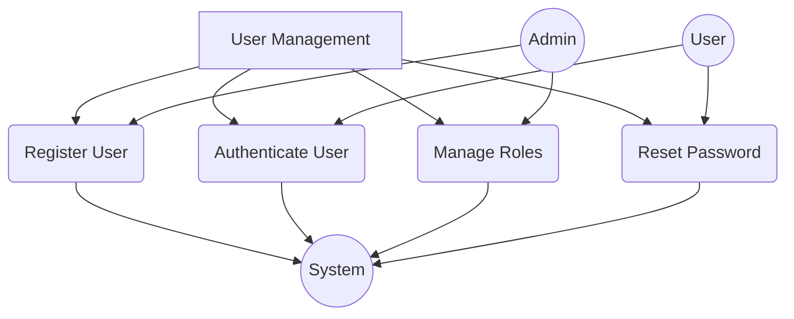

Description: This diagram illustrates the core functionalities of User Management. Admins can register new users and manage roles, while all users can authenticate and reset their passwords. The system handles these requests.

2. Job Requisition Management

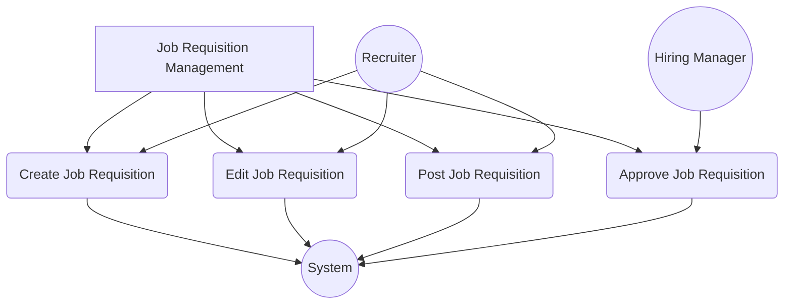

Description: This diagram shows the main actions in Job Requisition Management. Recruiters can create, edit, and post job requisitions, while hiring managers approve them. The system processes all these actions.

3. Candidate Management

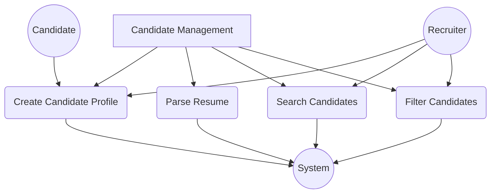

Description: This diagram depicts the core functions of Candidate Management. Both recruiters and candidates can create profiles. The system parses resumes, while recruiters can search and filter candidates.

4. Application Process

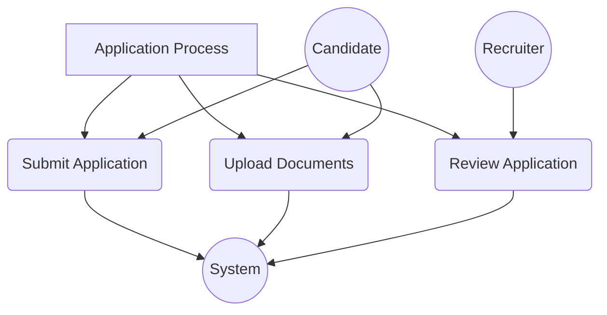

Description: This diagram shows the basic application process. Candidates can submit applications and upload documents, while recruiters review the applications. The system handles all these actions.

5. Screening and Assessment

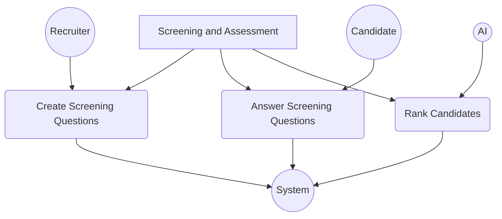

Description: This diagram illustrates the screening and assessment process. Recruiters create screening questions, candidates answer them, and the AI system ranks the candidates based on their responses.

6. Interview Management

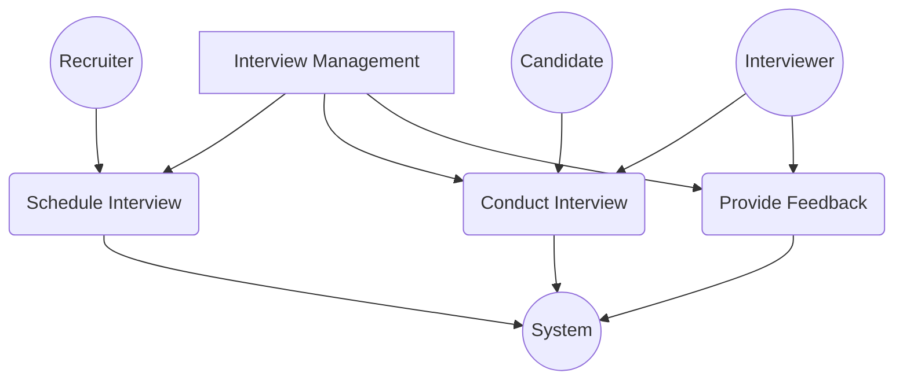

Description: This diagram shows the basic interview management process. Recruiters schedule interviews, interviewers conduct them and provide feedback, and candidates participate in the interviews.

7. Communication

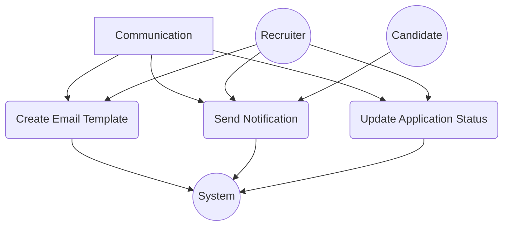

Description: This diagram depicts the communication functionalities. Recruiters can create email templates, send notifications, and update application statuses. Candidates receive notifications, and the system manages all these communications.

8. Reporting and Analytics

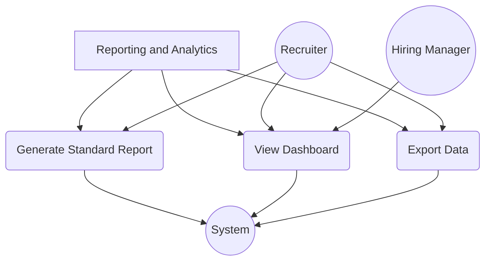

Description: This diagram shows the basic reporting and analytics features. Recruiters can generate standard reports, view dashboards, and export data. Hiring managers can also view dashboards. The system processes all these requests.

9. Compliance and EEO

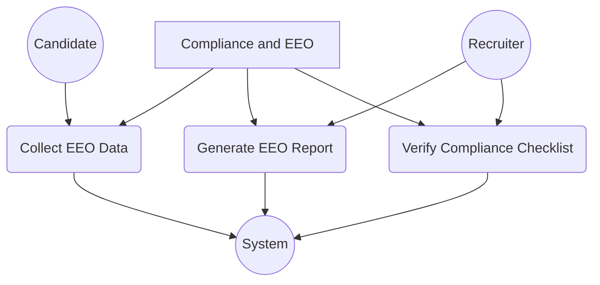

10. Security and Data Protection

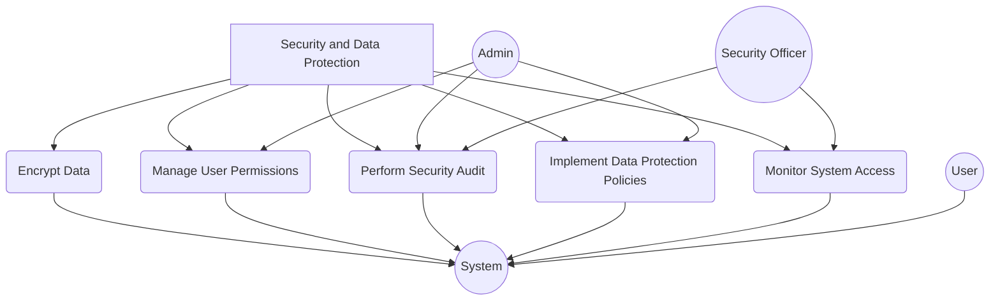

Description: This diagram illustrates the key functionalities of Security and Data Protection in LTI-ATS-JACA. The system is responsible for encrypting data and implementing data protection policies. Admins manage user permissions and implement data protection policies. Security officers perform security audits and monitor system access. All users interact with the system, which applies these security measures to protect their data and actions.

These diagrams provide a clear visual representation of the core functionalities for each Must Have feature in LTI-ATS-JACA, following UML syntax and best practices.

```
Create an Entity Relationship Diagram for the "Must Have" features using Mermaid, following the best practices for UML syntax. Include the field names and field types required for each entity.
```

Certainly! I'll create an Entity Relationship Diagram (ERD) for the "Must Have" features of LTI-ATS-JACA using Mermaid syntax. This diagram will include the main entities, their relationships, and key fields with their types.

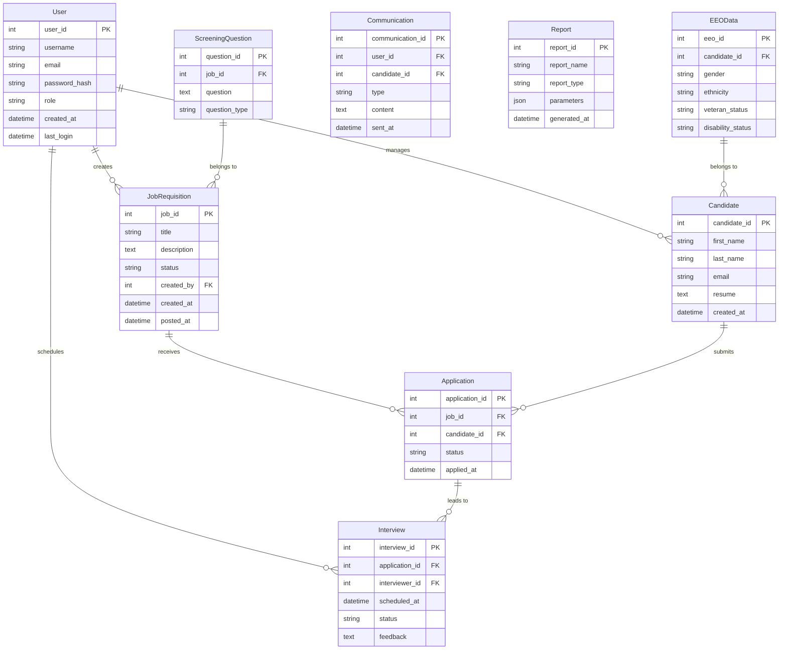

Description of the ERD:

1. User: Represents system users (recruiters, hiring managers, admins).
2. JobRequisition: Stores information about job openings.
3. Candidate: Contains details of job applicants.
4. Application: Represents a candidate's application for a specific job.
5. Interview: Stores interview details for applications.
6. ScreeningQuestion: Contains screening questions associated with job requisitions.
7. Communication: Tracks all communications with candidates.
8. Report: Stores generated reports.
9. EEOData: Contains Equal Employment Opportunity data for candidates.

Key relationships:
- Users create JobRequisitions and manage Candidates.
- JobRequisitions receive multiple Applications.
- Candidates submit multiple Applications.
- Applications can lead to multiple Interviews.
- ScreeningQuestions belong to JobRequisitions.
- EEOData belongs to Candidates.

This ERD covers the core entities required for the "Must Have" features of LTI-ATS-JACA. It provides a foundation for database design, showing the main tables and their relationships. The diagram includes primary keys (PK) and foreign keys (FK) to illustrate table connections.

Note that in a full implementation, you might need additional tables or fields, and some relationships might be more complex (e.g., many-to-many relationships might require junction tables). Also, consider adding indexes on frequently queried fields for performance optimization.

```
Following the industry best practices, select the tech stack that best fits the LTI-ATS-JACA product/system, and design the system architecture, creating a system architecture diagram using Mermaid and its description.
```

Certainly! I'll select a tech stack that best fits LTI-ATS-JACA based on industry best practices and design a system architecture accordingly. Then, I'll create a system architecture diagram using Mermaid and provide a description.

Tech Stack Selection:

1. Frontend: React.js with TypeScript
2. Backend: Node.js with Express.js
3. Database: PostgreSQL
4. Caching: Redis
5. Search Engine: Elasticsearch
6. Message Queue: RabbitMQ
7. Container Orchestration: Kubernetes
8. CI/CD: GitLab CI/CD
9. Monitoring: Prometheus and Grafana
10. Logging: ELK Stack (Elasticsearch, Logstash, Kibana)
11. API Gateway: Kong
12. Authentication: OAuth 2.0 with JSON Web Tokens (JWT)
13. Cloud Provider: AWS

This tech stack is chosen for its scalability, performance, and robust ecosystem support.

Now, let's create a system architecture diagram using Mermaid:

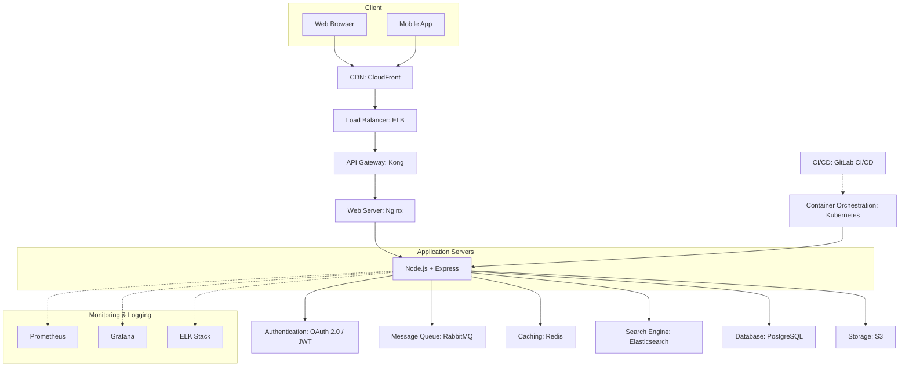

System Architecture Description:

1. Client Layer: Users interact with the system through web browsers or mobile apps. The frontend is built with React.js and TypeScript for a responsive and type-safe user interface.

2. Content Delivery Network (CDN): AWS CloudFront is used to serve static assets globally, reducing latency for users.

3. Load Balancer: AWS Elastic Load Balancing distributes incoming traffic across multiple instances of the application servers.

4. API Gateway: Kong serves as the API gateway, handling routing, rate limiting, and API versioning.

5. Web Server: Nginx acts as a reverse proxy and handles SSL termination.

6. Application Servers: Node.js with Express.js powers the backend, running in containers orchestrated by Kubernetes for scalability and easy management.

7. Authentication: OAuth 2.0 with JWT is used for secure authentication and authorization.

8. Message Queue: RabbitMQ handles asynchronous tasks and ensures system resilience.

9. Caching: Redis is used for caching frequently accessed data, improving performance.

10. Search Engine: Elasticsearch provides fast and efficient full-text search capabilities.

11. Databases: PostgreSQL serves as the primary relational database for structured data storage.

12. Storage: AWS S3 is used for storing files such as resumes and other documents.

13. Monitoring & Logging: Prometheus and Grafana are used for real-time monitoring and visualization of system metrics. The ELK Stack (Elasticsearch, Logstash, Kibana) is used for centralized logging and log analysis.

14. CI/CD: GitLab CI/CD is used for continuous integration and deployment, automating the build, test, and deployment processes.

15. Container Orchestration: Kubernetes manages the deployment, scaling, and operations of application containers across clusters of hosts.

This architecture is designed to be scalable, resilient, and maintainable. It leverages cloud services (AWS) for infrastructure, uses containers for consistency across environments, and implements modern DevOps practices for efficient development and operations.

The system is built with microservices architecture in mind, allowing for independent scaling and development of different components. The use of message queues and caching helps in handling high loads and improving response times. The inclusion of monitoring and logging systems ensures that the operations team can quickly identify and resolve any issues that arise.

This architecture provides a solid foundation for LTI-ATS-JACA, allowing it to handle the complexities of a modern ATS while providing room for future growth and feature additions.

```
Let's create the C4 diagrams for LIT-ATS-JACA, considering the given tech stack, system architecture, and "Must Have" priorities.

Provide the diagrams using both Mermeid code.

If you have any questions, ask me.
```

Certainly! I'll create the C4 diagrams for LTI-ATS-JACA, considering the given tech stack, system architecture, and "Must Have" priorities. I'll provide Mermaid code for each diagram. We'll create three levels of C4 diagrams: Context, Container, and Component.

Let's start with the Context Diagram:

1. Context Diagram

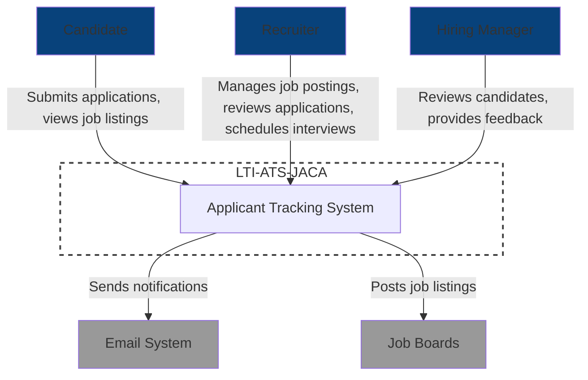

2. Container Diagram

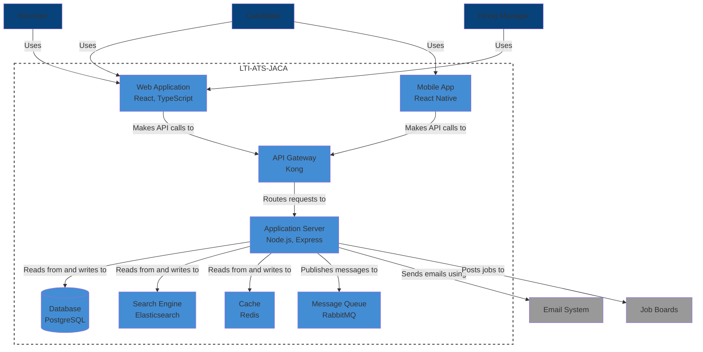

3. Component Diagram (focusing on the Application Server)

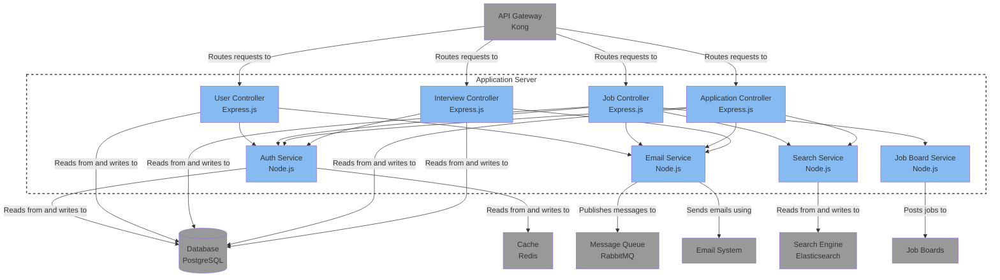

These C4 diagrams provide a comprehensive view of the LTI-ATS-JACA system at different levels of abstraction:

1. The Context Diagram shows the system's interactions with users and external systems.
2. The Container Diagram breaks down the system into its main components and shows their interactions.
3. The Component Diagram focuses on the Application Server, showing its internal components and their relationships.

These diagrams align with the given tech stack, system architecture, and "Must Have" priorities, providing a clear visualization of the system's structure and interactions.

```
Let's create the C4 Code diagrams for the following components:

- Job Controller
- Application Controller
- Interview Controller
- User Controller

Each component should include diagrams for:
- Interaction Diagram
- Sequence Diagram
- Class Diagram

The diagrams must be implemented using Mermaid and following the best UML practices.
```

Certainly! I'll create C4 Code diagrams for the Job Controller, Application Controller, Interview Controller, and User Controller components. For each component, I'll provide an Interaction Diagram, a Sequence Diagram, and a Class Diagram using Mermaid syntax and following UML best practices.

1. Job Controller

Interaction Diagram:

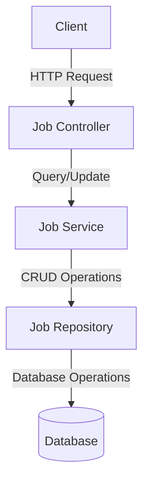

Sequence Diagram:

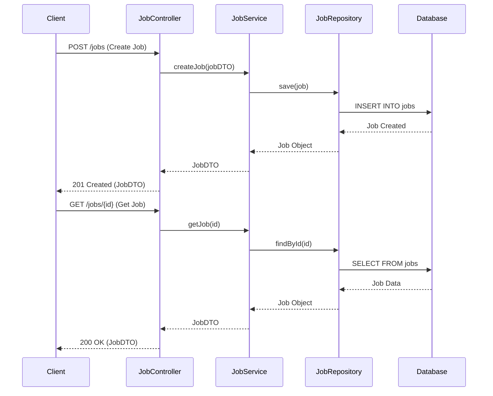

Class Diagram:

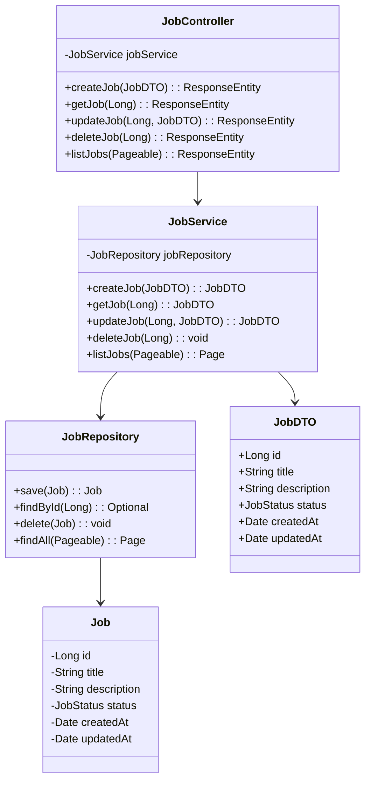

2. Application Controller

Interaction Diagram:

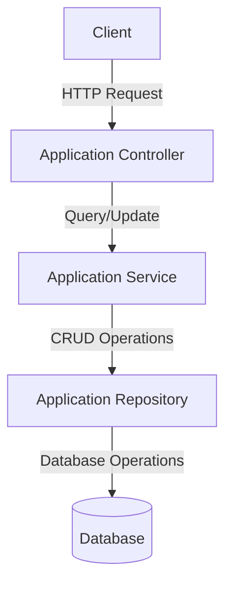

Sequence Diagram:

```mermaid
sequenceDiagram
    participant C as Client
    participant AC as ApplicationController
    participant AS as ApplicationService
    participant AR as ApplicationRepository
    participant DB as Database

    C->>AC: POST /applications (Submit Application)
    AC->>AS: submitApplication(applicationDTO)
    AS->>AR: save(application)
    AR->>DB: INSERT INTO applications
    DB-->>AR: Application Created
    AR-->>AS: Application Object
    AS-->>AC: ApplicationDTO
    AC-->>C: 201 Created (ApplicationDTO)

    C->>AC: GET /applications/{id} (Get Application)
    AC->>AS: getApplication(id)
    AS->>AR: findById(id)
    AR->>DB: SELECT FROM applications
    DB-->>AR: Application Data
    AR-->>AS: Application Object
    AS-->>AC: ApplicationDTO
    AC-->>C: 200 OK (ApplicationDTO)
```

Class Diagram:

```mermaid
classDiagram
    class ApplicationController {
        -ApplicationService applicationService
        +submitApplication(ApplicationDTO) : ResponseEntity
        +getApplication(Long) : ResponseEntity
        +updateApplication(Long, ApplicationDTO) : ResponseEntity
        +deleteApplication(Long) : ResponseEntity
        +listApplications(Pageable) : ResponseEntity
    }
    class ApplicationService {
        -ApplicationRepository applicationRepository
        +submitApplication(ApplicationDTO) : ApplicationDTO
        +getApplication(Long) : ApplicationDTO
        +updateApplication(Long, ApplicationDTO) : ApplicationDTO
        +deleteApplication(Long) : void
        +listApplications(Pageable) : Page<ApplicationDTO>
    }
    class ApplicationRepository {
        +save(Application) : Application
        +findById(Long) : Optional<Application>
        +delete(Application) : void
        +findAll(Pageable) : Page<Application>
    }
    class Application {
        -Long id
        -Long jobId
        -Long candidateId
        -ApplicationStatus status
        -Date appliedAt
    }
    class ApplicationDTO {
        +Long id
        +Long jobId
        +Long candidateId
        +ApplicationStatus status
        +Date appliedAt
    }

    ApplicationController --> ApplicationService
    ApplicationService --> ApplicationRepository
    ApplicationRepository --> Application
    ApplicationService --> ApplicationDTO
```

3. Interview Controller

Interaction Diagram:

```mermaid
graph TD
    A[Client] -->|HTTP Request| B[Interview Controller]
    B -->|Query/Update| C[Interview Service]
    C -->|CRUD Operations| D[Interview Repository]
    D -->|Database Operations| E[(Database)]
```

Sequence Diagram:

```mermaid
sequenceDiagram
    participant C as Client
    participant IC as InterviewController
    participant IS as InterviewService
    participant IR as InterviewRepository
    participant DB as Database

    C->>IC: POST /interviews (Schedule Interview)
    IC->>IS: scheduleInterview(interviewDTO)
    IS->>IR: save(interview)
    IR->>DB: INSERT INTO interviews
    DB-->>IR: Interview Scheduled
    IR-->>IS: Interview Object
    IS-->>IC: InterviewDTO
    IC-->>C: 201 Created (InterviewDTO)

    C->>IC: GET /interviews/{id} (Get Interview)
    IC->>IS: getInterview(id)
    IS->>IR: findById(id)
    IR->>DB: SELECT FROM interviews
    DB-->>IR: Interview Data
    IR-->>IS: Interview Object
    IS-->>IC: InterviewDTO
    IC-->>C: 200 OK (InterviewDTO)
```

Class Diagram:

```mermaid
classDiagram
    class InterviewController {
        -InterviewService interviewService
        +scheduleInterview(InterviewDTO) : ResponseEntity
        +getInterview(Long) : ResponseEntity
        +updateInterview(Long, InterviewDTO) : ResponseEntity
        +cancelInterview(Long) : ResponseEntity
        +listInterviews(Pageable) : ResponseEntity
    }
    class InterviewService {
        -InterviewRepository interviewRepository
        +scheduleInterview(InterviewDTO) : InterviewDTO
        +getInterview(Long) : InterviewDTO
        +updateInterview(Long, InterviewDTO) : InterviewDTO
        +cancelInterview(Long) : void
        +listInterviews(Pageable) : Page<InterviewDTO>
    }
    class InterviewRepository {
        +save(Interview) : Interview
        +findById(Long) : Optional<Interview>
        +delete(Interview) : void
        +findAll(Pageable) : Page<Interview>
    }
    class Interview {
        -Long id
        -Long applicationId
        -Long interviewerId
        -Date scheduledAt
        -InterviewStatus status
        -String feedback
    }
    class InterviewDTO {
        +Long id
        +Long applicationId
        +Long interviewerId
        +Date scheduledAt
        +InterviewStatus status
        +String feedback
    }

    InterviewController --> InterviewService
    InterviewService --> InterviewRepository
    InterviewRepository --> Interview
    InterviewService --> InterviewDTO
```

4. User Controller

Interaction Diagram:

```mermaid
graph TD
    A[Client] -->|HTTP Request| B[User Controller]
    B -->|Query/Update| C[User Service]
    C -->|CRUD Operations| D[User Repository]
    D -->|Database Operations| E[(Database)]
```

Sequence Diagram:

```mermaid
sequenceDiagram
    participant C as Client
    participant UC as UserController
    participant US as UserService
    participant UR as UserRepository
    participant DB as Database

    C->>UC: POST /users (Create User)
    UC->>US: createUser(userDTO)
    US->>UR: save(user)
    UR->>DB: INSERT INTO users
    DB-->>UR: User Created
    UR-->>US: User Object
    US-->>UC: UserDTO
    UC-->>C: 201 Created (UserDTO)

    C->>UC: GET /users/{id} (Get User)
    UC->>US: getUser(id)
    US->>UR: findById(id)
    UR->>DB: SELECT FROM users
    DB-->>UR: User Data
    UR-->>US: User Object
    US-->>UC: UserDTO
    UC-->>C: 200 OK (UserDTO)
```

Class Diagram:

```mermaid
classDiagram
    class UserController {
        -UserService userService
        +createUser(UserDTO) : ResponseEntity
        +getUser(Long) : ResponseEntity
        +updateUser(Long, UserDTO) : ResponseEntity
        +deleteUser(Long) : ResponseEntity
        +listUsers(Pageable) : ResponseEntity
    }
    class UserService {
        -UserRepository userRepository
        +createUser(UserDTO) : UserDTO
        +getUser(Long) : UserDTO
        +updateUser(Long, UserDTO) : UserDTO
        +deleteUser(Long) : void
        +listUsers(Pageable) : Page<UserDTO>
    }
    class UserRepository {
        +save(User) : User
        +findById(Long) : Optional<User>
        +delete(User) : void
        +findAll(Pageable) : Page<User>
    }
    class User {
        -Long id
        -String username
        -String email
        -String passwordHash
        -UserRole role
        -Date createdAt
        -Date lastLogin
    }
    class UserDTO {
        +Long id
        +String username
        +String email
        +UserRole role
        +Date createdAt
        +Date lastLogin
    }

    UserController --> UserService
    UserService --> UserRepository
    UserRepository --> User
    UserService --> UserDTO
```

These diagrams provide a comprehensive view of the structure and interactions within each controller component of the LTI-ATS-JACA system. They follow UML best practices and use Mermaid syntax for easy integration into documentation.

```
Taking in consideration this is the Tech Stack we're going to follow for LTI-ATS-JACA
1. Frontend: React.js with TypeScript
2. Backend: Node.js with Express.js
3. Database: PostgreSQL
4. Caching: Redis
5. Search Engine: Elasticsearch
6. Message Queue: RabbitMQ
7. Container Orchestration: Kubernetes
8. CI/CD: GitHub Actions
9. Monitoring: Prometheus and Grafana
10. Logging: ELK Stack (Elasticsearch, Logstash, Kibana)
11. API Gateway: Kong
12. Authentication: OAuth 2.0 with JSON Web Tokens (JWT)
13. Cloud Provider: AWS

Create an Architecture Diagram using Mermeid code and a full description of the diagram. Also consider that this should follow a micro-services architecture.
```

Certainly! I'll create an Architecture Diagram for LTI-ATS-JACA using Mermaid code, considering the specified tech stack and a microservices architecture. Here's the diagram followed by a full description:

```mermaid
graph TB
    subgraph "Client"
        A[React.js Frontend]
    end

    subgraph "API Gateway"
        B[Kong]
    end

    subgraph "Authentication"
        C[OAuth 2.0 / JWT]
    end

    subgraph "Microservices"
        D[Job Service]
        E[Application Service]
        F[Interview Service]
        G[User Service]
    end

    subgraph "Message Queue"
        H[RabbitMQ]
    end

    subgraph "Database"
        I[(PostgreSQL)]
    end

    subgraph "Caching"
        J[(Redis)]
    end

    subgraph "Search Engine"
        K[Elasticsearch]
    end

    subgraph "Monitoring & Logging"
        L[Prometheus]
        M[Grafana]
        N[ELK Stack]
    end

    subgraph "CI/CD"
        O[GitHub Actions]
    end

    subgraph "Container Orchestration"
        P[Kubernetes]
    end

    subgraph "Cloud Provider"
        Q[AWS]
    end

    A -->|HTTPS| B
    B -->|Auth| C
    B -->|REST API| D
    B -->|REST API| E
    B -->|REST API| F
    B -->|REST API| G
    D <--> H
    E <--> H
    F <--> H
    G <--> H
    D --> I
    E --> I
    F --> I
    G --> I
    D --> J
    E --> J
    F --> J
    G --> J
    D --> K
    E --> K
    F --> K
    G --> K
    D --> L
    E --> L
    F --> L
    G --> L
    L --> M
    D --> N
    E --> N
    F --> N
    G --> N
    O --> P
    P --> Q
```

Description of the Architecture:

1. Client: The frontend is built using React.js with TypeScript, providing a responsive and type-safe user interface.

2. API Gateway: Kong serves as the API gateway, handling incoming requests, routing them to appropriate microservices, and managing cross-cutting concerns like rate limiting and authentication.

3. Authentication: OAuth 2.0 with JWT is used for secure authentication and authorization across the system.

4. Microservices: The backend is divided into four main microservices:
   - Job Service: Manages job postings and related operations.
   - Application Service: Handles job applications and candidate information.
   - Interview Service: Manages interview scheduling and feedback.
   - User Service: Handles user management and authentication.

   Each microservice is built using Node.js with Express.js.

5. Message Queue: RabbitMQ is used for asynchronous communication between microservices, enabling event-driven architecture and improving system resilience.

6. Database: PostgreSQL serves as the primary database for storing structured data across all microservices.

7. Caching: Redis is used for caching frequently accessed data, reducing database load and improving response times.

8. Search Engine: Elasticsearch provides powerful full-text search capabilities, particularly useful for job and candidate searches.

9. Monitoring & Logging:
   - Prometheus collects metrics from all services.
   - Grafana visualizes the metrics collected by Prometheus.
   - ELK Stack (Elasticsearch, Logstash, Kibana) is used for centralized logging and log analysis.

10. CI/CD: GitHub Actions automates the build, test, and deployment processes.

11. Container Orchestration: Kubernetes manages the deployment, scaling, and operations of application containers across clusters of hosts.

12. Cloud Provider: The entire infrastructure is hosted on AWS, leveraging its scalable and reliable cloud services.

This architecture follows microservices best practices:

- Loose coupling: Each service operates independently and communicates via well-defined APIs.
- Scalability: Services can be scaled independently based on demand.
- Resilience: Failure in one service doesn't bring down the entire system.
- Technology diversity: Each service can potentially use different technologies if needed.
- Continuous deployment: Services can be deployed independently, enabling faster iterations.

The use of Kubernetes for container orchestration allows for efficient management of the microservices, while the API Gateway provides a single entry point for clients, simplifying the client-side code and providing a unified interface for the microservices.

Monitoring, logging, and CI/CD are integral parts of the architecture, ensuring the system's health, performance, and rapid, reliable deployments.

This architecture provides a robust, scalable, and maintainable foundation for the LTI-ATS-JACA applicant tracking system.

```
Each micro-service should have its own database, reflect that in the diagram.
```

You're absolutely right, and I apologize for the oversight. In a true microservices architecture, each service should indeed have its own database. I'll update the diagram to reflect this important aspect. Here's the revised architecture diagram:

```mermaid
graph TB
    subgraph "Client"
        A[React.js Frontend]
    end

    subgraph "API Gateway"
        B[Kong]
    end

    subgraph "Authentication"
        C[OAuth 2.0 / JWT]
    end

    subgraph "Microservices"
        subgraph "Job Service"
            D[Job Service]
            D1[(Job DB)]
        end
        subgraph "Application Service"
            E[Application Service]
            E1[(Application DB)]
        end
        subgraph "Interview Service"
            F[Interview Service]
            F1[(Interview DB)]
        end
        subgraph "User Service"
            G[User Service]
            G1[(User DB)]
        end
    end

    subgraph "Message Queue"
        H[RabbitMQ]
    end

    subgraph "Caching"
        J[(Redis)]
    end

    subgraph "Search Engine"
        K[Elasticsearch]
    end

    subgraph "Monitoring & Logging"
        L[Prometheus]
        M[Grafana]
        N[ELK Stack]
    end

    subgraph "CI/CD"
        O[GitHub Actions]
    end

    subgraph "Container Orchestration"
        P[Kubernetes]
    end

    subgraph "Cloud Provider"
        Q[AWS]
    end

    A -->|HTTPS| B
    B -->|Auth| C
    B -->|REST API| D
    B -->|REST API| E
    B -->|REST API| F
    B -->|REST API| G
    D <--> H
    E <--> H
    F <--> H
    G <--> H
    D <--> D1
    E <--> E1
    F <--> F1
    G <--> G1
    D --> J
    E --> J
    F --> J
    G --> J
    D --> K
    E --> K
    F --> K
    G --> K
    D --> L
    E --> L
    F --> L
    G --> L
    L --> M
    D --> N
    E --> N
    F --> N
    G --> N
    O --> P
    P --> Q
```

Description of the updated architecture:

The main change in this updated diagram is that each microservice now has its own dedicated database:

1. Job Service: Connected to Job DB
2. Application Service: Connected to Application DB
3. Interview Service: Connected to Interview DB
4. User Service: Connected to User DB

All these databases are represented as separate entities (D1, E1, F1, G1) within their respective microservice subgraphs.

This design adheres more closely to microservices principles:

1. Database per Service: Each microservice has its own private database, ensuring loose coupling and independent scalability.

2. Data Autonomy: Each service has complete control over its data model and schema, allowing for independent evolution.

3. Polyglot Persistence: While we're using PostgreSQL across the board in this case, the architecture now allows for different database technologies per service if needed in the future.

4. Scalability: Each database can be scaled independently based on the specific needs of its service.

5. Fault Isolation: Issues with one database don't directly impact other services.

The rest of the architecture remains the same:

- The API Gateway (Kong) routes requests to the appropriate microservices.
- RabbitMQ facilitates asynchronous communication between services.
- Redis provides caching capabilities across services.
- Elasticsearch offers powerful search functionality.
- Monitoring and logging tools (Prometheus, Grafana, ELK Stack) oversee the entire system.
- GitHub Actions manage the CI/CD pipeline.
- Kubernetes orchestrates the containerized services.
- The entire infrastructure is hosted on AWS.

This revised architecture provides a more accurate representation of a microservices-based system, with each service maintaining its own data store. This approach enhances service independence, allows for better scalability, and provides more flexibility in terms of data management and evolution for each microservice.

```
Create an Entity Relationship Diagram for the "Must Have" features and following the micro-services architecture planned using Mermaid, following the best practices for UML syntax. Include the field names, field types, primary keys and foreign keys required for each entity following the best practices for RDMS.
```

Certainly! I'll create an Entity Relationship Diagram (ERD) for the "Must Have" features, following the microservices architecture we've planned. This ERD will be divided into four parts, one for each microservice (Job, Application, Interview, and User). I'll use Mermaid syntax and follow best practices for UML and RDBMS design.

```mermaid
erDiagram
    %% Job Service
    JOB {
        BIGSERIAL job_id PK
        VARCHAR(255) title
        TEXT description
        VARCHAR(50) status
        BIGINT created_by_user_id FK
        TIMESTAMP created_at
        TIMESTAMP updated_at
    }
    JOB_SCREENING_QUESTION {
        BIGSERIAL question_id PK
        BIGINT job_id FK
        TEXT question
        VARCHAR(50) question_type
    }

    %% Application Service
    CANDIDATE {
        BIGSERIAL candidate_id PK
        VARCHAR(100) first_name
        VARCHAR(100) last_name
        VARCHAR(255) email
        TEXT resume
        TIMESTAMP created_at
    }
    APPLICATION {
        BIGSERIAL application_id PK
        BIGINT job_id FK
        BIGINT candidate_id FK
        VARCHAR(50) status
        TIMESTAMP applied_at
    }
    EEO_DATA {
        BIGSERIAL eeo_id PK
        BIGINT candidate_id FK
        VARCHAR(50) gender
        VARCHAR(50) ethnicity
        BOOLEAN veteran_status
        BOOLEAN disability_status
    }

    %% Interview Service
    INTERVIEW {
        BIGSERIAL interview_id PK
        BIGINT application_id FK
        BIGINT interviewer_id FK
        TIMESTAMP scheduled_at
        VARCHAR(50) status
        TEXT feedback
    }

    %% User Service
    USER {
        BIGSERIAL user_id PK
        VARCHAR(100) username
        VARCHAR(255) email
        VARCHAR(255) password_hash
        VARCHAR(50) role
        TIMESTAMP created_at
        TIMESTAMP last_login
    }

    %% Relationships
    JOB ||--o{ JOB_SCREENING_QUESTION : "has"
    JOB ||--o{ APPLICATION : "receives"
    CANDIDATE ||--o{ APPLICATION : "submits"
    CANDIDATE ||--o{ EEO_DATA : "provides"
    APPLICATION ||--o{ INTERVIEW : "schedules"
    USER ||--o{ JOB : "creates"
    USER ||--o{ INTERVIEW : "conducts"
```

Description of the ERD:

1. Job Service:
   - JOB: Represents job postings.
   - JOB_SCREENING_QUESTION: Stores screening questions for each job.

2. Application Service:
   - CANDIDATE: Stores information about job applicants.
   - APPLICATION: Represents a candidate's application for a specific job.
   - EEO_DATA: Contains Equal Employment Opportunity data for candidates.

3. Interview Service:
   - INTERVIEW: Stores interview details for applications.

4. User Service:
   - USER: Represents system users (recruiters, hiring managers, admins).

Key points about the design:

1. Primary Keys: Each table has a BIGSERIAL primary key, which auto-increments and ensures each record has a unique identifier.

2. Foreign Keys: Foreign keys are used to establish relationships between tables, even across different services. In a microservices architecture, these would be logical relations rather than actual foreign key constraints in the database.

3. Data Types: Appropriate PostgreSQL data types are used (e.g., VARCHAR for strings, TEXT for long text, TIMESTAMP for dates and times).

4. Normalization: The design follows normalization principles to reduce data redundancy.

5. Scalability: The use of BIGSERIAL for IDs allows for a large number of records.

6. Audit Fields: Created_at and updated_at fields are included where appropriate for auditing purposes.

7. Status Fields: Enum-like status fields are used to track the state of jobs, applications, and interviews.

Inter-service relationships:
- The JOB table in the Job Service has a foreign key to the USER table in the User Service (created_by_user_id).
- The APPLICATION table in the Application Service has a foreign key to the JOB table in the Job Service.
- The INTERVIEW table in the Interview Service has foreign keys to the APPLICATION table in the Application Service and the USER table in the User Service.

In a true microservices architecture, these cross-service relationships would be managed at the application level rather than through direct database foreign keys. Each service would maintain its own database integrity, and inter-service data consistency would be ensured through careful API design and eventual consistency patterns.

This ERD provides a solid foundation for the "Must Have" features of the LTI-ATS-JACA system, following best practices for both UML and RDBMS design in a microservices context.
