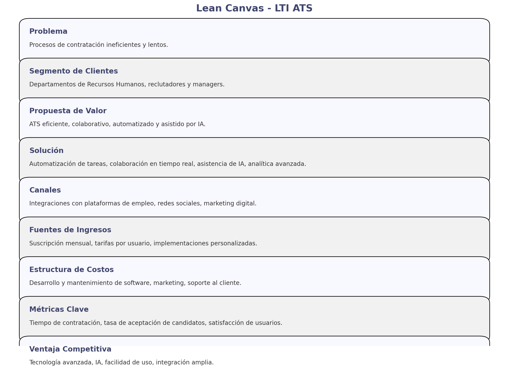
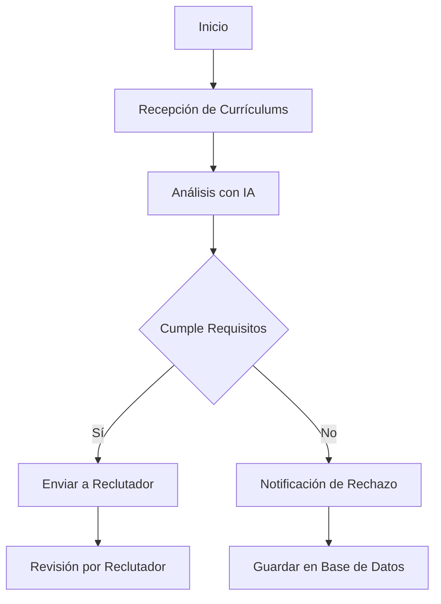
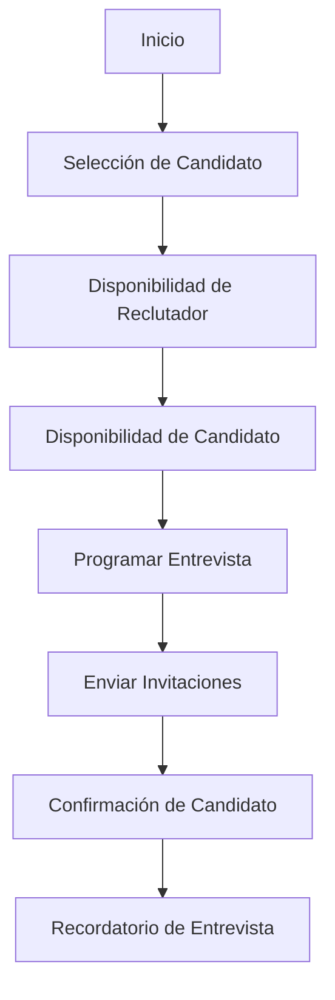
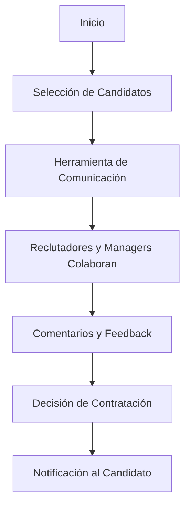
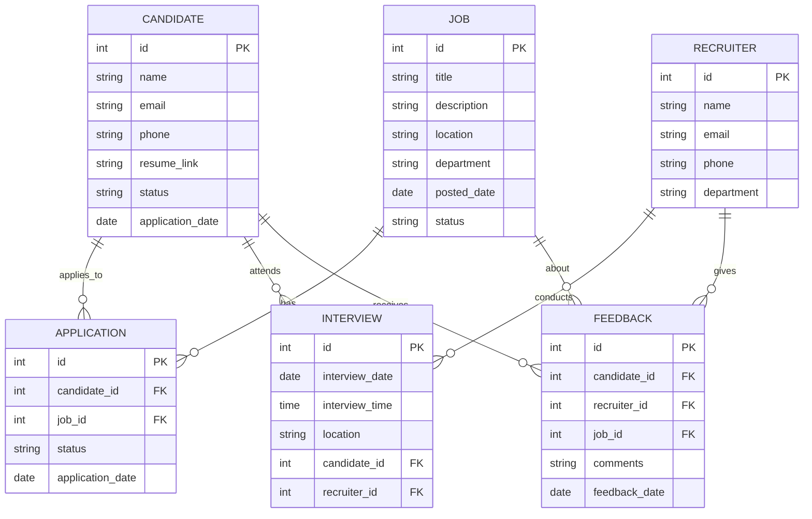
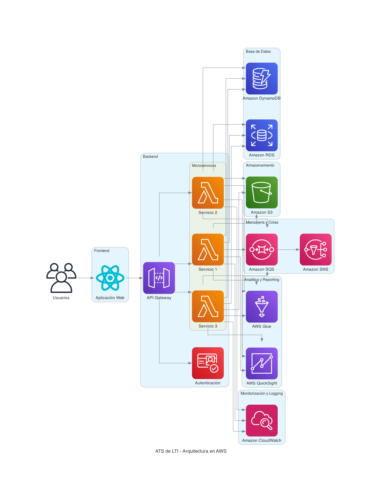
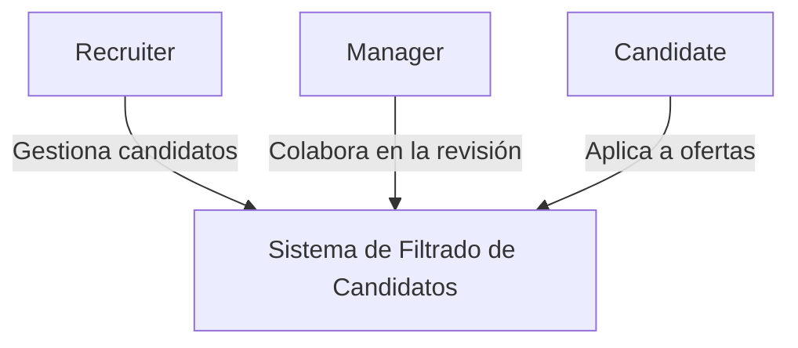
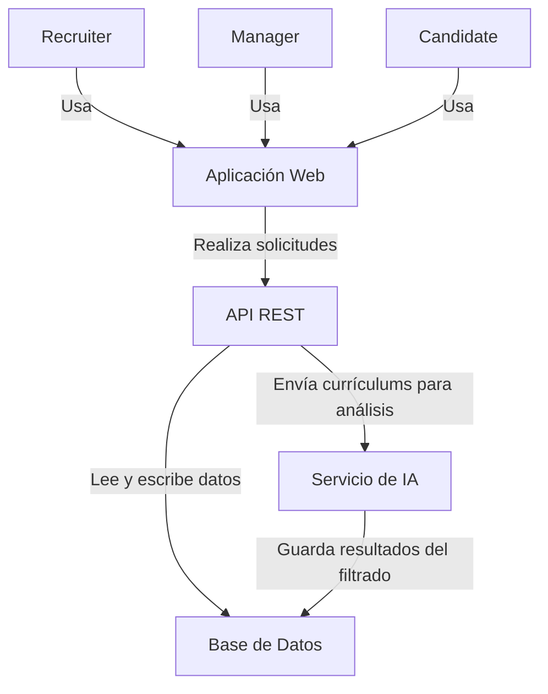
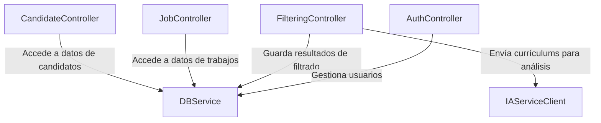
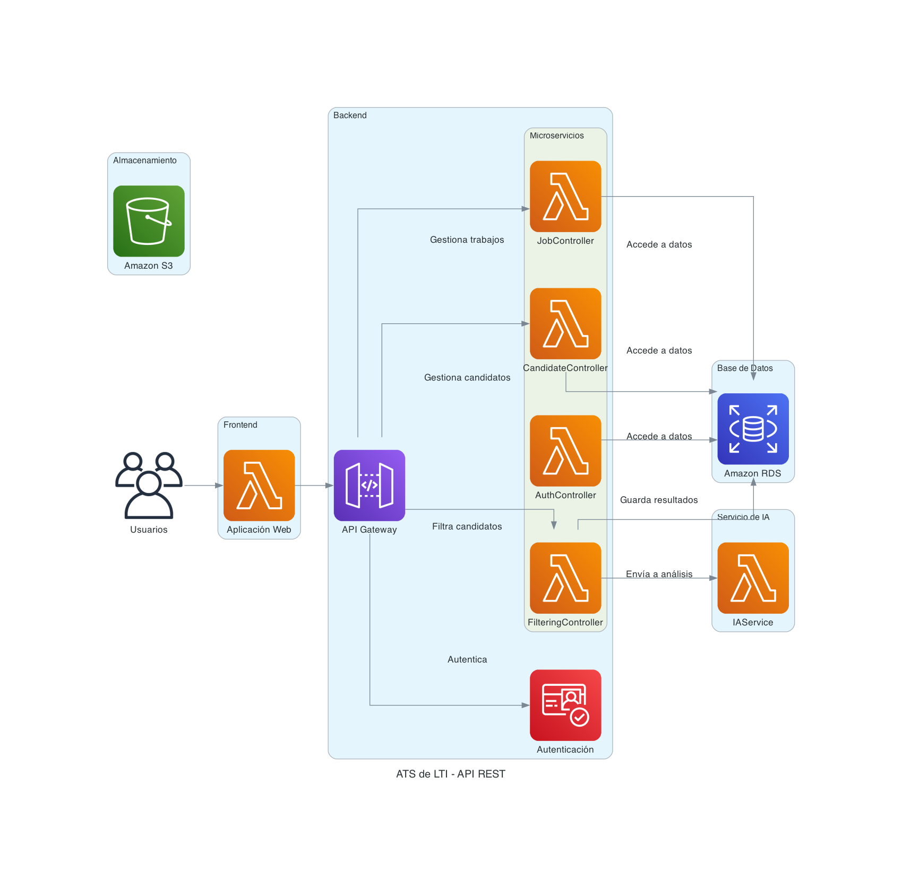

# LTI-JCO

- [Descripción breve del software LTI](#descripción-breve-del-software-lti)
- [Valor añadido y ventajas competitivas](#valor-añadido-y-ventajas-competitivas)
- [Funciones principales](#funciones-principales)
- [Diagrama Lean Canvas](#diagrama-lean-canvas)
- [Casos de Uso Principales del ATS de LTI](#casos-de-uso-principales-del-ats-de-lti)
- [Modelo de datos](#modelo-de-datos)
- [Diseño del Sistema a Alto Nivel](#diseño-del-sistema-a-alto-nivel)
- [Diagrama AWS](#diagrama-aws)
- [Diagrama C4](#diagrama-c4)

### Descripción breve del software LTI

LTI es un avanzado sistema de seguimiento de candidatos (ATS) diseñado para transformar y optimizar el proceso de contratación. Con un enfoque en la eficiencia, la colaboración en tiempo real y la automatización impulsada por inteligencia artificial, LTI permite a los departamentos de recursos humanos y a los reclutadores gestionar de manera efectiva el ciclo de vida completo de la contratación, desde la solicitud hasta la incorporación del nuevo empleado.

### Valor añadido y ventajas competitivas

- **Eficiencia mejorada:** LTI automatiza tareas repetitivas y administra grandes volúmenes de datos de candidatos, permitiendo a los equipos de recursos humanos centrarse en la toma de decisiones estratégicas.
- **Colaboración en tiempo real:** Integración fluida de comunicación y herramientas colaborativas para que los reclutadores y gerentes trabajen conjuntamente en tiempo real.
- **Asistencia de IA:** Utiliza inteligencia artificial para mejorar la preselección de candidatos, análisis de currículums, programación de entrevistas y generación de informes detallados.
- **Interfaz intuitiva:** Diseñada para ser fácil de usar, lo que reduce el tiempo de capacitación y mejora la adopción por parte del equipo.
- **Analíticas y reportes avanzados:** Ofrece insights y reportes detallados para ayudar a las empresas a mejorar continuamente sus procesos de contratación.

### Funciones principales

1. **Automatización del flujo de trabajo:** Automatización de tareas rutinarias como el envío de correos electrónicos, recordatorios de entrevistas y actualización de estados de los candidatos.
2. **Preselección y análisis de candidatos impulsados por IA:** Algoritmos de IA que filtran y analizan currículums, identificando los candidatos más adecuados basados en criterios personalizados.
3. **Portal de colaboración en tiempo real:** Herramientas integradas de chat y videoconferencia que permiten la colaboración sin interrupciones entre reclutadores y gerentes.
4. **Gestión centralizada de candidatos:** Base de datos unificada que almacena toda la información de los candidatos, incluyendo currículums, cartas de presentación, notas de entrevistas y más.
5. **Analíticas y reportes:** Dashboard interactivo con métricas clave y reportes personalizables para evaluar el rendimiento del proceso de contratación.
6. **Programación de entrevistas:** Herramientas de programación automatizadas que sincronizan calendarios y envían invitaciones a entrevistas.
7. **Integraciones con otras herramientas:** Integración con sistemas de gestión de recursos humanos (HRMS), plataformas de redes sociales y sitios de empleo para una gestión de candidatos sin fisuras.

### Diagrama Lean Canvas



### Casos de Uso Principales del ATS de LTI

#### Caso de Uso 1: Automatización del Filtrado de Candidatos

**Descripción**:
El ATS de LTI automatiza el proceso de filtrado inicial de candidatos, utilizando algoritmos de inteligencia artificial para evaluar currículums y perfiles, seleccionando los más adecuados según los requisitos del puesto.

**Diagrama Mermaid**:


#### Caso de Uso 2: Programación Automática de Entrevistas

**Descripción**:
LTI permite la programación automática de entrevistas, sincronizando las agendas de los reclutadores y los candidatos, y enviando recordatorios para evitar ausencias y retrasos.

**Diagrama Mermaid**:


#### Caso de Uso 3: Colaboración en Tiempo Real entre Reclutadores y Managers

**Descripción**:
El sistema permite la colaboración en tiempo real entre los reclutadores y los managers a través de herramientas de comunicación integradas, facilitando la toma de decisiones rápidas y efectivas.

**Diagrama Mermaid**:


Estos casos de uso ilustran cómo LTI puede optimizar y facilitar los procesos de reclutamiento mediante la automatización, la programación eficiente y la colaboración en tiempo real.

### Modelo de datos



**Relaciones**

- Un candidato puede tener múltiples aplicaciones (one-to-many).
- Un trabajo puede tener múltiples aplicaciones (one-to-many).
- Un reclutador puede conducir múltiples entrevistas (one-to-many).
- Un candidato puede asistir a múltiples entrevistas (one-to-many).
- Un candidato puede recibir múltiples comentarios de feedback (one-to-many).
- Un trabajo puede tener múltiples comentarios de feedback sobre candidatos (one-to-many).
- Un reclutador puede dar múltiples comentarios de feedback (one-to-many).

### Diseño del Sistema a Alto Nivel

El ATS de LTI será diseñado como una arquitectura basada en microservicios utilizando AWS (Amazon Web Services) para garantizar escalabilidad, alta disponibilidad y facilidad de mantenimiento. A continuación, se describen los componentes clave y el flujo general del sistema.

#### Componentes Principales

1. **Frontend**:
   - **React.js**: Aplicación web para la interfaz de usuario.
   - **AWS S3**: Almacenamiento de contenido estático (HTML, CSS, JS).

2. **Backend**:
   - **Microservicios**: Implementados en **Node.js** o **Python**, utilizando **AWS Lambda** para ejecutar código sin servidor.
   - **API Gateway**: **AWS API Gateway** para gestionar las solicitudes API y enrutarlas a los microservicios correspondientes.
   - **Autenticación**: **Amazon Cognito** para la gestión de usuarios y autenticación.

3. **Base de Datos**:
   - **Amazon RDS**: Base de datos relacional para almacenar datos estructurados.
   - **Amazon DynamoDB**: Base de datos NoSQL para datos no estructurados o semi-estructurados.

4. **Almacenamiento**:
   - **AWS S3**: Almacenamiento de currículums, documentos y otros archivos.

5. **Mensajería y Colas**:
   - **Amazon SQS**: Colas de mensajes para la gestión de tareas asíncronas.
   - **Amazon SNS**: Servicio de notificación para enviar mensajes y alertas.

6. **Analítica y Reporting**:
   - **AWS QuickSight**: Herramienta de análisis y visualización de datos.
   - **AWS Glue**: Servicio de preparación de datos para ETL (Extract, Transform, Load).

7. **Monitorización y Logging**:
   - **Amazon CloudWatch**: Monitorización del rendimiento y logging.
   - **AWS X-Ray**: Seguimiento de solicitudes para el análisis y depuración.

### Diagrama AWS



### Diagrama C4
Vamos a generar un diagrama C4 que profundice en el componente "API REST" del sistema ATS de LTI y explicar la arquitectura del sistema en los cuatro niveles: contexto, contenedores, componentes y código.

#### Nivel 1: Diagrama de Contexto



El diagrama de contexto muestra cómo interactúan los actores principales (Recruiter, Manager, Candidate) con el sistema de filtrado de candidatos. Este nivel proporciona una visión general de quién usa el sistema y cómo se relaciona con él.

#### Nivel 2: Diagrama de Contenedores



El diagrama de contenedores descompone el sistema en varios contenedores:
- **Aplicación Web**: La interfaz de usuario que utilizan los reclutadores, managers y candidatos.
- **API REST**: Proporciona acceso a los servicios del sistema.
- **Base de Datos**: Almacena los datos de candidatos, trabajos y resultados del filtrado.
- **Servicio de IA**: Analiza y filtra los currículums de los candidatos.

#### Nivel 3: Diagrama de Componentes


El diagrama de componentes desglosa el API REST en sus componentes internos:
- **AuthController**: Gestiona la autenticación y autorización de usuarios.
- **CandidateController**: Gestiona las operaciones relacionadas con los candidatos.
- **JobController**: Gestiona las operaciones relacionadas con los trabajos.
- **FilteringController**: Gestiona el filtrado de candidatos.
- **DBService**: Servicio para acceder a la base de datos.
- **IAServiceClient**: Cliente para comunicarse con el Servicio de IA.

#### Nivel 4: Diagrama de Código

Para este nivel, se proporciona un ejemplo básico de cómo podría verse el código en uno de los componentes. Aquí, detallamos el `FilteringController`.

```javascript
// FilteringController.js
const express = require('express');
const router = express.Router();
const dbService = require('../services/DBService');
const iaServiceClient = require('../services/IAServiceClient');

// Endpoint para filtrar candidatos
router.post('/filter', async (req, res) => {
    try {
        const { jobId, resume } = req.body;
        const analysisResult = await iaServiceClient.analyzeResume(resume);

        const filteredCandidate = await dbService.saveFilteringResult(jobId, analysisResult);
        res.status(200).json(filteredCandidate);
    } catch (error) {
        res.status(500).json({ error: error.message });
    }
});

module.exports = router;
```
El nivel de código proporciona un ejemplo de cómo podría implementarse uno de los componentes, en este caso, el `FilteringController`. Este componente recibe solicitudes para filtrar candidatos, envía los currículums al Servicio de IA para su análisis y guarda los resultados en la base de datos.

#### Diagrama C4 con Diagrams

