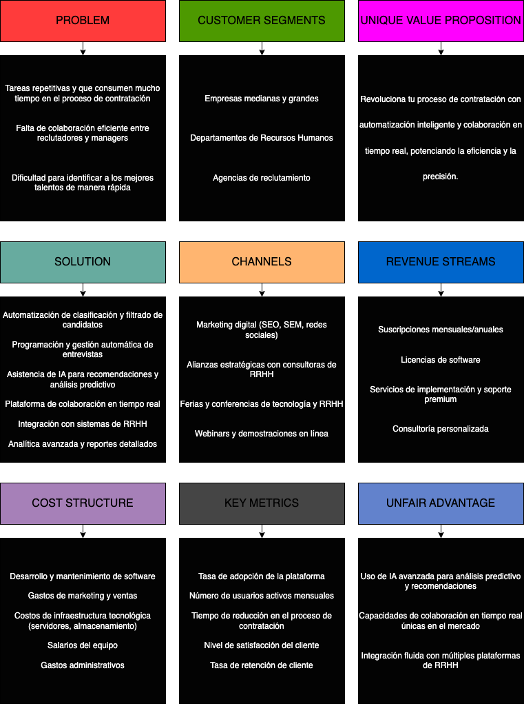
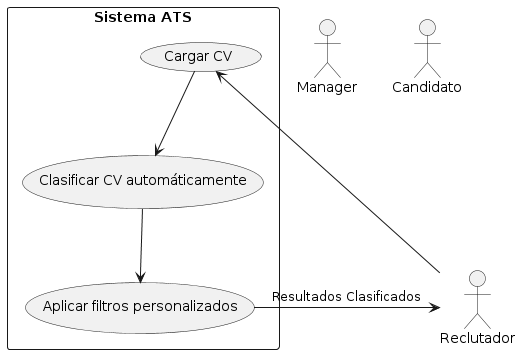
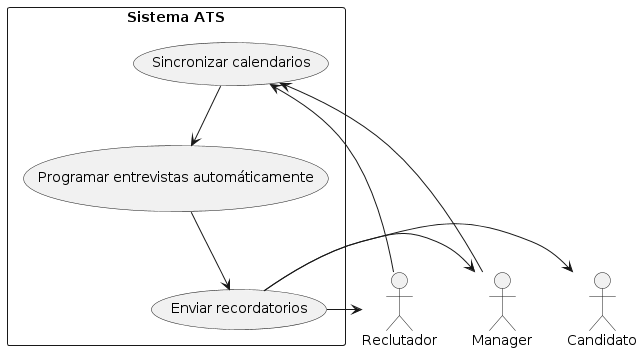
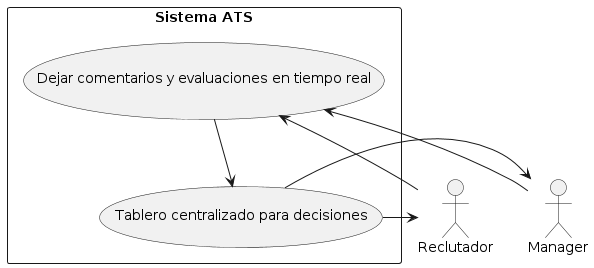
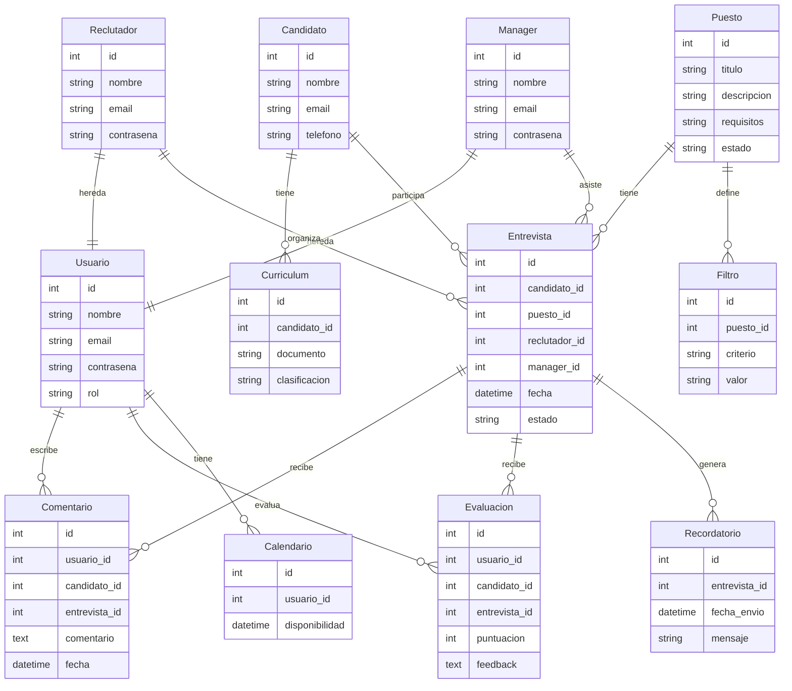
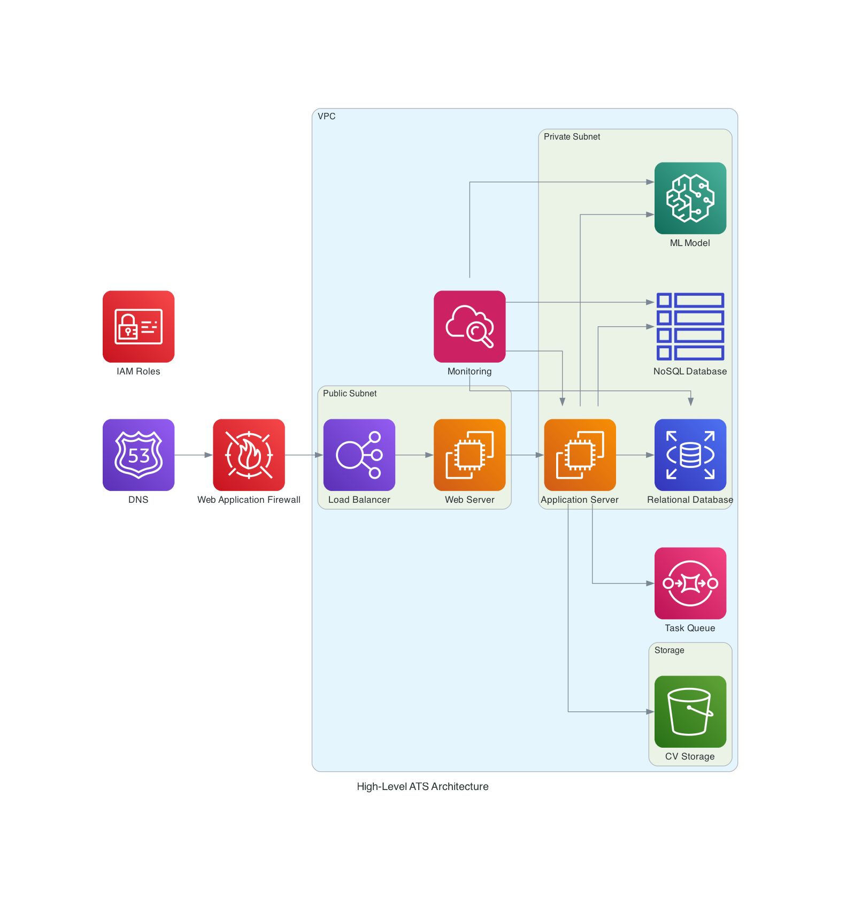
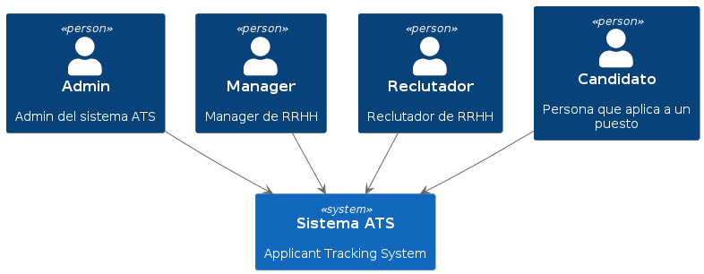
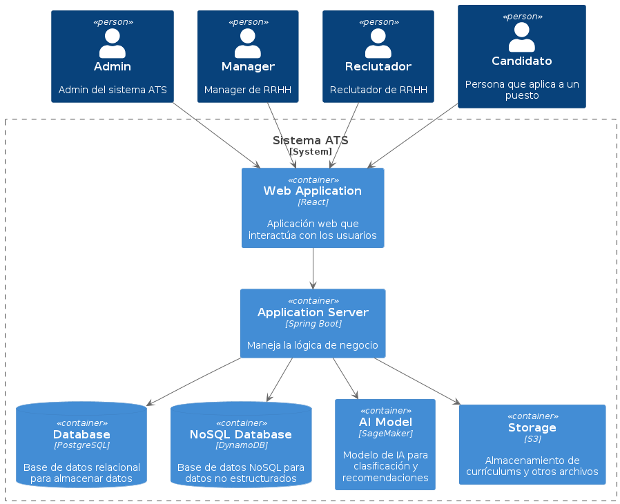
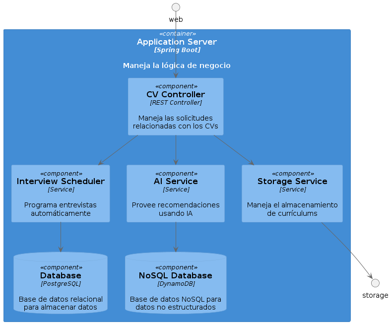
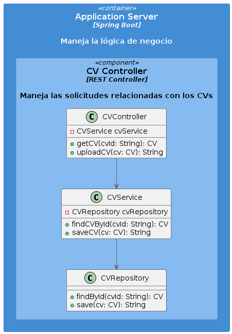

# LTI-JCO

### Tabla de Contenidos

  - [Descripción breve del software LTI](#descripción-breve-del-software-lti)
  - [Valor añadido y ventajas competitivas](#valor-añadido-y-ventajas-competitivas)
  - [Funciones principales](#funciones-principales)
  - [Lean Canvas para el ATS de LTI](#lean-canvas-para-el-ats-de-lti)
  - [Descripción de los 3 principales casos de uso](#descripción-de-los-3-principales-casos-de-uso)
  - [Modelo de datos](#modelo-de-datos)
  - [Diseño del Sistema a Alto Nivel](#diseño-del-sistema-a-alto-nivel)
  - [Diagrama C4](#diagrama-c4)

### Descripción breve del software LTI

LTI es un sistema avanzado de seguimiento de candidatos (ATS) diseñado para revolucionar el proceso de reclutamiento. Nuestro software combina la última tecnología en automatización, inteligencia artificial y colaboración en tiempo real para mejorar la eficiencia y la efectividad de los departamentos de recursos humanos. Con LTI, las empresas pueden gestionar sus procesos de contratación de manera más rápida, colaborativa y precisa.

### Valor añadido y ventajas competitivas

1. **Automatización inteligente**: LTI automatiza tareas repetitivas y consume tiempo, como la clasificación de currículums y la programación de entrevistas, permitiendo a los reclutadores enfocarse en tareas estratégicas.

2. **Asistencia de IA avanzada**: Nuestra IA no solo ayuda en la clasificación de candidatos, sino que también proporciona recomendaciones basadas en datos históricos y análisis predictivos para identificar a los mejores talentos.

3. **Colaboración en tiempo real**: LTI facilita la colaboración entre reclutadores y managers a través de una plataforma centralizada, permitiendo comentarios, evaluaciones y decisiones en tiempo real.

4. **Experiencia de usuario optimizada**: Una interfaz intuitiva y fácil de usar que mejora la adopción y el uso diario por parte de los equipos de recursos humanos y de contratación.

5. **Integración completa**: LTI se integra perfectamente con otras herramientas y plataformas de gestión de recursos humanos, lo que garantiza una interoperabilidad y flujo de datos sin interrupciones.

6. **Analítica y reportes detallados**: Proporcionamos análisis en profundidad y reportes personalizables que permiten a las empresas tomar decisiones basadas en datos y mejorar continuamente sus procesos de contratación.

### Funciones principales

1. **Clasificación y filtrado automático de candidatos**:
   - **IA de análisis de CV**: Utiliza inteligencia artificial para escanear y clasificar currículums, destacando los perfiles más adecuados según las descripciones de los puestos.
   - **Filtro automatizado**: Aplica filtros personalizados para reducir la cantidad de candidatos y centrarse en los más prometedores.

2. **Programación y gestión de entrevistas**:
   - **Calendario inteligente**: Sincroniza con los calendarios de los entrevistadores y candidatos para programar entrevistas automáticamente en los momentos disponibles.
   - **Recordatorios automáticos**: Envía recordatorios a los candidatos y entrevistadores para minimizar los no-shows.

3. **Asistencia de IA en la toma de decisiones**:
   - **Recomendaciones de candidatos**: Basado en datos históricos y criterios específicos, la IA sugiere los mejores candidatos para cada puesto.
   - **Análisis predictivo**: Prevén tendencias y patrones para ayudar en la planificación de futuras necesidades de contratación.

4. **Plataforma de colaboración en tiempo real**:
   - **Comentarios y evaluaciones en vivo**: Permite a los miembros del equipo dejar comentarios y evaluaciones en tiempo real durante el proceso de entrevistas.
   - **Tablero de decisiones**: Centraliza la toma de decisiones con herramientas de votación y consenso.

5. **Integraciones y API**:
   - **Integración con plataformas de RRHH**: Compatible con sistemas de gestión de recursos humanos (HRMS) y otras herramientas de reclutamiento.
   - **API abierta**: Permite personalizaciones y extensiones para adaptarse a las necesidades específicas de la empresa.

6. **Analítica avanzada y reportes**:
   - **Dashboards personalizables**: Visualiza datos clave de contratación en tiempo real.
   - **Reportes detallados**: Genera reportes específicos sobre rendimiento de candidatos, tiempos de contratación, y otros KPIs relevantes.

7. **Portal de candidatos**:
   - **Aplicaciones fáciles**: Interfaz amigable para los candidatos que simplifica el proceso de solicitud.
   - **Seguimiento del estado de la solicitud**: Permite a los candidatos ver el estado de su aplicación en tiempo real.

### Lean Canvas para el ATS de LTI

### Descripción detallada del Lean Canvas

#### Problema
1. **Tareas repetitivas y que consumen mucho tiempo en el proceso de contratación**: Los reclutadores pierden mucho tiempo en tareas manuales como la revisión de currículums y la programación de entrevistas.
2. **Falta de colaboración eficiente entre reclutadores y managers**: La comunicación y la toma de decisiones pueden ser lentas y desorganizadas.
3. **Dificultad para identificar a los mejores talentos de manera rápida**: La selección de candidatos puede ser ineficiente, lo que lleva a la pérdida de buenos candidatos.

#### Segmentos de Clientes
1. **Empresas medianas y grandes**: Organizaciones con una alta demanda de contratación y recursos suficientes para invertir en tecnología avanzada.
2. **Departamentos de Recursos Humanos**: Equipos internos de RRHH que buscan mejorar sus procesos de contratación.
3. **Agencias de reclutamiento**: Empresas especializadas en la contratación de personal para otras organizaciones.

#### Propuesta de Valor Única
- **"Revoluciona tu proceso de contratación con automatización inteligente y colaboración en tiempo real, potenciando la eficiencia y la precisión."**

#### Solución
1. **Automatización de clasificación y filtrado de candidatos**: Uso de IA para revisar y clasificar currículums.
2. **Programación y gestión automática de entrevistas**: Herramientas que sincronizan agendas y envían recordatorios.
3. **Asistencia de IA para recomendaciones y análisis predictivo**: IA que sugiere los mejores candidatos y prevé necesidades futuras.
4. **Plataforma de colaboración en tiempo real**: Espacio centralizado para comentarios y decisiones.
5. **Integración con sistemas de RRHH**: Compatibilidad con otras herramientas de gestión.
6. **Analítica avanzada y reportes detallados**: Dashboards y reportes personalizables para análisis profundo.

#### Canales
1. **Marketing digital (SEO, SEM, redes sociales)**: Estrategias para atraer tráfico y conversiones.
2. **Alianzas estratégicas con consultoras de RRHH**: Colaboraciones para ampliar el alcance.
3. **Ferias y conferencias de tecnología y RRHH**: Eventos para mostrar el producto.
4. **Webinars y demostraciones en línea**: Presentaciones para educar y atraer clientes.

#### Fuentes de Ingresos
1. **Suscripciones mensuales/anuales**: Modelo de suscripción basado en el uso del software.
2. **Licencias de software**: Pago por uso de licencias.
3. **Servicios de implementación y soporte premium**: Servicios adicionales para personalización y soporte avanzado.
4. **Consultoría personalizada**: Servicios de consultoría específicos para necesidades particulares.

#### Estructura de Costos
1. **Desarrollo y mantenimiento de software**: Gastos en tecnología y desarrollo continuo.
2. **Gastos de marketing y ventas**: Inversiones en promoción y ventas.
3. **Costos de infraestructura tecnológica (servidores, almacenamiento)**: Gastos en hardware y servicios en la nube.
4. **Salarios del equipo**: Pago al personal de la empresa.
5. **Gastos administrativos**: Costos operativos generales.

#### Métricas Clave
1. **Tasa de adopción de la plataforma**: Medida de cuántas nuevas empresas están utilizando el ATS.
2. **Número de usuarios activos mensuales**: Cuántos usuarios están utilizando activamente el software cada mes.
3. **Tiempo de reducción en el proceso de contratación**: Cuánto tiempo se ahorra en la contratación.
4. **Nivel de satisfacción del cliente**: Feedback y encuestas de satisfacción.
5. **Tasa de retención de clientes**: Porcentaje de clientes que renuevan su suscripción.

#### Ventaja Injusta
1. **Uso de IA avanzada para análisis predictivo y recomendaciones**: Tecnología superior en IA.
2. **Capacidades de colaboración en tiempo real únicas en el mercado**: Características que facilitan una colaboración efectiva.
3. **Integración fluida con múltiples plataformas de RRHH**: Compatibilidad con diversas herramientas de gestión.

### Descripción de los 3 principales casos de uso

#### Caso de Uso 1: Clasificación y Filtrado Automático de Candidatos
Los usuarios logueados (reclutadores) pueden cargar currículums, y el sistema los clasifica automáticamente utilizando IA, aplicando filtros personalizados según los criterios del puesto de trabajo.

En este diagrama, el reclutador carga los currículums en el sistema. La IA del sistema clasifica los currículums automáticamente y aplica filtros personalizados. El reclutador recibe los resultados clasificados.

#### Caso de Uso 2: Programación y Gestión de Entrevistas
Los usuarios logueados (reclutadores y managers) pueden sincronizar sus calendarios y programar entrevistas automáticamente con los candidatos seleccionados. El sistema envía recordatorios automáticos tanto a candidatos como a entrevistadores.

En este diagrama, tanto reclutadores como managers sincronizan sus calendarios con el sistema. El sistema programa entrevistas automáticamente y envía recordatorios a candidatos, reclutadores y managers.

#### Caso de Uso 3: Colaboración en Tiempo Real
Los usuarios logueados (reclutadores y managers) pueden dejar comentarios y evaluaciones en tiempo real sobre los candidatos durante el proceso de entrevistas. Además, tienen un tablero centralizado para tomar decisiones conjuntas.

En este diagrama, los reclutadores y managers dejan comentarios y evaluaciones en tiempo real sobre los candidatos. Un tablero centralizado facilita la toma de decisiones conjuntas.

### Modelo de datos

### Descripción de las Entidades

1. **Usuario**: Representa a cualquier usuario del sistema.
   - Atributos: id (int), nombre (string), email (string), contraseña (string), rol (string).

2. **Reclutador**: Es una especialización de Usuario.
   - Atributos: id (int), nombre (string), email (string), contraseña (string).

3. **Manager**: Es una especialización de Usuario.
   - Atributos: id (int), nombre (string), email (string), contraseña (string).

4. **Candidato**: Representa a los candidatos que aplican a puestos de trabajo.
   - Atributos: id (int), nombre (string), email (string), telefono (string).

5. **Curriculum**: Contiene la información del currículum de un candidato.
   - Atributos: id (int), candidato_id (int), documento (string), clasificacion (string).

6. **Puesto**: Detalla los puestos de trabajo disponibles.
   - Atributos: id (int), titulo (string), descripcion (string), requisitos (string), estado (string).

7. **Entrevista**: Información sobre las entrevistas programadas.
   - Atributos: id (int), candidato_id (int), puesto_id (int), reclutador_id (int), manager_id (int), fecha (datetime), estado (string).

8. **Comentario**: Comentarios hechos por los usuarios sobre los candidatos.
   - Atributos: id (int), usuario_id (int), candidato_id (int), entrevista_id (int), comentario (text), fecha (datetime).

9. **Evaluación**: Evaluaciones hechas por los usuarios sobre los candidatos.
   - Atributos: id (int), usuario_id (int), candidato_id (int), entrevista_id (int), puntuacion (int), feedback (text).

10. **Calendario**: Disponibilidad de los usuarios para entrevistas.
    - Atributos: id (int), usuario_id (int), disponibilidad (datetime).

11. **Recordatorio**: Recordatorios enviados para entrevistas.
    - Atributos: id (int), entrevista_id (int), fecha_envio (datetime), mensaje (string).

12. **Filtro**: Criterios y valores de filtrado para los puestos.
    - Atributos: id (int), puesto_id (int), criterio (string), valor (string).

### Diseño del Sistema a Alto Nivel
#### Componentes del Sistema

1. **Frontend**: Un servidor web (EC2) que maneja las solicitudes de los usuarios.
2. **Load Balancer (ELB)**: Balanceador de carga para distribuir el tráfico entre múltiples instancias del servidor web.
3. **DNS (Route53)**: Sistema de nombres de dominio para manejar las solicitudes de los usuarios y dirigirlas al balanceador de carga.
4. **Firewall (WAF)**: Firewall de aplicaciones web para proteger contra amenazas comunes.
5. **Backend (Application Server en EC2)**: Servidor de aplicaciones que maneja la lógica del negocio.
6. **Bases de Datos**:
   - **RDS**: Base de datos relacional para almacenar datos estructurados.
   - **DynamoDB**: Base de datos NoSQL para datos no estructurados.
7. **ML Model (Sagemaker)**: Modelo de aprendizaje automático para la clasificación y recomendaciones de candidatos.
8. **Almacenamiento (S3)**: Almacenamiento de currículums y otros archivos.
9. **Cola de Tareas (SQS)**: Sistema de colas para manejar tareas asincrónicas.
10. **Monitoreo (CloudWatch)**: Servicio para monitorear la infraestructura y las aplicaciones.
11. **IAM**: Gestión de identidades y accesos para manejar permisos y seguridad.

### Explicación del Diagrama

1. **Route53** gestiona las solicitudes DNS y las dirige al **WAF**.
2. **WAF** protege la aplicación y dirige el tráfico al **Load Balancer (ELB)**.
3. **ELB** distribuye las solicitudes entre los **Web Servers (EC2)** en la subred pública.
4. **Web Servers (EC2)** manejan las solicitudes y las envían al **Application Server (EC2)** en la subred privada.
5. **Application Server (EC2)** procesa las solicitudes utilizando:
   - **RDS** para datos estructurados.
   - **DynamoDB** para datos no estructurados.
   - **Sagemaker** para procesamiento de ML.
   - **S3** para almacenamiento de archivos.
   - **SQS** para manejo de tareas asincrónicas.
6. **CloudWatch** monitorea la infraestructura y aplicaciones, proporcionando métricas y alertas.
7. **IAM** maneja las identidades y accesos para asegurar el sistema.

### Diagrama C4
Para crear un diagrama C4 que llegue en profundidad a uno de los componentes del sistema ATS, nos enfocaremos en el "Application Server". A continuación, se presenta el código necesario en PlantUML para los cuatro niveles del modelo C4: Contexto, Contenedores, Componentes y Código.

### Nivel 1: Diagrama de Contexto

Muestra las interacciones entre el sistema ATS y sus principales usuarios (Admin, Manager, Reclutador, Candidato).

### Nivel 2: Diagrama de Contenedores

Detalla los principales contenedores dentro del sistema ATS, incluyendo la aplicación web, el servidor de aplicaciones, las bases de datos, el modelo de IA y el almacenamiento.

### Nivel 3: Diagrama de Componentes (para el Application Server)

Se enfoca en el servidor de aplicaciones, mostrando sus principales componentes como el controlador de CV, el programador de entrevistas, el servicio de IA y el servicio de almacenamiento.

### Nivel 4: Diagrama de Código (para CV Controller)

Detalla la implementación del controlador de CV (CV Controller), mostrando las clases y sus interacciones dentro del componente.