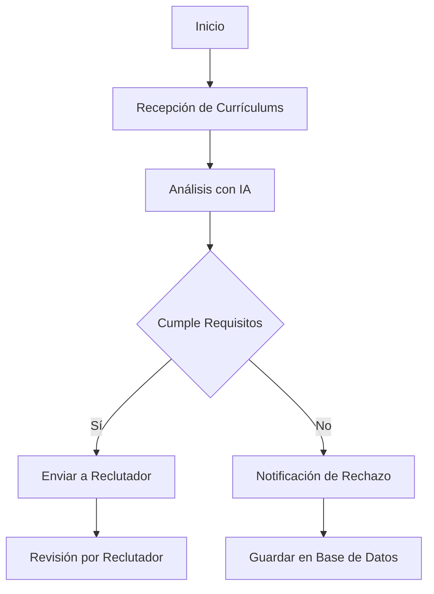
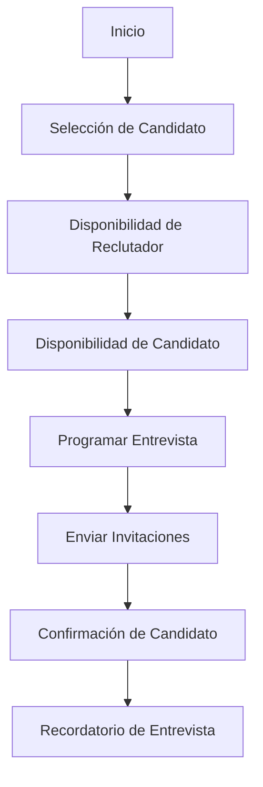
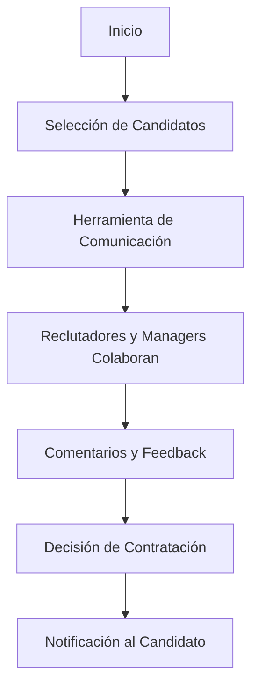
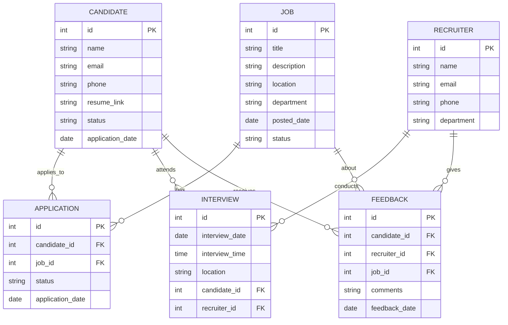

ChatGPT 4o

# Prompts
## PROMPT 1
Eres el product manager de LTI, una startup que quiere desarrollar el ATS (Applicant-Tracking System) del futuro.
Debes definir esas funcionalidades clave que harán brillar a LTI por encima de los competidores: aumentar la eficiencia para los departamentos de HR, mejorar la colaboración en tiempo real entre reclutadores y managers, automatizaciones, asistencia de IA en diversas tareas...es el momento de hacer brainstorming, investigar cuáles pueden ser las claves del éxito, y dejarlo plasmado para el resto del equipo.

Empieza generando
- una descripción breve del software LTI
- una descripción valor añadido y ventajas competitivas
- una explicación de las funciones principales.
- un diagrama Lean Canvas del modelo de negocio, visual que se pueda meter en un documento. Estructura la respuesta y adapta el diseño de la tabla acorde a este ejemplo https://innokabi.com/wp-content/uploads/2013/09/lienzo-lean-canvas-de-ash-maurya.jpg

## PROMPT 2
Describe los 3 principales casos de uso, con el diagrama asociado a cada uno en formato mermaid

## PROMPT 3
Genera el modelo de datos que cubra entidades, atributos (nombre y tipo) y relaciones en formato mermaid

## PROMPT 4
Actúa como un experto arquitecto de software. Diseña el sistema a alto nivel, tanto explicado como con un diagrama para AWS hecho en Diagrams con python

## PROMPT 5
Genera un diagrama C4 que llegue en profundidad a uno de los componentes del sistema y explique la arquitectura del sistema en cuatro niveles: contexto, contenedores, componentes y código.

## PROMPT 6 (extra)
Genera la tabla de contenidos del siguiente markdown

_(markdown completo)_

# Respuestas
## RESPUESTA 1
### Descripción del Software LTI

LTI es un sistema de seguimiento de candidatos (ATS) de última generación diseñado para revolucionar el proceso de contratación. Nuestra plataforma combina tecnología avanzada con una interfaz intuitiva, permitiendo a los departamentos de recursos humanos y a los reclutadores gestionar eficientemente todo el ciclo de contratación, desde la publicación de ofertas de empleo hasta la incorporación de nuevos empleados.

### Valor Añadido y Ventajas Competitivas

LTI no es solo otro ATS en el mercado; es una solución integral que optimiza cada etapa del proceso de reclutamiento. Nuestras principales ventajas competitivas incluyen:

- **Automatización Inteligente**: Automatizamos tareas repetitivas y procesos administrativos, liberando tiempo para que los equipos de HR se centren en tareas estratégicas.
- **Colaboración en Tiempo Real**: Facilitamos la comunicación y colaboración instantánea entre reclutadores, managers y equipos de HR.
- **Asistencia de IA**: Implementamos algoritmos de inteligencia artificial para mejorar la selección de candidatos, ofreciendo recomendaciones precisas basadas en datos.
- **Analítica y Reporting Avanzado**: Proporcionamos herramientas de análisis detalladas para medir el rendimiento de los procesos de contratación y optimizarlos continuamente.
- **Integración Fácil**: LTI se integra sin problemas con otras herramientas y plataformas de HR, como sistemas de gestión de recursos humanos (HRMS) y plataformas de redes sociales.

### Funciones Principales

1. **Gestión de Publicaciones de Empleo**:
   - Creación y publicación de ofertas de trabajo en múltiples plataformas.
   - Plantillas personalizables para descripciones de trabajo.

2. **Automatización de Procesos**:
   - Filtrado automático de currículums y aplicaciones.
   - Programación automática de entrevistas y recordatorios.

3. **Colaboración y Comunicación**:
   - Herramientas de chat y videoconferencia integradas.
   - Panel de control compartido para feedback y comentarios sobre candidatos.

4. **Asistencia de IA**:
   - Evaluación automática de habilidades y competencias.
   - Sugerencias de candidatos ideales basadas en análisis de datos.

5. **Analítica y Reporting**:
   - Dashboards personalizables con métricas clave.
   - Informes detallados sobre el proceso de contratación y KPIs.

6. **Integraciones**:
   - Conexión con plataformas de redes sociales, portales de empleo y HRMS.
   - API abierta para integraciones personalizadas.

### Diagrama Lean Canvas del Modelo de Negocio

Para adaptar el Lean Canvas de LTI según el ejemplo proporcionado, organizaremos el contenido en nueve bloques específicos, cada uno claramente definido. La estructura será la siguiente:

1. Problema
2. Segmento de Clientes
3. Propuesta de Valor
4. Solución
5. Canales
6. Fuentes de Ingresos
7. Estructura de Costos
8. Métricas Clave
9. Ventaja Competitiva

Vamos a generar un diagrama visual similar al ejemplo del lienzo Lean Canvas de Ash Maurya:

```python
import matplotlib.pyplot as plt
import matplotlib.patches as patches

# Crear figura y ejes
fig, ax = plt.subplots(figsize=(15, 10))
ax.axis('off')

# Añadir títulos a las secciones
sections = [
    ("Problema", "Procesos de contratación ineficientes y lentos."),
    ("Segmento de Clientes", "Departamentos de Recursos Humanos, reclutadores y managers."),
    ("Propuesta de Valor", "ATS eficiente, colaborativo, automatizado y asistido por IA."),
    ("Solución", "Automatización de tareas, colaboración en tiempo real, asistencia de IA, analítica avanzada."),
    ("Canales", "Integraciones con plataformas de empleo, redes sociales, marketing digital."),
    ("Fuentes de Ingresos", "Suscripción mensual, tarifas por usuario, implementaciones personalizadas."),
    ("Estructura de Costos", "Desarrollo y mantenimiento de software, marketing, soporte al cliente."),
    ("Métricas Clave", "Tiempo de contratación, tasa de aceptación de candidatos, satisfacción de usuarios."),
    ("Ventaja Competitiva", "Tecnología avanzada, IA, facilidad de uso, integración amplia.")
]

# Dibujar cajas para cada sección
colors = ["#f8f8ff", "#f1f1f2"]
y = 0.95
for i, (title, content) in enumerate(sections):
    color = colors[i % 2]
    box = patches.FancyBboxPatch((0.1, y-0.1), 0.8, 0.1, boxstyle="round,pad=0.02", edgecolor="black", facecolor=color)
    ax.add_patch(box)
    ax.text(0.1, y, title, ha='left', va='center', fontsize=12, fontweight='bold', color="#40466e")
    ax.text(0.1, y-0.05, content, ha='left', va='center', fontsize=10, wrap=True)
    y -= 0.15

plt.title('Lean Canvas - LTI ATS', fontsize=16, weight='bold', color='#40466e')
plt.show()
```

Voy a generar este diagrama visual ahora.

Aquí tienes el Lean Canvas del ATS de LTI, estructurado y diseñado de manera visualmente atractiva según el ejemplo proporcionado. Este formato permite una comprensión clara y rápida de las áreas clave del modelo de negocio.

### Lean Canvas - LTI ATS

1. **Problema**:
   - Procesos de contratación ineficientes y lentos.

2. **Segmento de Clientes**:
   - Departamentos de Recursos Humanos, reclutadores y managers.

3. **Propuesta de Valor**:
   - ATS eficiente, colaborativo, automatizado y asistido por IA.

4. **Solución**:
   - Automatización de tareas, colaboración en tiempo real, asistencia de IA, analítica avanzada.

5. **Canales**:
   - Integraciones con plataformas de empleo, redes sociales, marketing digital.

6. **Fuentes de Ingresos**:
   - Suscripción mensual, tarifas por usuario, implementaciones personalizadas.

7. **Estructura de Costos**:
   - Desarrollo y mantenimiento de software, marketing, soporte al cliente.

8. **Métricas Clave**:
   - Tiempo de contratación, tasa de aceptación de candidatos, satisfacción de usuarios.

9. **Ventaja Competitiva**:
   - Tecnología avanzada, IA, facilidad de uso, integración amplia.

Este diagrama puede ser incluido en tu documentación para el equipo y otras partes interesadas.

## RESPUESTA 2
### Casos de Uso Principales del ATS de LTI

#### Caso de Uso 1: Automatización del Filtrado de Candidatos

**Descripción**:
El ATS de LTI automatiza el proceso de filtrado inicial de candidatos, utilizando algoritmos de inteligencia artificial para evaluar currículums y perfiles, seleccionando los más adecuados según los requisitos del puesto.

**Diagrama Mermaid**:


#### Caso de Uso 2: Programación Automática de Entrevistas

**Descripción**:
LTI permite la programación automática de entrevistas, sincronizando las agendas de los reclutadores y los candidatos, y enviando recordatorios para evitar ausencias y retrasos.

**Diagrama Mermaid**:


#### Caso de Uso 3: Colaboración en Tiempo Real entre Reclutadores y Managers

**Descripción**:
El sistema permite la colaboración en tiempo real entre los reclutadores y los managers a través de herramientas de comunicación integradas, facilitando la toma de decisiones rápidas y efectivas.

**Diagrama Mermaid**:


Estos casos de uso ilustran cómo LTI puede optimizar y facilitar los procesos de reclutamiento mediante la automatización, la programación eficiente y la colaboración en tiempo real.

## RESPUESTA 3
Aquí tienes el modelo de datos en formato Mermaid, que cubre las entidades, atributos y relaciones para el ATS de LTI:



### Descripción de Entidades y Atributos

1. **CANDIDATE**
   - id (int, PK)
   - name (string)
   - email (string)
   - phone (string)
   - resume_link (string)
   - status (string)
   - application_date (date)

2. **JOB**
   - id (int, PK)
   - title (string)
   - description (string)
   - location (string)
   - department (string)
   - posted_date (date)
   - status (string)

3. **RECRUITER**
   - id (int, PK)
   - name (string)
   - email (string)
   - phone (string)
   - department (string)

4. **INTERVIEW**
   - id (int, PK)
   - interview_date (date)
   - interview_time (time)
   - location (string)
   - candidate_id (int, FK)
   - recruiter_id (int, FK)

5. **FEEDBACK**
   - id (int, PK)
   - candidate_id (int, FK)
   - recruiter_id (int, FK)
   - job_id (int, FK)
   - comments (string)
   - feedback_date (date)

6. **APPLICATION**
   - id (int, PK)
   - candidate_id (int, FK)
   - job_id (int, FK)
   - status (string)
   - application_date (date)

### Relaciones

- Un candidato puede tener múltiples aplicaciones (one-to-many).
- Un trabajo puede tener múltiples aplicaciones (one-to-many).
- Un reclutador puede conducir múltiples entrevistas (one-to-many).
- Un candidato puede asistir a múltiples entrevistas (one-to-many).
- Un candidato puede recibir múltiples comentarios de feedback (one-to-many).
- Un trabajo puede tener múltiples comentarios de feedback sobre candidatos (one-to-many).
- Un reclutador puede dar múltiples comentarios de feedback (one-to-many).


## RESPUESTA 4
### Diseño del Sistema a Alto Nivel

El ATS de LTI será diseñado como una arquitectura basada en microservicios utilizando AWS (Amazon Web Services) para garantizar escalabilidad, alta disponibilidad y facilidad de mantenimiento. A continuación, se describen los componentes clave y el flujo general del sistema.

#### Componentes Principales

1. **Frontend**:
   - **React.js**: Aplicación web para la interfaz de usuario.
   - **AWS S3**: Almacenamiento de contenido estático (HTML, CSS, JS).

2. **Backend**:
   - **Microservicios**: Implementados en **Node.js** o **Python**, utilizando **AWS Lambda** para ejecutar código sin servidor.
   - **API Gateway**: **AWS API Gateway** para gestionar las solicitudes API y enrutarlas a los microservicios correspondientes.
   - **Autenticación**: **Amazon Cognito** para la gestión de usuarios y autenticación.

3. **Base de Datos**:
   - **Amazon RDS**: Base de datos relacional para almacenar datos estructurados.
   - **Amazon DynamoDB**: Base de datos NoSQL para datos no estructurados o semi-estructurados.

4. **Almacenamiento**:
   - **AWS S3**: Almacenamiento de currículums, documentos y otros archivos.

5. **Mensajería y Colas**:
   - **Amazon SQS**: Colas de mensajes para la gestión de tareas asíncronas.
   - **Amazon SNS**: Servicio de notificación para enviar mensajes y alertas.

6. **Analítica y Reporting**:
   - **AWS QuickSight**: Herramienta de análisis y visualización de datos.
   - **AWS Glue**: Servicio de preparación de datos para ETL (Extract, Transform, Load).

7. **Monitorización y Logging**:
   - **Amazon CloudWatch**: Monitorización del rendimiento y logging.
   - **AWS X-Ray**: Seguimiento de solicitudes para el análisis y depuración.

### Diagrama AWS

Voy a generar el diagrama AWS utilizando la biblioteca Diagrams en Python.

```python
from diagrams import Diagram, Cluster
from diagrams.aws.compute import Lambda
from diagrams.aws.database import RDS, Dynamodb
from diagrams.aws.network import APIGateway
from diagrams.aws.storage import S3
from diagrams.aws.security import Cognito
from diagrams.aws.analytics import Quicksight, Glue
from diagrams.aws.management import Cloudwatch, XRay
from diagrams.aws.integration import SQS, SNS
from diagrams.onprem.client import Users
from diagrams.programming.framework import React

with Diagram("ATS de LTI - Arquitectura en AWS", show=False):

    users = Users("Usuarios")

    with Cluster("Frontend"):
        frontend = React("Aplicación Web")

    with Cluster("Backend"):
        api_gw = APIGateway("API Gateway")
        auth = Cognito("Autenticación")
        with Cluster("Microservicios"):
            services = [Lambda("Servicio 1"),
                        Lambda("Servicio 2"),
                        Lambda("Servicio 3")]

    with Cluster("Base de Datos"):
        rds = RDS("Amazon RDS")
        dynamo = Dynamodb("Amazon DynamoDB")

    with Cluster("Almacenamiento"):
        storage = S3("Amazon S3")

    with Cluster("Mensajería y Colas"):
        sqs = SQS("Amazon SQS")
        sns = SNS("Amazon SNS")

    with Cluster("Analítica y Reporting"):
        quicksight = Quicksight("AWS QuickSight")
        glue = Glue("AWS Glue")

    with Cluster("Monitorización y Logging"):
        cloudwatch = Cloudwatch("Amazon CloudWatch")
        xray = XRay("AWS X-Ray")

    users >> frontend >> api_gw >> services
    api_gw >> auth
    services >> rds
    services >> dynamo
    services >> storage
    services >> sqs
    sqs >> sns
    services >> cloudwatch
    services >> xray
    services >> quicksight
    services >> glue
```

Voy a generar el diagrama ahora.

Parece que hay un problema con la conexión a Internet en el entorno actual, lo que impide la instalación de la biblioteca Diagrams. No obstante, puedo proporcionarte el código necesario para que lo ejecutes en tu propio entorno de desarrollo local, donde podrás generar el diagrama AWS.

### Código para Generar el Diagrama AWS

Asegúrate de tener instalado Python y la biblioteca `diagrams` en tu entorno. Puedes instalarla con el siguiente comando:

```sh
pip install diagrams
```

Luego, utiliza el siguiente código para generar el diagrama:

```python
from diagrams import Diagram, Cluster
from diagrams.aws.compute import Lambda
from diagrams.aws.database import RDS, Dynamodb
from diagrams.aws.network import APIGateway
from diagrams.aws.storage import S3
from diagrams.aws.security import Cognito
from diagrams.aws.analytics import Quicksight, Glue
from diagrams.aws.management import Cloudwatch, XRay
from diagrams.aws.integration import SQS, SNS
from diagrams.onprem.client import Users
from diagrams.programming.framework import React

with Diagram("ATS de LTI - Arquitectura en AWS", show=False):

    users = Users("Usuarios")

    with Cluster("Frontend"):
        frontend = React("Aplicación Web")

    with Cluster("Backend"):
        api_gw = APIGateway("API Gateway")
        auth = Cognito("Autenticación")
        with Cluster("Microservicios"):
            services = [Lambda("Servicio 1"),
                        Lambda("Servicio 2"),
                        Lambda("Servicio 3")]

    with Cluster("Base de Datos"):
        rds = RDS("Amazon RDS")
        dynamo = Dynamodb("Amazon DynamoDB")

    with Cluster("Almacenamiento"):
        storage = S3("Amazon S3")

    with Cluster("Mensajería y Colas"):
        sqs = SQS("Amazon SQS")
        sns = SNS("Amazon SNS")

    with Cluster("Analítica y Reporting"):
        quicksight = Quicksight("AWS QuickSight")
        glue = Glue("AWS Glue")

    with Cluster("Monitorización y Logging"):
        cloudwatch = Cloudwatch("Amazon CloudWatch")
        xray = XRay("AWS X-Ray")

    users >> frontend >> api_gw >> services
    api_gw >> auth
    services >> rds
    services >> dynamo
    services >> storage
    services >> sqs
    sqs >> sns
    services >> cloudwatch
    services >> xray
    services >> quicksight
    services >> glue
```

### Pasos a Seguir

1. **Instalar la Biblioteca**: Ejecuta `pip install diagrams` para instalar la biblioteca Diagrams.
2. **Ejecutar el Código**: Guarda el código proporcionado en un archivo Python y ejecútalo. Esto generará un archivo de imagen con el diagrama de arquitectura AWS.

Si tienes alguna otra pregunta o necesitas más ayuda, estaré encantado de asistirte.

## RESPUESTA 5
Vamos a generar un diagrama C4 que profundice en el componente "API REST" del sistema ATS de LTI y explicar la arquitectura del sistema en los cuatro niveles: contexto, contenedores, componentes y código.

### Nivel 1: Diagrama de Contexto

```mermaid
graph TB
    title Sistema ATS de LTI - Contexto

    A[Recruiter] -->|Gestiona candidatos| B[Sistema de Filtrado de Candidatos]
    C[Manager] -->|Colabora en la revisión| B[Sistema de Filtrado de Candidatos]
    D[Candidate] -->|Aplica a ofertas| B[Sistema de Filtrado de Candidatos]
```

### Nivel 2: Diagrama de Contenedores

```mermaid
graph TB
    title Sistema de Filtrado de Candidatos - Contenedores

    A[Recruiter] -->|Usa| B[Aplicación Web]
    C[Manager] -->|Usa| B[Aplicación Web]
    D[Candidate] -->|Usa| B[Aplicación Web]

    B[Aplicación Web] -->|Realiza solicitudes| E[API REST]
    E[API REST] -->|Lee y escribe datos| F[Base de Datos]
    E[API REST] -->|Envía currículums para análisis| G[Servicio de IA]
    G[Servicio de IA] -->|Guarda resultados del filtrado| F[Base de Datos]
```

### Nivel 3: Diagrama de Componentes

```mermaid
graph TB
    title API REST - Componentes

    A[CandidateController] -->|Accede a datos de candidatos| B[DBService]
    C[JobController] -->|Accede a datos de trabajos| B[DBService]
    D[FilteringController] -->|Guarda resultados de filtrado| B[DBService]
    D[FilteringController] -->|Envía currículums para análisis| E[IAServiceClient]
    F[AuthController] -->|Gestiona usuarios| B[DBService]
```

### Nivel 4: Diagrama de Código

Para este nivel, se proporciona un ejemplo básico de cómo podría verse el código en uno de los componentes. Aquí, detallamos el `FilteringController`.

```javascript
// FilteringController.js
const express = require('express');
const router = express.Router();
const dbService = require('../services/DBService');
const iaServiceClient = require('../services/IAServiceClient');

// Endpoint para filtrar candidatos
router.post('/filter', async (req, res) => {
    try {
        const { jobId, resume } = req.body;
        const analysisResult = await iaServiceClient.analyzeResume(resume);

        const filteredCandidate = await dbService.saveFilteringResult(jobId, analysisResult);
        res.status(200).json(filteredCandidate);
    } catch (error) {
        res.status(500).json({ error: error.message });
    }
});

module.exports = router;
```

### Explicación del Diagrama C4

#### Nivel 1: Contexto

El diagrama de contexto muestra cómo interactúan los actores principales (Recruiter, Manager, Candidate) con el sistema de filtrado de candidatos. Este nivel proporciona una visión general de quién usa el sistema y cómo se relaciona con él.

#### Nivel 2: Contenedores

El diagrama de contenedores descompone el sistema en varios contenedores:
- **Aplicación Web**: La interfaz de usuario que utilizan los reclutadores, managers y candidatos.
- **API REST**: Proporciona acceso a los servicios del sistema.
- **Base de Datos**: Almacena los datos de candidatos, trabajos y resultados del filtrado.
- **Servicio de IA**: Analiza y filtra los currículums de los candidatos.

#### Nivel 3: Componentes

El diagrama de componentes desglosa el API REST en sus componentes internos:
- **AuthController**: Gestiona la autenticación y autorización de usuarios.
- **CandidateController**: Gestiona las operaciones relacionadas con los candidatos.
- **JobController**: Gestiona las operaciones relacionadas con los trabajos.
- **FilteringController**: Gestiona el filtrado de candidatos.
- **DBService**: Servicio para acceder a la base de datos.
- **IAServiceClient**: Cliente para comunicarse con el Servicio de IA.

#### Nivel 4: Código

El nivel de código proporciona un ejemplo de cómo podría implementarse uno de los componentes, en este caso, el `FilteringController`. Este componente recibe solicitudes para filtrar candidatos, envía los currículums al Servicio de IA para su análisis y guarda los resultados en la base de datos.

### Generación del Diagrama C4 con `diagrams` en Python

Para generar estos diagramas en Python utilizando la biblioteca `diagrams`, puedes usar el siguiente código:

```python
from diagrams import Diagram, Cluster, Edge
from diagrams.aws.compute import Lambda
from diagrams.aws.database import RDS
from diagrams.aws.network import APIGateway
from diagrams.aws.security import Cognito
from diagrams.aws.storage import S3
from diagrams.onprem.client import Users

with Diagram("ATS de LTI - API REST", show=False):

    users = Users("Usuarios")

    with Cluster("Frontend"):
        webapp = Lambda("Aplicación Web")

    with Cluster("Backend"):
        api_gw = APIGateway("API Gateway")
        auth = Cognito("Autenticación")

        with Cluster("Microservicios"):
            auth_service = Lambda("AuthController")
            candidate_service = Lambda("CandidateController")
            job_service = Lambda("JobController")
            filtering_service = Lambda("FilteringController")

    with Cluster("Base de Datos"):
        database = RDS("Amazon RDS")

    with Cluster("Servicio de IA"):
        ia_service = Lambda("IAService")

    with Cluster("Almacenamiento"):
        storage = S3("Amazon S3")

    users >> webapp >> api_gw >> Edge(label="Autentica") >> auth
    api_gw >> Edge(label="Gestiona candidatos") >> candidate_service
    api_gw >> Edge(label="Gestiona trabajos") >> job_service
    api_gw >> Edge(label="Filtra candidatos") >> filtering_service
    filtering_service >> Edge(label="Envía a análisis") >> ia_service
    filtering_service >> Edge(label="Guarda resultados") >> database

    candidate_service >> Edge(label="Accede a datos") >> database
    job_service >> Edge(label="Accede a datos") >> database
    auth_service >> Edge(label="Accede a datos") >> database
```

Este código genera un diagrama visual que muestra cómo se comunican los diferentes componentes del sistema y cómo se gestionan las operaciones dentro del componente "API REST". Puedes ejecutar este código en tu entorno local para generar el diagrama visualmente.

## RESPUESTA 6 (extra)
- [Descripción breve del software LTI](#descripción-breve-del-software-lti)
- [Valor añadido y ventajas competitivas](#valor-añadido-y-ventajas-competitivas)
- [Funciones principales](#funciones-principales)
- [Diagrama Lean Canvas](#diagrama-lean-canvas)
- [Casos de Uso Principales del ATS de LTI](#casos-de-uso-principales-del-ats-de-lti)
- [Modelo de datos](#modelo-de-datos)
- [Diseño del Sistema a Alto Nivel](#diseño-del-sistema-a-alto-nivel)
- [Diagrama AWS](#diagrama-aws)
- [Diagrama C4](#diagrama-c4)

