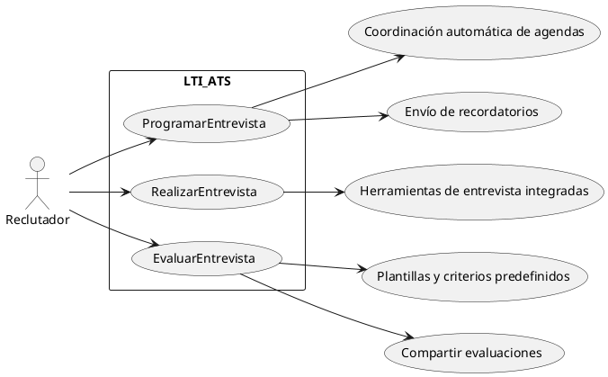
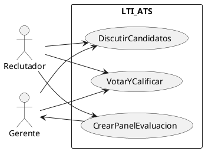
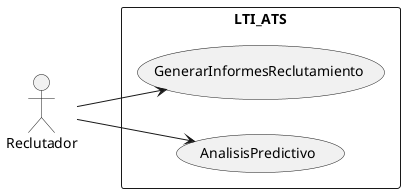
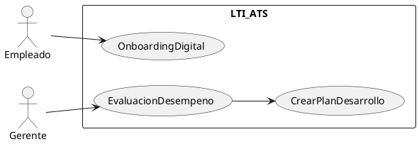
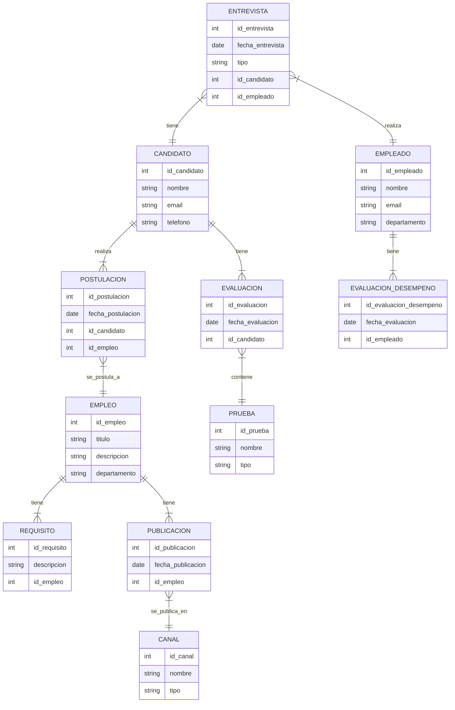

## PROMT 1 (Gemini Advanced)

Necesito que tomes el rol de Product Manager y analisis el siguiente diagrama. Una vez que lo hayas revisado te dare un poco de contexto. La Startup LTI quiere desarrollar el ATS (Applicant-Tracking System) del futuro, para ello es necesario darle un valor agregado que lo diferencie del resto.

En primer lugar necesito que me ayudes a identificar las etapas del proceso.

### RESPUESTA

¡Claro! Analizando el diagrama, identifico las siguientes etapas en el proceso de un sistema de seguimiento de candidatos (ATS):

1. **Creación de empleos:** El proceso comienza con la definición y publicación de las vacantes disponibles.
2. **Publicación de empleos:** Las ofertas de trabajo se difunden en diversas plataformas como bolsas de empleo, sitios web de la empresa, redes sociales y otros canales relevantes.
3. **Recepción de solicitudes:** Los candidatos interesados envían sus solicitudes y currículums a través de los canales habilitados.
4. **Revisión de solicitudes:** El sistema y/o los reclutadores evalúan las solicitudes recibidas, filtrando y seleccionando a los candidatos que mejor se ajustan a los requisitos del puesto.
5. **Realización de pruebas en línea:** En algunos casos, se aplican pruebas en línea a los candidatos preseleccionados para evaluar sus habilidades, conocimientos o aptitudes específicas.
6. **Programación de entrevistas:** Se coordinan y agendan entrevistas con los candidatos que han superado las etapas anteriores.
7. **Contratación de candidatos seleccionados:** Tras las entrevistas y evaluaciones finales, se selecciona a los candidatos que serán contratados para ocupar las vacantes.

Este es un flujo básico de un ATS, pero cada sistema puede tener variaciones y funcionalidades adicionales.

¿Te gustaría que profundice en alguna de estas etapas o que exploremos cómo LTI podría agregar valor y diferenciarse en el mercado con su ATS?

## PROMT 2 (Gemini Advanced)

Teniendo en cuenta las etapas de un ATS básico, podremos buscar alternativas para darle el valor agregado considerando los siguientes puntos:

-   Aumentar la eficiencia para los departamentos de Recursos Humanos
-   Mejorar la colaboración en tiempo real entre reclutadores y managers
-   Automatizaciones
-   Asistencia de IA

Qué y en que parte del proceso de ATS podríamos agregar ese valor extra, para que nuestro sistema se diferencie de los demás.

### RESPUESTA

¡Excelente! Teniendo en cuenta los puntos que mencionas, podemos explorar las siguientes oportunidades para agregar valor al ATS de LTI en cada etapa del proceso:

**1. Creación de empleos:**

-   **Asistencia de IA para la redacción de descripciones de puestos:** La IA puede ayudar a generar descripciones claras, atractivas y optimizadas para motores de búsqueda, utilizando datos de mercado y mejores prácticas.
-   **Análisis predictivo de habilidades:** La IA puede analizar datos históricos de candidatos exitosos para identificar las habilidades clave que predicen el éxito en un puesto, lo que facilita la definición de requisitos más precisos.

**2. Publicación de empleos:**

-   **Automatización de la publicación multicanal:** El sistema puede publicar automáticamente las ofertas de trabajo en múltiples plataformas (bolsas de empleo, redes sociales, etc.) con un solo clic, ahorrando tiempo y esfuerzo.
-   **Optimización de publicaciones para motores de búsqueda:** La IA puede optimizar el contenido de las publicaciones para mejorar su visibilidad en los resultados de búsqueda, atrayendo a más candidatos cualificados.

**3. Recepción de solicitudes:**

-   **Análisis inteligente de currículums:** La IA puede analizar y clasificar automáticamente los currículums recibidos, extrayendo información relevante y facilitando la identificación de los candidatos más adecuados.
-   **Chatbots para responder preguntas frecuentes:** Los chatbots pueden interactuar con los candidatos, respondiendo preguntas comunes sobre el proceso de selección y la empresa, mejorando la experiencia del candidato y liberando tiempo a los reclutadores.

**4. Revisión de solicitudes:**

-   **Evaluación automatizada de habilidades:** La IA puede evaluar automáticamente las habilidades de los candidatos mediante pruebas en línea personalizadas, reduciendo la carga de trabajo de los reclutadores y acelerando el proceso de selección.
-   **Herramientas de colaboración en tiempo real:** Los reclutadores y gerentes pueden compartir comentarios y evaluaciones de los candidatos en tiempo real, agilizando la toma de decisiones y mejorando la comunicación.

**5. Realización de pruebas en línea:**

-   **Pruebas adaptativas:** Las pruebas pueden adaptarse al nivel de conocimiento y habilidades de cada candidato, proporcionando una evaluación más precisa y personalizada.
-   **Análisis de videoentrevistas:** La IA puede analizar las expresiones faciales, el lenguaje corporal y el contenido de las videoentrevistas para identificar candidatos con las habilidades blandas y la actitud adecuadas.

**6. Programación de entrevistas:**

-   **Automatización de la programación:** El sistema puede coordinar automáticamente las agendas de los candidatos y entrevistadores, optimizando la programación de entrevistas y reduciendo las tareas administrativas.
-   **Recordatorios y notificaciones automáticas:** El sistema puede enviar recordatorios automáticos a los candidatos y entrevistadores, reduciendo las ausencias y mejorando la eficiencia del proceso.

**7. Contratación de candidatos seleccionados:**

-   **Generación automatizada de contratos:** El sistema puede generar automáticamente contratos de trabajo personalizados, agilizando el proceso de contratación y reduciendo el riesgo de errores.
-   **Onboarding digital:** El sistema puede guiar a los nuevos empleados a través de un proceso de onboarding digital, proporcionando información relevante, recursos y herramientas para facilitar su integración a la empresa.

Al incorporar estas mejoras basadas en IA y automatización, el ATS de LTI se diferenciará de la competencia, ofreciendo una solución más eficiente, colaborativa y personalizada que ayudará a las empresas a atraer y contratar al mejor talento de manera más rápida y efectiva.

¿Te gustaría que profundizáramos en alguna de estas ideas o que exploráramos otras áreas de mejora?

## PROMT 3 (Gemini Advanced)

Bien ahora basandose en toda la información que me has entregado, necesito lo siguiente:

-   Una breve descripción de lo que sera el sofware de LTI
-   La funciones principales mencionando como nos diferenciamos de los demas sistemas

### RESPUESTA

¡Perfecto! Basándome en nuestro análisis y las mejoras que hemos discutido, te presento una breve descripción y las funciones principales del innovador software ATS de LTI:

**LTI ATS: El futuro de la adquisición de talento impulsado por IA**

LTI ATS es una solución de seguimiento de candidatos de vanguardia que revoluciona la forma en que las empresas atraen, evalúan y contratan talento. Combinando la eficiencia de la automatización con el poder de la inteligencia artificial, LTI ATS ofrece una experiencia integral y personalizada tanto para reclutadores como para candidatos.

**Funciones principales y diferenciadores clave:**

1.  **Asistente de IA para la creación de empleos:** Nuestro asistente de IA te guía en la creación de descripciones de puestos atractivas y optimizadas, utilizando datos de mercado y mejores prácticas para atraer a los candidatos ideales.

2.  **Análisis predictivo de habilidades:** Identifica las habilidades clave que predicen el éxito en cada puesto, lo que te permite definir requisitos más precisos y encontrar candidatos con mayor potencial.

3.  **Publicación automatizada multicanal y optimizada:** Publica tus ofertas de trabajo en múltiples plataformas con un solo clic, optimizadas para motores de búsqueda para maximizar su visibilidad y alcance.

4.  **Análisis inteligente de currículums y chatbots interactivos:** Nuestro sistema analiza automáticamente los currículums, extrayendo información relevante y facilitando la identificación de los candidatos más adecuados. Además, nuestros chatbots responden preguntas frecuentes, mejorando la experiencia del candidato y liberando tiempo a los reclutadores.

5.  **Evaluación automatizada de habilidades y colaboración en tiempo real:** Evalúa automáticamente las habilidades de los candidatos mediante pruebas en línea personalizadas y facilita la colaboración en tiempo real entre reclutadores y gerentes para agilizar la toma de decisiones.

6.  **Pruebas adaptativas y análisis de videoentrevistas:** Nuestras pruebas se adaptan al nivel de conocimiento de cada candidato, proporcionando una evaluación más precisa. Además, analizamos las videoentrevistas para identificar candidatos con las habilidades blandas y la actitud adecuadas.

7.  **Automatización de la programación de entrevistas y recordatorios:** Optimiza la programación de entrevistas coordinando automáticamente las agendas y envía recordatorios automáticos para reducir las ausencias.

8.  **Generación automatizada de contratos y onboarding digital:** Agiliza el proceso de contratación generando contratos personalizados y guía a los nuevos empleados a través de un proceso de onboarding digital para facilitar su integración.

**LTI ATS se diferencia de otros sistemas por:**

-   **Su enfoque centrado en la IA:** Utilizamos inteligencia artificial en todas las etapas del proceso para optimizar la eficiencia, mejorar la toma de decisiones y ofrecer una experiencia más personalizada.
-   **Su énfasis en la colaboración en tiempo real:** Facilitamos la comunicación y colaboración entre reclutadores y gerentes para agilizar el proceso de selección y mejorar la calidad de las decisiones de contratación.
-   **Su compromiso con la innovación:** Estamos constantemente explorando nuevas formas de aprovechar la tecnología para mejorar la experiencia de contratación tanto para empresas como para candidatos.

Con LTI ATS, las empresas pueden optimizar sus procesos de reclutamiento, reducir costos, mejorar la calidad de sus contrataciones y construir equipos de alto rendimiento.

## PROMT 4 (Gemini Advanced)

Me podrías enumerar y describir brevemente los casos de uso principales que puedes identificar en para este desarrollo y siempre considerando el valor agregado mencionado anteriormente.

### RESPUESTA

¡Por supuesto! Considerando el valor agregado que hemos discutido para el ATS de LTI, identifico los siguientes casos de uso principales, además de los que ya hemos cubierto:

**1. Gestión de entrevistas:**

-   **Programar entrevistas:** El sistema permite a los reclutadores programar entrevistas con los candidatos, coordinando automáticamente las agendas y enviando recordatorios.
-   **Realizar entrevistas:** Los reclutadores pueden llevar a cabo entrevistas en persona, por videoconferencia o por teléfono, utilizando herramientas integradas en el ATS.
-   **Evaluar entrevistas:** Los reclutadores pueden registrar sus impresiones y evaluaciones de cada entrevista, utilizando plantillas y criterios predefinidos.
-   **Compartir evaluaciones:** Las evaluaciones de las entrevistas se comparten automáticamente con otros reclutadores y gerentes involucrados en el proceso de selección.

**2. Toma de decisiones colaborativa:**

-   **Crear paneles de evaluación:** Los reclutadores pueden crear paneles de evaluación para cada vacante, invitando a otros miembros del equipo a participar en el proceso de selección.
-   **Discutir candidatos:** Los miembros del panel pueden discutir los perfiles de los candidatos, compartir opiniones y tomar decisiones conjuntas sobre quiénes avanzarán en el proceso.
-   **Votar y calificar:** El sistema permite a los miembros del panel votar y calificar a los candidatos, facilitando la toma de decisiones objetivas y basadas en datos.

**3. Generación de informes y análisis:**

-   **Informes de reclutamiento:** El sistema genera informes personalizados sobre el progreso del proceso de reclutamiento, incluyendo métricas clave como el tiempo de contratación, el costo por contratación y la calidad de las contrataciones.
-   **Análisis predictivo:** El sistema utiliza técnicas de análisis predictivo para identificar patrones y tendencias en los datos de reclutamiento, lo que permite a las empresas tomar decisiones más informadas y mejorar sus estrategias de contratación.

**4. Onboarding y gestión del desempeño:**

-   **Onboarding digital:** El sistema guía a los nuevos empleados a través de un proceso de onboarding digital personalizado, proporcionando información relevante, recursos y herramientas para facilitar su integración a la empresa.
-   **Evaluación del desempeño:** El sistema permite a los gerentes realizar evaluaciones de desempeño periódicas de los empleados, utilizando herramientas integradas y criterios predefinidos.
-   **Planes de desarrollo:** El sistema ayuda a los gerentes a crear planes de desarrollo personalizados para los empleados, basados en sus evaluaciones de desempeño y objetivos profesionales.

Estos casos de uso, junto con los que ya hemos detallado, cubren el ciclo completo de la adquisición de talento, desde la publicación de empleos hasta la gestión del desempeño de los empleados, aprovechando el valor agregado de la IA y la automatización para optimizar cada etapa del proceso.

## PROMT 5 (Gemini Advanced)

Genera el diagrama de caso de uso con PlantUML para cada uno de los casos de uso enumerados.

### Respuesta

¡Absolutamente! Aquí están los diagramas de casos de uso en PlantUML para cada uno de los casos de uso adicionales que mencioné, siempre teniendo en cuenta el valor agregado de LTI ATS:

**1. Gestión de entrevistas:**



**2. Toma de decisiones colaborativa:**



**3. Generación de informes y análisis:**



**4. Onboarding y gestión del desempeño:**



Estos diagramas ilustran los principales casos de uso del sistema LTI ATS, destacando las interacciones entre los actores (reclutadores, gerentes, empleados) y el sistema, así como las funcionalidades clave que aportan valor agregado al proceso de adquisición de talento.

Ten en cuenta que estos son solo ejemplos y pueden adaptarse o expandirse según los requisitos específicos del sistema.

## PROMT 6 (Gemini Advanced)

Bien, ahora como arquitecto de sistemas deberías ser capas que diseñar un modelo de datos preliminar con la infomación obtenida hasta el momento. Deberías conisderar al menos los 4 casos de uso principales para el modelo.

Considera generar el modelo utilizando Mermaid.

### RESPUESTA

¡Absolutamente! Basándome en los casos de uso principales que hemos identificado y discutido, he diseñado un modelo de datos preliminar para el sistema LTI ATS utilizando Mermaid. Este modelo considera las entidades clave y sus relaciones, abarcando los aspectos esenciales de los casos de uso.



**Explicación del modelo:**

-   **EMPLEO:** Representa una vacante laboral, con atributos como título, descripción y departamento.
-   **REQUISITO:** Describe los requisitos de un empleo, relacionados con un empleo específico.
-   **PUBLICACION:** Representa la publicación de un empleo en un canal, con fecha de publicación.
-   **CANAL:** Representa los diferentes canales donde se pueden publicar empleos (LinkedIn, Indeed, etc.).
-   **CANDIDATO:** Representa a un postulante a un empleo, con sus datos personales.
-   **POSTULACION:** Representa la postulación de un candidato a un empleo específico, con fecha de postulación.
-   **EVALUACION:** Representa la evaluación de un candidato, que puede incluir varias pruebas.
-   **PRUEBA:** Representa un tipo de prueba que se puede realizar en una evaluación (conocimientos, personalidad, etc.).
-   **ENTREVISTA:** Representa una entrevista realizada a un candidato por un empleado, con fecha y tipo de entrevista.
-   **EMPLEADO:** Representa a un empleado de la empresa que puede realizar entrevistas y evaluaciones de desempeño.
-   **EVALUACION_DESEMPENO:** Representa la evaluación de desempeño de un empleado, con fecha de evaluación.

**Consideraciones:**

-   Este modelo es preliminar y puede evolucionar a medida que se definan los requisitos con más detalle.
-   Se pueden agregar más entidades y atributos para cubrir otros casos de uso y funcionalidades.
-   Las relaciones entre entidades pueden ajustarse según las necesidades específicas del sistema.

Este modelo proporciona una base sólida para el diseño de la base de datos del sistema LTI ATS, asegurando que se puedan almacenar y gestionar los datos necesarios para soportar los casos de uso principales y ofrecer el valor agregado que hemos discutido.

## PROMT 7 (Diagram GPT)

Serverless AWS architecture for an ATS system.
Static site in S3, which communicates with the services layer, exposed through Cloudfront and Route53,
Services layer exposed by API Gateway and microservices in Lambda.
DynamoDB as a database

### RESPUESTA


## PROMT 8 (Gemini Advanced)

Bueno, ahora a nivel de arquitectura necesito un breve descripción basandote en el siguiente diagrama. Como complemento, utilizaremos un arquitectura full serverless, es decir, solo utilizaremos servicios administrados por AWS.

### RESPUESTA

La arquitectura presentada en el diagrama es un diseño "serverless" en AWS para el sistema LTI ATS. Esto significa que no hay servidores que administrar directamente, lo que reduce la sobrecarga operativa y permite escalar automáticamente según la demanda.

**Descripción general:**

1. **Route 53:** Este servicio de DNS (Domain Name System) de AWS se encarga de dirigir el tráfico web hacia la aplicación. Traduce el nombre de dominio legible (como [www.ejemplo.com](https://www.ejemplo.com)) a la dirección IP del servidor donde se aloja la aplicación.

2. **CloudFront:** Es una red de entrega de contenido (CDN) global de AWS. Almacena en caché el contenido estático (como imágenes, CSS y JavaScript) en ubicaciones perimetrales en todo el mundo, lo que acelera la entrega a los usuarios finales y reduce la carga en el servidor de origen.

3. **Static Site (S3):** Amazon S3 (Simple Storage Service) se utiliza para alojar el contenido estático del sitio web. S3 es un servicio de almacenamiento de objetos altamente escalable y duradero.

4. **API Gateway:** Actúa como la "puerta de entrada" a los servicios backend. Maneja las solicitudes de los clientes, las enruta a los servicios Lambda apropiados y devuelve las respuestas. También puede manejar autenticación, autorización y limitación de velocidad.

5. **LTI Service (Lambda):** Es una función Lambda que probablemente maneja la lógica de negocio principal de la aplicación LTI. Las funciones Lambda son fragmentos de código sin servidor que se ejecutan en respuesta a eventos.

6. **Auth Service (Lambda):** Otra función Lambda que se encarga de la autenticación y autorización de los usuarios. Puede usar servicios como Amazon Cognito o integrar proveedores de identidad externos.

7. **Data Service (Lambda):** Esta función Lambda probablemente interactúa con la base de datos DynamoDB para realizar operaciones de lectura y escritura de datos.

8. **DynamoDB:** Es una base de datos NoSQL rápida y flexible, totalmente administrada por AWS. Es ideal para aplicaciones sin servidor debido a su escalabilidad automática y modelo de precios de pago por uso.

**Ventajas de esta arquitectura:**

-   **Escalabilidad automática:** Los servicios serverless como Lambda y DynamoDB escalan automáticamente para manejar la carga de trabajo, lo que garantiza un rendimiento óptimo incluso durante picos de tráfico.
-   **Reducción de costos:** Solo se paga por los recursos consumidos, lo que puede ser más rentable que mantener servidores en funcionamiento constante.
-   **Mayor agilidad:** Los desarrolladores pueden centrarse en escribir código en lugar de administrar infraestructura, lo que acelera el desarrollo y la implementación de nuevas funciones.
-   **Alta disponibilidad:** Los servicios de AWS están diseñados para ser altamente disponibles, lo que reduce el riesgo de tiempo de inactividad.

**Consideraciones adicionales:**

-   Es posible que se necesiten servicios adicionales de AWS para funciones específicas, como Amazon SES (Simple Email Service) para enviar correos electrónicos o Amazon SNS (Simple Notification Service) para enviar notificaciones.
-   La seguridad es fundamental en cualquier arquitectura. Se deben implementar prácticas de seguridad adecuadas, como el cifrado de datos en reposo y en tránsito, la gestión de identidades y accesos (IAM) y la supervisión de registros.

Espero que esta descripción te sea útil. Si tienes alguna otra pregunta, no dudes en consultarme.

## PROMPT 9 (Gemini)

Podrías generar un diagrama C4 (Context, Containers, Components, Code) para el caso de uso Toma de decisiones colaborativa. Utiliza PlantUML para la generación del diagrama.

### RESPUESTA

¡Claro! Aquí tienes un diagrama C4 utilizando PlantUML para el caso de uso "Toma de decisiones colaborativa" en el sistema LTI ATS, considerando el enfoque serverless en AWS:

**Nivel de Contexto (System Context):**

```plantuml
@startuml
!include https://raw.githubusercontent.com/plantuml-stdlib/C4-PlantUML/master/C4_Context.puml

Person(Reclutador, "Reclutador")
Person(Gerente, "Gerente de Contratación")

System(LTIAts, "LTI ATS", "Sistema de seguimiento de candidatos (ATS) basado en AWS serverless.")

Rel(Reclutador, LTIAts, "Utiliza para evaluar y seleccionar candidatos")
Rel(Gerente, LTIAts, "Utiliza para revisar evaluaciones y tomar decisiones de contratación")
@enduml
```

**Nivel de Contenedores (Containers):**

```plantuml
@startuml
!include https://raw.githubusercontent.com/plantuml-stdlib/C4-PlantUML/master/C4_Container.puml

System_Boundary(LTIAts, "LTI ATS") {
    Container(Frontend, "Interfaz de usuario", "React, HTML, CSS", "Permite la interacción del usuario con el sistema.")
    Container(ApiGateway, "API Gateway", "AWS API Gateway", "Gestiona las solicitudes y respuestas entre el frontend y los servicios backend.")
    Container(AuthService, "Servicio de autenticación", "AWS Lambda", "Autentica y autoriza a los usuarios.")
    Container(DecisionService, "Servicio de decisiones colaborativas", "AWS Lambda", "Gestiona la creación de paneles, discusiones y votaciones.")
    ContainerDb(Database, "Base de datos", "DynamoDB", "Almacena datos de candidatos, evaluaciones, paneles y decisiones.")
}

Rel(Reclutador, Frontend, "Interactúa")
Rel(Gerente, Frontend, "Interactúa")
Rel(Frontend, ApiGateway, "API REST")
Rel(ApiGateway, AuthService, "API REST")
Rel(ApiGateway, DecisionService, "API REST")
Rel(AuthService, Database, "Lee y escribe")
Rel(DecisionService, Database, "Lee y escribe")
@enduml
```

**Nivel de Componentes (Components - DecisionService):**

```plantuml
@startuml
!include https://raw.githubusercontent.com/plantuml-stdlib/C4-PlantUML/master/C4_Component.puml

Container_Boundary(DecisionService, "Servicio de decisiones colaborativas") {
    Component(PanelManager, "Gestor de paneles", "Gestiona la creación, edición y eliminación de paneles de evaluación.")
    Component(DiscussionManager, "Gestor de discusiones", "Permite a los usuarios discutir sobre los candidatos en un panel.")
    Component(VotingManager, "Gestor de votaciones", "Permite a los usuarios votar y calificar a los candidatos.")
}

Rel(PanelManager, Database, "Lee y escribe datos de paneles")
Rel(DiscussionManager, Database, "Lee y escribe comentarios y discusiones")
Rel(VotingManager, Database, "Lee y escribe votos y calificaciones")
@enduml
```

**Nivel de Código (Code - Opcional):**

El nivel de código se detallaría aún más la implementación de cada componente, mostrando clases, funciones y relaciones entre ellas. Dado que estamos usando AWS Lambda, este nivel podría mostrar el código en Node.js, Python u otro lenguaje compatible, junto con las interacciones con el SDK de AWS para acceder a DynamoDB.

**Ejemplo (VotingManager):**

**NO PUDE CORREGIR ESTE DIAGRAMA :( **

```plantuml
@startuml
!include https://raw.githubusercontent.com/plantuml-stdlib/C4-PlantUML/master/C4_Component.puml

Component(VotingManager, "Gestor de votaciones") {
    Class(Vote, "Voto") {
        -candidateId: string
        -userId: string
        -value: boolean
        +Vote(candidateId: string, userId: string, value: boolean)
    }
    Class(Rating, "Calificación") {
        -candidateId: string
        -userId: string
        -value: int
        +Rating(candidateId: string, userId: string, value: int)
    }
    Interface(DynamoDBClient, "Cliente DynamoDB") {
        +putItem(item: Map<String, AttributeValue>): PutItemResult
        +getItem(key: Map<String, AttributeValue>): GetItemResult
        +updateItem(key: Map<String, AttributeValue>, updateExpression: String, attributeValues: Map<String, AttributeValue>): UpdateItemResult
    }
}

Rel(VotingManager, Vote, "Crea y gestiona")
Rel(VotingManager, Rating, "Crea y gestiona")
Rel(VotingManager, DynamoDBClient, "Utiliza para almacenar y recuperar votos y calificaciones")
@enduml
```

Estos diagramas C4 proporcionan una visión clara de la arquitectura del sistema LTI ATS, desde el contexto general hasta los componentes específicos involucrados en el caso de uso "Toma de decisiones colaborativa".
