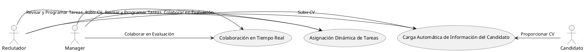
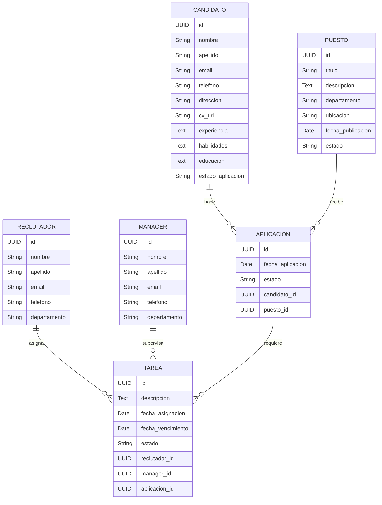
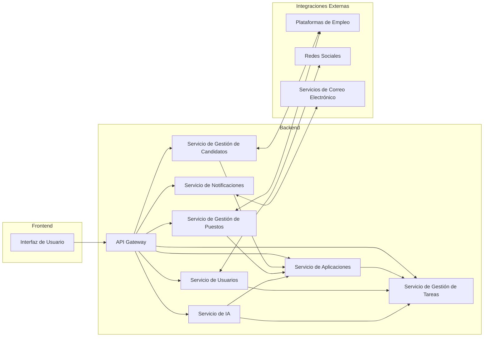
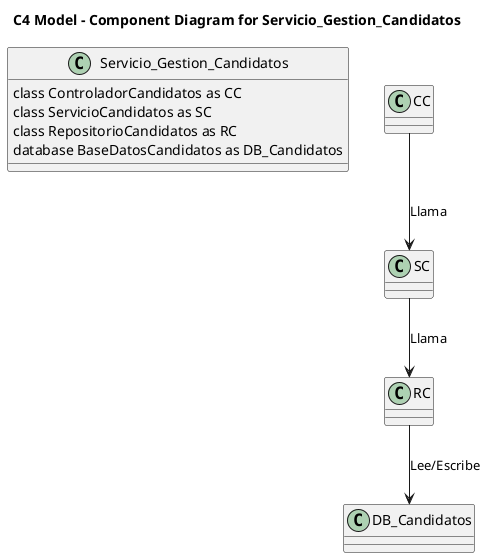

### Descripción del Software LTI

El software LTI (Linked Talent Intelligence) es un sistema avanzado de seguimiento de candidatos (ATS) diseñado para revolucionar la gestión de reclutamiento y selección de personal. Está impulsado por inteligencia artificial y automatización para maximizar la eficiencia y efectividad de los departamentos de recursos humanos.

### Valor Añadido

LTI ofrece una solución integral que no solo simplifica el proceso de reclutamiento, sino que también mejora la calidad de las contrataciones. Su enfoque en la automatización y la colaboración en tiempo real permite a los equipos de recursos humanos y managers trabajar de manera más cohesiva y eficiente.

### Ventajas Competitivas

1. **Automatización con IA**: Reduce el tiempo y el esfuerzo manual mediante la automatización de tareas rutinarias como la entrada de datos, el cribado de CVs y la programación de entrevistas.
2. **Colaboración en Tiempo Real**: Facilita la comunicación y colaboración instantánea entre reclutadores y managers, mejorando la toma de decisiones.
3. **Asignación Dinámica de Tareas**: Utiliza algoritmos de IA para asignar automáticamente tareas al equipo adecuado, optimizando los flujos de trabajo.
4. **Análisis Predictivo**: Ofrece análisis y reportes avanzados para prever tendencias de contratación y mejorar las estrategias de reclutamiento.

### Funciones Principales

1. **Carga Automática de Información del Candidato**: Al subir un CV, la IA extrae y organiza automáticamente todos los datos relevantes, como experiencia laboral, habilidades y educación.
2. **Asignación Dinámica de Tareas**: La IA asigna tareas automáticamente a los miembros del equipo más adecuados, mejorando la gestión del tiempo y los recursos.
3. **Mejora de la Eficiencia en HR**: Automatiza procesos como la programación de entrevistas y la gestión de comunicaciones, permitiendo a los reclutadores centrarse en tareas estratégicas.
4. **Colaboración en Tiempo Real**: Herramientas de colaboración que permiten a los reclutadores y managers comentar y compartir información en tiempo real sobre los candidatos.
5. **Automatización de Cribado de CVs**: La IA evalúa los CVs basándose en criterios predefinidos, reduciendo significativamente el tiempo de revisión y mejorando la precisión del cribado.
6. **Análisis y Reportes**: Proporciona reportes detallados sobre el rendimiento del reclutamiento, identificando áreas de mejora y optimización de procesos.

### Diagrama Lean Canvas

#### 1. **Problemática**
   - Tareas manuales y repetitivas que consumen tiempo.
   - Falta de coordinación y comunicación entre reclutadores y managers.
   - Dificultad para gestionar grandes volúmenes de candidatos de manera eficiente.

#### 2. **Segmentos de Clientes**
   - Departamentos de recursos humanos en medianas y grandes empresas.
   - Empresas de reclutamiento y selección de personal.
   - Managers de contratación.

#### 3. **Propuesta de Valor**
   - Automatización de tareas repetitivas.
   - Mejora de la eficiencia y la colaboración en tiempo real.
   - Análisis predictivo para mejores decisiones de contratación.

#### 4. **Solución**
   - IA para la carga automática de información de candidatos.
   - Asignación dinámica de tareas con IA.
   - Herramientas de colaboración en tiempo real.

#### 5. **Canales**
   - Venta directa a empresas.
   - Marketing digital.
   - Asociaciones con consultoras de recursos humanos.

#### 6. **Ingresos**
   - Suscripciones mensuales o anuales.
   - Tarifas por usuario.
   - Servicios premium y personalizados.

#### 7. **Estructura de Costos**
   - Desarrollo y mantenimiento del software.
   - Marketing y ventas.
   - Soporte al cliente y formación.

#### 8. **Métricas Clave**
   - Tasa de adopción del software.
   - Tiempo medio de contratación.
   - Satisfacción del cliente.

#### 9. **Ventaja Competitiva**
   - IA avanzada y automatización.
   - Integración fluida y herramientas de colaboración.
   - Análisis predictivo y reportes detallados.

### Lean Canvas Diagram

```plaintext
+------------------------+------------------------+
| Problem                | Customer Segments      |
| - Time-consuming manual| - HR departments in    |
|   tasks                |   medium and large     |
| - Lack of coordination |   enterprises          |
| - Difficulty managing  | - Recruitment agencies |
|   large candidate pools| - Hiring managers      |
+------------------------+------------------------+
| Unique Value Proposition| Solution              |
| - Automation of        | - AI for automatic     |
|   repetitive tasks     |   candidate data entry |
| - Enhanced efficiency  | - Dynamic task         |
|   and collaboration    |   assignment with AI   |
| - Predictive analytics | - Real-time            |
|   for better hiring    |   collaboration tools  |
|   decisions            |                        |
+------------------------+------------------------+
| Channels               | Revenue Streams        |
| - Direct sales to      | - Monthly or annual    |
|   enterprises          |   subscriptions        |
| - Digital marketing    | - Per user fees        |
| - Partnerships with HR | - Premium services     |
|   consultancies        |   and customization    |
+------------------------+------------------------+
| Cost Structure         | Key Metrics            |
| - Software development | - Software adoption    |
|   and maintenance      |   rate                 |
| - Marketing and sales  | - Average hiring time  |
| - Customer support and | - Customer satisfaction|
|   training             |                        |
+------------------------+------------------------+
| Competitive Advantage  |
| - Advanced AI and      |
|   automation           |
| - Seamless integration |
|   and collaboration    |
|   tools                |
| - Predictive analytics |
|   and detailed reports |
+------------------------+------------------------+
```

El software LTI se posiciona como una solución integral que no solo mejora la eficiencia del proceso de reclutamiento, sino que también facilita una colaboración más estrecha y efectiva entre todos los involucrados en la contratación.


### Casos de Uso Principales para LTI

1. **Carga Automática de Información del Candidato**
   - **Descripción**: Este caso de uso permite a los reclutadores y managers subir un CV, y la inteligencia artificial del sistema extrae automáticamente toda la información relevante del candidato (experiencia laboral, habilidades, educación, etc.) y la organiza en el perfil del candidato en la plataforma.
   - **Roles Involucrados**: Reclutador, Manager, Candidato.

2. **Asignación Dinámica de Tareas**
   - **Descripción**: Este caso de uso utiliza algoritmos de IA para asignar tareas automáticamente a los miembros del equipo más adecuados. Por ejemplo, la IA puede asignar la revisión de CVs a un reclutador específico o programar entrevistas según la disponibilidad del equipo y las prioridades establecidas.
   - **Roles Involucrados**: Reclutador, Manager.

3. **Colaboración en Tiempo Real**
   - **Descripción**: Este caso de uso permite la colaboración en tiempo real entre reclutadores y managers. Los usuarios pueden comentar y compartir información sobre los candidatos, hacer anotaciones en los perfiles y recibir notificaciones instantáneas sobre actualizaciones y decisiones.
   - **Roles Involucrados**: Reclutador, Manager.

### Diagrama UML de Casos de Uso

#### Descripción de Roles
- **Reclutador**: Usuario del sistema encargado de la gestión inicial de los candidatos, desde la publicación de ofertas hasta la revisión de CVs y la programación de entrevistas.
- **Manager**: Usuario del sistema que supervisa el proceso de contratación, toma decisiones finales sobre los candidatos y colabora con los reclutadores.
- **Candidato**: Persona que aplica a las posiciones abiertas y cuyos datos son procesados por el sistema.

#### PlantUML Code



### Explicación del Diagrama

1. **Carga Automática de Información del Candidato**: 
   - El Reclutador y el Manager pueden subir un CV. El Candidato proporciona su CV para el sistema.
   - La IA del sistema extrae automáticamente la información relevante del CV y la organiza en el perfil del candidato.

2. **Asignación Dinámica de Tareas**:
   - Tanto el Reclutador como el Manager pueden revisar y programar tareas. La IA asigna automáticamente las tareas a los miembros del equipo más adecuados, optimizando los flujos de trabajo.

3. **Colaboración en Tiempo Real**:
   - El Reclutador y el Manager colaboran en la evaluación de candidatos. Pueden comentar y compartir información en tiempo real sobre los perfiles de los candidatos, facilitando una toma de decisiones más rápida y eficiente.

Este diagrama UML y la descripción de los casos de uso proporcionan una visión clara de las funcionalidades básicas esenciales para el sistema LTI, asegurando que se cumplan los requisitos clave de los usuarios y se mejore la eficiencia del proceso de reclutamiento.


### Modelo de Datos para el Sistema de Seguimiento de Candidatos (ATS) de LTI

#### Entidades y Atributos

1. **Candidato**
   - `id`: UUID
   - `nombre`: String
   - `apellido`: String
   - `email`: String
   - `telefono`: String
   - `direccion`: String
   - `cv_url`: String
   - `experiencia`: Text
   - `habilidades`: Text
   - `educacion`: Text
   - `estado_aplicacion`: String

2. **Puesto**
   - `id`: UUID
   - `titulo`: String
   - `descripcion`: Text
   - `departamento`: String
   - `ubicacion`: String
   - `fecha_publicacion`: Date
   - `estado`: String

3. **Aplicacion**
   - `id`: UUID
   - `fecha_aplicacion`: Date
   - `estado`: String
   - `candidato_id`: UUID
   - `puesto_id`: UUID

4. **Reclutador**
   - `id`: UUID
   - `nombre`: String
   - `apellido`: String
   - `email`: String
   - `telefono`: String
   - `departamento`: String

5. **Manager**
   - `id`: UUID
   - `nombre`: String
   - `apellido`: String
   - `email`: String
   - `telefono`: String
   - `departamento`: String

6. **Tarea**
   - `id`: UUID
   - `descripcion`: Text
   - `fecha_asignacion`: Date
   - `fecha_vencimiento`: Date
   - `estado`: String
   - `reclutador_id`: UUID
   - `manager_id`: UUID
   - `aplicacion_id`: UUID

#### Relaciones
- Un **Candidato** puede aplicar a muchos **Puestos** a través de **Aplicaciones**.
- Un **Puesto** puede tener muchas **Aplicaciones**.
- Un **Reclutador** y un **Manager** pueden tener muchas **Tareas** asignadas.
- Una **Tarea** está asociada a una **Aplicacion** específica.

### Diagrama de Modelo de Datos en Formato Mermaid



### Descripción del Diagrama

- La entidad **Candidato** tiene atributos para almacenar información personal y profesional del candidato.
- La entidad **Puesto** tiene atributos que describen las características del trabajo publicado.
- La entidad **Aplicacion** relaciona candidatos con los puestos a los que han aplicado.
- La entidad **Reclutador** y **Manager** tienen atributos para almacenar la información de los usuarios que gestionan el proceso de selección.
- La entidad **Tarea** se utiliza para asignar y gestionar tareas específicas relacionadas con las aplicaciones, vinculadas tanto a reclutadores como a managers.

Este modelo de datos proporciona una estructura robusta para gestionar eficientemente el proceso de reclutamiento y seguimiento de candidatos, permitiendo una integración fluida y automatizada de las funciones principales del ATS de LTI.

### Diseño de Sistema de Alto Nivel para LTI

#### Estructura General del Sistema

La arquitectura de software para LTI sigue un modelo de microservicios, permitiendo una escalabilidad y mantenibilidad superiores al dividir el sistema en componentes independientes. Cada microservicio es responsable de una funcionalidad específica y se comunica con otros servicios a través de APIs RESTful. La arquitectura incluye los siguientes componentes principales:

1. **Servicio de Gestión de Candidatos**: Maneja toda la información relacionada con los candidatos.
2. **Servicio de Gestión de Puestos**: Gestiona la información sobre los puestos de trabajo disponibles.
3. **Servicio de Aplicaciones**: Controla las aplicaciones de los candidatos a los puestos.
4. **Servicio de Gestión de Tareas**: Administra la asignación y seguimiento de tareas.
5. **Servicio de Usuarios**: Gestiona la autenticación y autorización de usuarios (Reclutadores y Managers).
6. **Servicio de IA**: Proporciona funcionalidades avanzadas como la carga automática de información del candidato y la asignación dinámica de tareas.
7. **Servicio de Notificaciones**: Maneja las notificaciones en tiempo real para colaboración y alertas.
8. **API Gateway**: Punto de entrada único para todos los microservicios, manejando las solicitudes de los clientes y distribuyendo las peticiones a los servicios correspondientes.
9. **Frontend**: Interfaz de usuario que interactúa con el API Gateway.
10. **Integraciones Externas**: Conectores para integrarse con otros sistemas externos, como plataformas de empleo, redes sociales y servicios de correo electrónico.

#### Patrones de Comunicación

- **Comunicación Interna**: Los microservicios se comunican entre sí utilizando APIs RESTful y mensajes a través de un bus de mensajes (como Kafka o RabbitMQ) para operaciones asincrónicas.
- **API Gateway**: Maneja todas las solicitudes de los clientes, autenticación, y enrutamiento a los microservicios correspondientes.
- **Frontend**: La interfaz de usuario interactúa con el API Gateway para realizar operaciones CRUD y recibir actualizaciones en tiempo real.
- **Integraciones Externas**: Uso de APIs y webhooks para integrarse con sistemas externos, permitiendo la importación y exportación de datos.

### Diagrama de Arquitectura de Alto Nivel en Formato Mermaid



### Descripción del Diagrama

- **Frontend**: La interfaz de usuario interactúa con el sistema a través del **API Gateway**.
- **API Gateway**: Sirve como punto de entrada único, manejando la autenticación, autorización y enrutamiento de solicitudes a los microservicios apropiados.
- **Microservicios**:
  - **Servicio de Gestión de Candidatos**: Maneja la información de los candidatos.
  - **Servicio de Gestión de Puestos**: Administra la información de los puestos de trabajo.
  - **Servicio de Aplicaciones**: Gestiona las aplicaciones de los candidatos a los puestos.
  - **Servicio de Gestión de Tareas**: Administra la asignación y el seguimiento de las tareas.
  - **Servicio de Usuarios**: Gestiona la autenticación y autorización de los usuarios.
  - **Servicio de IA**: Proporciona funcionalidades avanzadas como la carga automática de información y la asignación dinámica de tareas.
  - **Servicio de Notificaciones**: Gestiona las notificaciones en tiempo real.
- **Integraciones Externas**: Permiten la interacción con plataformas de empleo, redes sociales y servicios de correo electrónico para una integración más amplia y funcional.

Esta arquitectura modular y escalable permite a LTI manejar eficientemente el seguimiento de candidatos y optimizar los procesos de contratación.


### Modelo C4 para el Sistema LTI

El modelo C4 es una forma de estructurar la documentación arquitectónica de software, dividiendo la arquitectura en cuatro niveles de detalle: Contexto, Contenedores, Componentes y Código.

#### Niveles del Modelo C4

1. **Contexto (Context)**:
   - Este nivel proporciona una visión general del sistema en el contexto de su entorno, mostrando cómo interactúan los usuarios y otros sistemas con el sistema LTI.

2. **Contenedores (Containers)**:
   - Este nivel desglosa el sistema en contenedores, que pueden ser aplicaciones, bases de datos, microservicios, etc. Cada contenedor representa una unidad ejecutable o desplegable dentro del sistema.

3. **Componentes (Components)**:
   - Este nivel desglosa los contenedores en componentes individuales, mostrando cómo cada componente colabora para cumplir con las responsabilidades del contenedor.

4. **Código (Code)**:
   - Este nivel proporciona detalles sobre la implementación de un componente específico, normalmente en forma de diagramas de clases, secuencia, etc. No incluiremos este nivel para mantener la simplicidad en esta explicación.

#### Diagrama C4 en Formato PlantUML

Para este ejercicio, nos enfocaremos en el Servicio de Gestión de Candidatos y proporcionaremos los diagramas para los niveles de Contexto, Contenedores y Componentes.

```plantuml
@startuml
!define RECTANGLE class
!define BOUNDED_CONTEXT RECTANGLE

title C4 Model - Context Diagram

actor Usuario as User

BOUNDED_CONTEXT SistemaLTI {
    RECTANGLE API_Gateway as AG
    RECTANGLE Servicio_Gestion_Candidatos as SGC
    RECTANGLE Servicio_Gestion_Puestos as SGP
    RECTANGLE Servicio_Aplicaciones as SA
    RECTANGLE Servicio_Gestion_Tareas as SGT
    RECTANGLE Servicio_Usuarios as SU
    RECTANGLE Servicio_IA as SIA
    RECTANGLE Servicio_Notificaciones as SN
}

User --> AG : Usa
AG --> SGC : Interactúa
AG --> SGP : Interactúa
AG --> SA : Interactúa
AG --> SGT : Interactúa
AG --> SU : Autentica
AG --> SIA : Utiliza IA
AG --> SN : Recibe Notificaciones

@enduml
```

```plantuml
@startuml
!define RECTANGLE class
!define BOUNDED_CONTEXT RECTANGLE

title C4 Model - Container Diagram

actor Usuario as User

BOUNDED_CONTEXT SistemaLTI {
    RECTANGLE API_Gateway as AG {
        RECTANGLE Servicio_Gestion_Candidatos as SGC {
            database BaseDatosCandidatos as DB_Candidatos
        }
    }
    RECTANGLE Servicio_Gestion_Puestos as SGP
    RECTANGLE Servicio_Aplicaciones as SA
    RECTANGLE Servicio_Gestion_Tareas as SGT
    RECTANGLE Servicio_Usuarios as SU
    RECTANGLE Servicio_IA as SIA
    RECTANGLE Servicio_Notificaciones as SN
}

User --> AG : Usa
AG --> SGC : Gestiona Candidatos
SGC --> DB_Candidatos : Lee/Escribe
AG --> SGP : Gestiona Puestos
AG --> SA : Gestiona Aplicaciones
AG --> SGT : Gestiona Tareas
AG --> SU : Autentica Usuarios
AG --> SIA : Utiliza IA
AG --> SN : Recibe Notificaciones

@enduml
```



### Explicación del Diagrama

1. **Contexto (Context)**
   - **Usuario (User)**: Representa a cualquier usuario que interactúa con el sistema, como reclutadores o managers.
   - **Sistema LTI**: Sistema de seguimiento de candidatos que interactúa con varios servicios.
   - **API Gateway**: Punto de entrada para todas las solicitudes de los usuarios, manejando la autenticación y enrutamiento a los servicios correspondientes.

2. **Contenedores (Containers)**
   - **API Gateway**: Maneja todas las solicitudes de los usuarios y distribuye las peticiones a los microservicios apropiados.
   - **Servicio de Gestión de Candidatos**: Contenedor responsable de manejar toda la información relacionada con los candidatos, incluyendo lectura y escritura en la base de datos de candidatos.
   - **Base de Datos de Candidatos**: Almacena la información de los candidatos.
   - Otros contenedores (Servicios de Gestión de Puestos, Aplicaciones, Tareas, Usuarios, IA y Notificaciones) también se incluyen pero no se desglosan en detalle aquí.

3. **Componentes (Components)**
   - **Controlador de Candidatos (ControladorCandidatos)**: Maneja las solicitudes HTTP relacionadas con los candidatos.
   - **Servicio de Candidatos (ServicioCandidatos)**: Contiene la lógica de negocio para gestionar candidatos.
   - **Repositorio de Candidatos (RepositorioCandidatos)**: Accede a la base de datos para realizar operaciones CRUD sobre los candidatos.
   - **Base de Datos de Candidatos (BaseDatosCandidatos)**: Almacena toda la información relacionada con los candidatos.

Estos diagramas proporcionan una visión clara y estructurada del sistema de LTI en diferentes niveles de detalle, permitiendo una mejor comprensión y comunicación de la arquitectura del sistema.