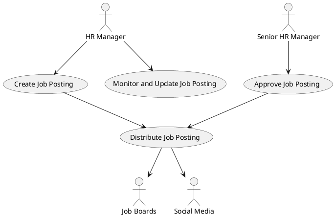
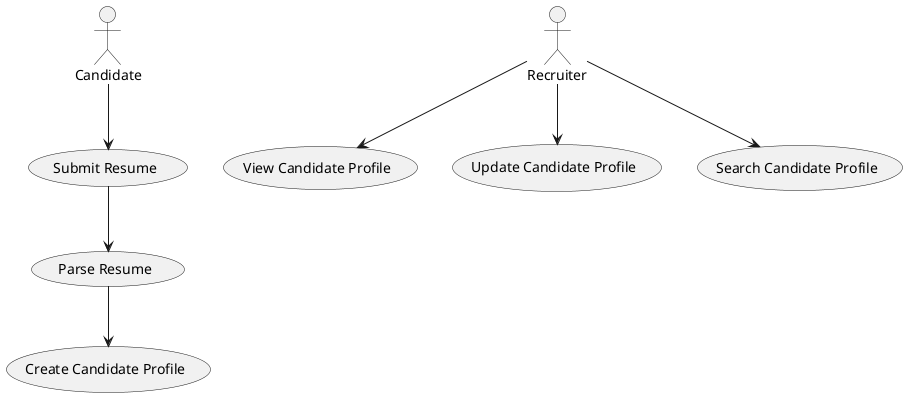
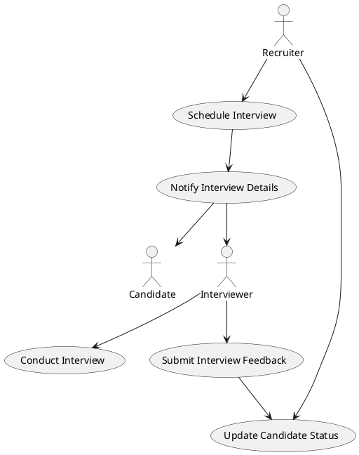
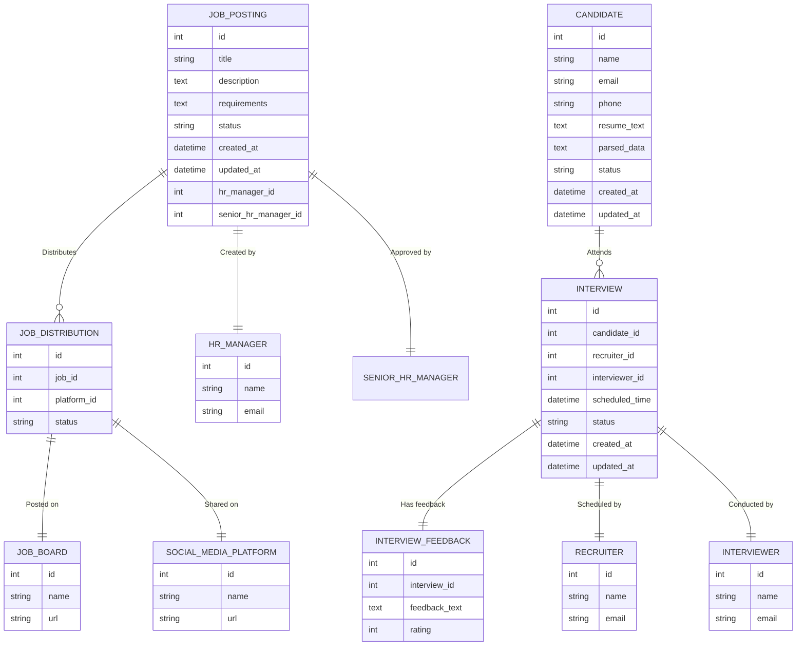
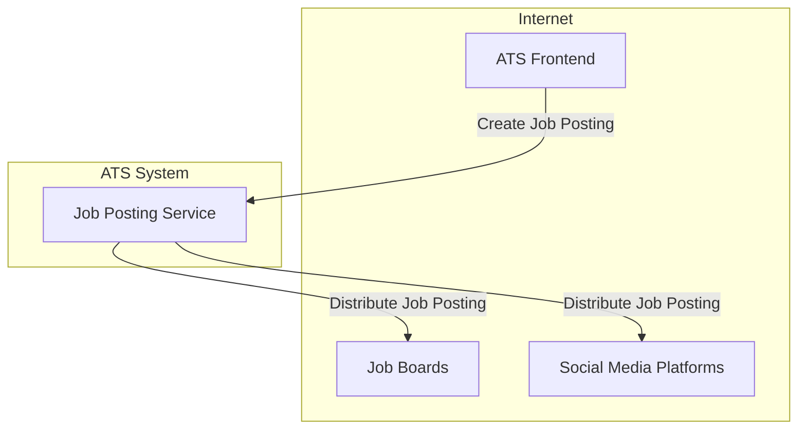
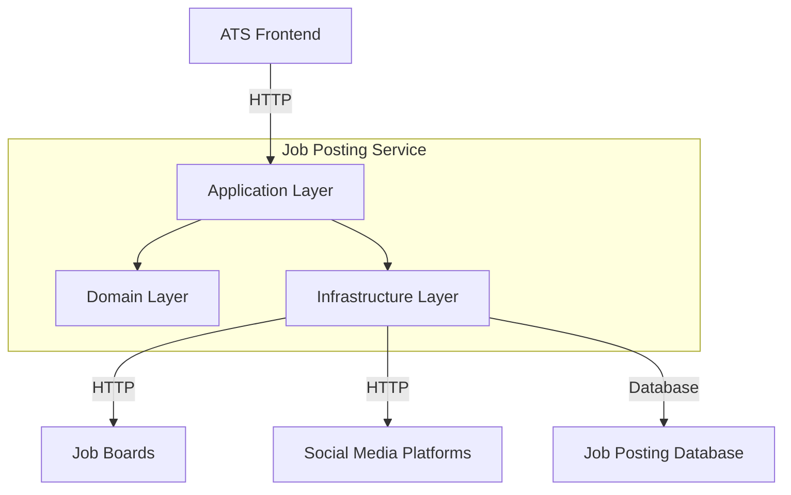
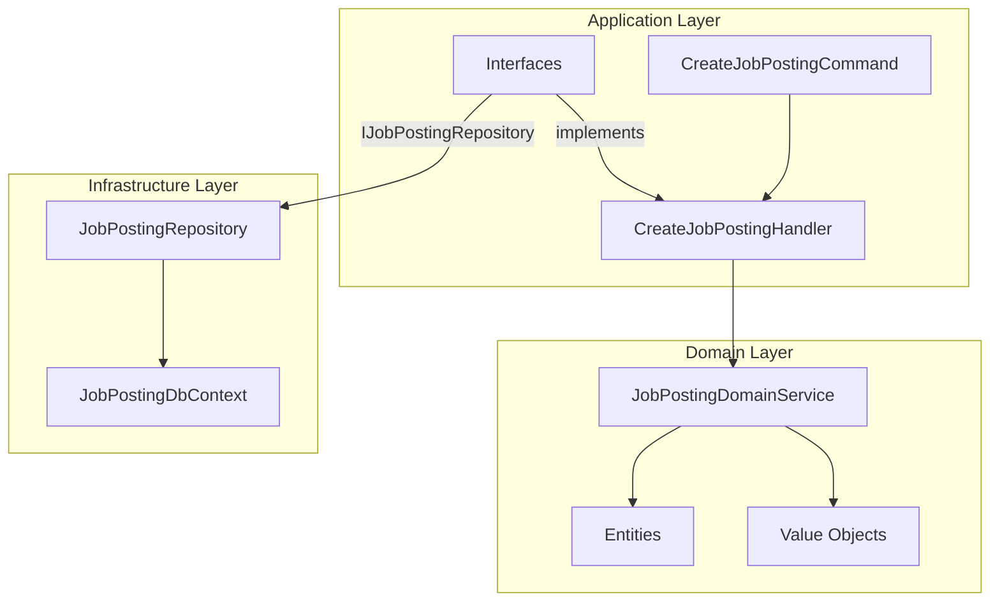
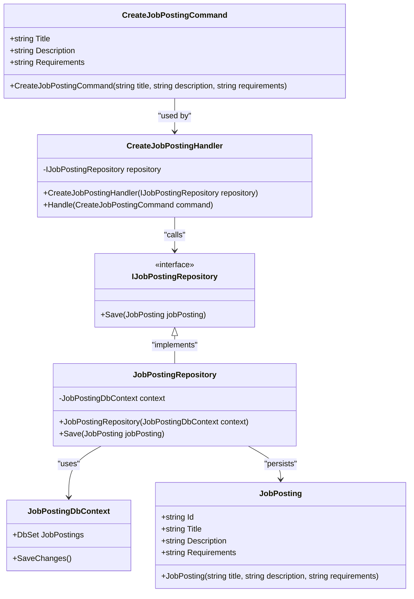

# Investigation

## Analysis of Requirements 

### Basic Functionalities of an ATS

1. **Job Posting and Distribution**
   - Automatically distribute job postings to multiple job boards and social media platforms.
   - Create and manage job listings.

2. **Resume Parsing**
   - Extract relevant information from resumes and populate candidate profiles automatically.
   - Support for various file formats (PDF, DOC, etc.).

3. **Candidate Management**
   - Maintain a database of all candidates, tracking their progress through the recruitment process.
   - Enable tagging, filtering, and searching of candidates based on various criteria.

4. **Application Tracking**
   - Track the status of each application through different stages (e.g., applied, screened, interviewed, offered).
   - Automated status updates and notifications to candidates.

5. **Interview Scheduling**
   - Facilitate scheduling interviews with integrated calendar systems (Google Calendar, Outlook).
   - Automated reminders for both candidates and interviewers.

6. **Communication Tools**
   - Integrated email and messaging system to communicate with candidates.
   - Templates for common communications (e.g., rejection letters, interview invitations).

7. **Reporting and Analytics**
   - Generate reports on various recruitment metrics (time-to-hire, source effectiveness, diversity metrics).
   - Customizable dashboards for tracking key performance indicators (KPIs).

8. **Collaboration Features**
   - Allow multiple users (recruiters, hiring managers) to collaborate on candidate evaluation.
   - Role-based access controls to ensure appropriate data access.

9. **Compliance Management**
   - Ensure adherence to legal requirements (e.g., GDPR, EEOC).
   - Document retention policies and audit trails.

10. **Mobile Access**
    - Mobile-friendly interface or dedicated mobile app for on-the-go access.
    - Push notifications for important updates.

### Benefits of Using an ATS for LTI

1. **Streamlined Recruitment Process**
   - Centralized platform for managing all recruitment activities, reducing administrative overhead.

2. **Improved Candidate Experience**
   - Faster response times and clear communication channels enhance candidate satisfaction.

3. **Better Data Management**
   - Organized database of candidate information, making it easier to find and track applicants.

4. **Enhanced Reporting and Analytics**
   - Insightful data helps in making informed decisions and optimizing recruitment strategies.

5. **Increased Productivity**
   - Automation of routine tasks allows recruiters to focus on strategic activities.

### Efficiency Gains for HR Departments

- **Time Savings**: Automation of repetitive tasks like resume screening and interview scheduling.
- **Reduced Errors**: Standardized processes minimize human error.
- **Better Collaboration**: Centralized data and communication tools enhance teamwork among HR staff.

### Alternatives to Using an ATS

1. **Manual Recruitment Processes**
   - Using spreadsheets and email for managing applications.
   - Relevant for very small companies with low recruitment volumes.

2. **Outsourcing Recruitment**
   - Hiring external agencies to handle the recruitment process.
   - Useful when specialized talent is required or during periods of high growth.

3. **General HR Software**
   - Using broader HR management systems that include recruitment modules.
   - Suitable for companies looking for an integrated approach to HR.

### Customer Journey of an ATS User

1. **Job Posting**
   - User creates and posts job listings to various platforms through the ATS.
   
2. **Application Reception**
   - Candidates apply, and their applications are parsed and stored in the ATS database.

3. **Screening**
   - ATS screens applications based on predefined criteria and filters.

4. **Candidate Shortlisting**
   - Recruiters review shortlisted candidates and update their status in the system.

5. **Interview Scheduling**
   - Interviews are scheduled using the integrated calendar, with automated reminders sent to both parties.

6. **Interview and Feedback**
   - Interviewers provide feedback through the ATS, which is logged in the candidate's profile.

7. **Offer Management**
   - The system generates offer letters and manages communication with successful candidates.

8. **Onboarding**
   - Once a candidate accepts an offer, onboarding processes are initiated through the ATS.

### Real-time Collaboration Improvement

An ATS significantly enhances real-time collaboration between recruiters and hiring managers by:
- Providing a shared platform for reviewing candidate profiles and feedback.
- Allowing real-time updates on candidate status and interview outcomes.
- Enabling collaborative decision-making with tools like shared notes and evaluation forms.

### Automation and AI Assistance in an ATS

Yes, it is possible to integrate automations and AI assistance in an ATS. Key areas include:

1. **Resume Screening**
   - AI-powered algorithms to screen and rank resumes based on job requirements.

2. **Chatbots**
   - Automated chatbots to handle initial candidate queries and pre-screening.

3. **Interview Scheduling**
   - AI-assisted scheduling tools to find optimal interview times for all parties.

4. **Predictive Analytics**
   - Using AI to predict candidate success and turnover rates based on historical data.

5. **Candidate Matching**
   - Machine learning models to match candidates to the most suitable job openings.

6. **Automated Workflows**
   - Setting up automated workflows for different stages of the recruitment process, reducing manual intervention.

By focusing on these features and leveraging AI and automation, LTI can develop a state-of-the-art ATS that outperforms competitors and provides significant value to its clients.

## Summary and Conclusions

### 1. Brief Description of ATS Software for LTI

The ATS software developed by LTI (LeadersTechnology Impact) aims to revolutionize recruitment processes by automating and digitizing the hiring journey. This state-of-the-art system is designed to streamline the entire recruitment lifecycle, from job posting to onboarding, ensuring that companies can attract and hire top talent with minimal effort. 

**Added Value and Competitive Advantages:**
- **Efficiency and Productivity:** Automation of routine tasks such as resume parsing and interview scheduling saves time and reduces administrative burden, allowing HR professionals to focus on strategic initiatives.
- **Enhanced Candidate Experience:** Faster response times, clear communication, and a user-friendly application process improve the overall candidate experience.
- **Data-Driven Decision Making:** Advanced reporting and analytics provide insights into recruitment metrics, enabling companies to make informed decisions and optimize their hiring strategies.
- **Real-Time Collaboration:** Integrated communication tools and role-based access controls enhance collaboration between recruiters and hiring managers, improving the efficiency and effectiveness of the recruitment process.
- **AI and Automation Integration:** Leveraging AI for resume screening, candidate matching, and predictive analytics ensures a smarter, faster, and more accurate recruitment process.

### 2. Main Functions of the ATS

1. **Job Posting and Distribution:**
   - Centralized platform for creating and managing job listings.
   - Automatic distribution to multiple job boards and social media channels.

2. **Resume Parsing:**
   - AI-driven extraction of candidate information from various file formats.
   - Automated population of candidate profiles for easy tracking and management.

3. **Candidate Management:**
   - Comprehensive database to maintain and organize candidate information.
   - Advanced search and filtering capabilities to quickly identify suitable candidates.

4. **Application Tracking:**
   - Status tracking of applications through different recruitment stages.
   - Automated notifications and updates for candidates.

5. **Interview Scheduling:**
   - Seamless scheduling with integrated calendar systems.
   - Automated reminders for interviewers and candidates.

6. **Communication Tools:**
   - Built-in email and messaging for streamlined candidate communication.
   - Predefined templates for common communication needs.

7. **Reporting and Analytics:**
   - Customizable dashboards and reports to monitor recruitment performance.
   - Insights into key metrics such as time-to-hire and source effectiveness.

8. **Collaboration Features:**
   - Shared platform for recruiters and hiring managers to collaborate on candidate evaluations.
   - Role-based access to ensure secure and appropriate data access.

9. **Compliance Management:**
   - Tools to ensure adherence to legal and regulatory requirements.
   - Audit trails and document retention policies for compliance.

10. **Mobile Access:**
    - Mobile-friendly interface or dedicated app for access on the go.
    - Push notifications for real-time updates.

### 3. Lean Canvas Diagram

| **Lean Canvas**                     | **Description**                                      |
|-------------------------------------|------------------------------------------------------|
| **Problem**                         | - Inefficient recruitment processes.<br>- High administrative burden.<br>- Poor candidate experience.<br>- Lack of data-driven insights. |
| **Customer Segments**               | - Small to large enterprises.<br>- HR departments.<br>- Recruitment agencies. |
| **Unique Value Proposition**        | - Streamlined recruitment process.<br>- Enhanced candidate experience.<br>- Data-driven decision-making.<br>- Real-time collaboration.<br>- AI and automation integration. |
| **Solution**                        | - Automated job posting and distribution.<br>- AI-driven resume parsing and candidate matching.<br>- Comprehensive candidate management.<br>- Integrated interview scheduling and communication tools.<br>- Advanced reporting and analytics. |
| **Channels**                        | - Direct sales.<br>- Online marketing.<br>- Partnerships with HR service providers. |
| **Revenue Streams**                 | - Subscription-based model.<br>- Tiered pricing plans.<br>- Additional charges for premium features. |
| **Key Activities**                  | - Software development and maintenance.<br>- Customer support and training.<br>- Marketing and sales efforts.<br>- Continuous improvement based on feedback and market trends. |
| **Key Resources**                   | - Development team.<br>- AI and data analytics specialists.<br>- Customer support team.<br>- Marketing and sales team. |
| **Key Partners**                    | - Job boards and social media platforms.<br>- HR technology providers.<br>- Data security and compliance firms. |
| **Cost Structure**                  | - Software development costs.<br>- Marketing and sales expenses.<br>- Customer support and training.<br>- Infrastructure and hosting costs. |

By focusing on these features and leveraging the Lean Canvas approach, LTI's ATS software is positioned to become the leading solution in the market, offering unparalleled efficiency, collaboration, and data-driven insights to transform the recruitment process.

## Buy vs Build

### Buy vs Build: A Detailed Justification

#### Considerations for Building an ATS

**Pros:**
- **Customization:** Building an ATS in-house allows LTI to tailor the software specifically to the company's needs and workflows.
- **Competitive Advantage:** Unique features can be developed that differentiate the product in the market.
- **Control:** Full control over the development process, data security, and future enhancements.

**Cons:**
- **High Initial Cost:** Significant investment in terms of money, time, and resources for development.
- **Maintenance:** Ongoing costs for updates, bug fixes, and scaling.
- **Time to Market:** Longer time to develop and launch the product, potentially missing out on market opportunities.

#### Considerations for Buying an ATS

**Pros:**
- **Speed:** Faster implementation, allowing LTI to start using the system and gaining benefits almost immediately.
- **Lower Upfront Costs:** Typically lower initial investment compared to building an ATS from scratch.
- **Proven Solutions:** Established products with a track record of reliability and performance.
- **Support and Updates:** Regular updates and support from the vendor, reducing the burden on internal teams.

**Cons:**
- **Customization Limitations:** Limited ability to customize the software to meet specific needs.
- **Dependency:** Dependence on the vendor for updates, support, and potential data security concerns.
- **Cost Over Time:** Ongoing subscription or licensing fees can add up over time.

### Best Known Open Source ATS

1. **OpenCATS**
   - **Features:** Resume parsing, candidate management, job posting, reporting.
   - **Pros:** Free, highly customizable, active community support.
   - **Cons:** Limited advanced features, requires technical expertise to set up and maintain.

2. **CandidATS**
   - **Features:** Candidate tracking, resume parsing, reporting, interview scheduling.
   - **Pros:** Free, flexible, and user-friendly.
   - **Cons:** Less comprehensive than commercial options, limited support.

3. **Odoo Recruitment**
   - **Features:** Part of a larger ERP suite, includes job posting, candidate tracking, and reporting.
   - **Pros:** Integrated with other Odoo modules, customizable.
   - **Cons:** Can become complex, paid enterprise version for advanced features.

### Best Known Commercial ATS

1. **Greenhouse**
   - **Features:** Advanced interview scheduling, robust analytics, AI-powered resume parsing, collaborative hiring.
   - **Pros:** Highly scalable, excellent user interface, extensive integrations.
   - **Cons:** Higher cost, complex pricing structure.

2. **Lever**
   - **Features:** AI-driven candidate sourcing, automated workflows, CRM features, robust analytics.
   - **Pros:** Strong focus on automation and AI, user-friendly interface.
   - **Cons:** Expensive, potential overkill for smaller companies.

3. **Jobvite**
   - **Features:** AI-powered recruiting, social media integrations, candidate nurturing, onboarding.
   - **Pros:** Comprehensive feature set, strong analytics, good support.
   - **Cons:** High cost, some features may require additional modules.

4. **Workday Recruiting**
   - **Features:** Integrated with HR and finance systems, AI-driven insights, robust analytics.
   - **Pros:** Comprehensive enterprise solution, seamless integration with other Workday products.
   - **Cons:** Very expensive, best suited for large enterprises.

### Comparison Based on AI Automations

1. **Greenhouse**
   - **AI Features:** AI-powered resume parsing, predictive analytics.
   - **Strengths:** Strong in candidate experience and collaborative hiring.
   - **Weaknesses:** Higher cost, complex to set up and configure.

2. **Lever**
   - **AI Features:** AI-driven candidate sourcing, automated workflows, predictive analytics.
   - **Strengths:** Excellent for automating recruitment workflows and sourcing.
   - **Weaknesses:** Expensive, may have a steeper learning curve.

3. **Jobvite**
   - **AI Features:** AI-powered candidate matching, automated scheduling, predictive analytics.
   - **Strengths:** Comprehensive AI features, good support and user experience.
   - **Weaknesses:** High cost, additional modules for some features.

4. **Workday Recruiting**
   - **AI Features:** AI-driven insights, machine learning for candidate matching.
   - **Strengths:** Best suited for large enterprises with complex needs.
   - **Weaknesses:** Very expensive, complex implementation.

### Recommended Strategy: Buy

**Justification:**
Given LTI's startup status and the need to quickly establish a competitive advantage in the market, buying a commercial ATS would be the most prudent strategy. This approach provides immediate access to advanced features, AI capabilities, and a reliable support system, enabling LTI to focus on core business activities and strategic initiatives.

**Best Commercial ATS for LTI: Lever**

- **Reasoning:**
  - **AI and Automation:** Lever offers strong AI-driven candidate sourcing, automated workflows, and predictive analytics, which align well with LTI's goal of minimizing effort and maximizing efficiency in recruitment.
  - **User Experience:** Its user-friendly interface ensures quick adoption and ease of use, which is crucial for a startup.
  - **Scalability:** Lever is highly scalable, allowing LTI to grow and expand its operations without needing to switch systems.
  - **Support and Integration:** Excellent support and extensive integrations with other HR tools and systems.

Lever's comprehensive feature set, focus on AI and automation, and scalability make it the best fit for LTI to establish itself as a leading HR company in the market.

## Use Cases

Sure, let's create the use case diagrams using PlantUML.

### Use Case 1: Job Posting and Distribution

**Description:** This use case involves creating job postings within the ATS and distributing them to various job boards and social media platforms. The goal is to streamline the process of advertising job openings to attract a large pool of qualified candidates.

**Steps:**
1. **Create Job Posting:** HR manager creates a job posting by filling out a form with job details (title, description, requirements, etc.).
2. **Approve Job Posting:** The job posting is reviewed and approved by a senior HR manager.
3. **Distribute Job Posting:** The approved job posting is automatically distributed to selected job boards and social media platforms.
4. **Monitor and Update:** HR manager monitors the posting's performance and updates the job details if necessary.

**PlantUML Use Case Diagram:**



### Use Case 2: Resume Parsing and Candidate Management

**Description:** This use case involves parsing resumes submitted by candidates, extracting relevant information, and managing candidate profiles within the ATS. The objective is to organize candidate data efficiently and make it easily searchable.

**Steps:**
1. **Receive Resume:** Candidates submit their resumes through the ATS.
2. **Parse Resume:** The ATS parses the resume to extract relevant information (name, contact details, experience, skills).
3. **Create Candidate Profile:** The extracted information is used to create a candidate profile in the ATS.
4. **Manage Candidate Profile:** Recruiters can view, update, and search candidate profiles.

**PlantUML Use Case Diagram:**



### Use Case 3: Interview Scheduling and Management

**Description:** This use case involves scheduling interviews between candidates and interviewers, sending notifications, and managing interview feedback. The goal is to automate the interview scheduling process and streamline feedback collection.

**Steps:**
1. **Schedule Interview:** Recruiter selects a candidate and schedules an interview by choosing available time slots.
2. **Notify Participants:** The ATS sends notifications to the candidate and interviewers with the interview details.
3. **Conduct Interview:** The interview is conducted as scheduled.
4. **Collect Feedback:** Interviewers submit their feedback through the ATS.
5. **Update Candidate Status:** The ATS updates the candidate's status based on the feedback.

**PlantUML Use Case Diagram:**



These diagrams correctly represent the use cases for job posting and distribution, resume parsing and candidate management, and interview scheduling and management in the ATS system.

## Data model diagram 

Sure! Here is the updated data model diagram with detailed explanations for each entity and their relationships.

### Entities and Fields

1. **Job Posting**
   - **Description:** Represents a job opening created by the HR team. It includes details about the job such as title, description, and requirements.
   - **Fields:**
     - `id` (Primary Key, Integer): Unique identifier for the job posting.
     - `title` (String): The title of the job position.
     - `description` (Text): A detailed description of the job.
     - `requirements` (Text): The qualifications and skills required for the job.
     - `status` (String, e.g., Draft, Approved): The current status of the job posting.
     - `created_at` (DateTime): Timestamp when the job posting was created.
     - `updated_at` (DateTime): Timestamp when the job posting was last updated.
     - `hr_manager_id` (Foreign Key to HR Manager, Integer): ID of the HR manager who created the job posting.
     - `senior_hr_manager_id` (Foreign Key to Senior HR Manager, Integer): ID of the senior HR manager who approved the job posting.
   - **Relationships:**
     - One-to-Many with `Job Distribution`
     - Many-to-One with `HR Manager`
     - Many-to-One with `Senior HR Manager`

2. **Job Distribution**
   - **Description:** Manages the distribution of job postings to various platforms like job boards and social media platforms.
   - **Fields:**
     - `id` (Primary Key, Integer): Unique identifier for the job distribution.
     - `job_id` (Foreign Key to Job Posting, Integer): ID of the job posting.
     - `platform_id` (Foreign Key to Platform, Integer): ID of the platform (job board or social media) where the job is posted.
     - `status` (String, e.g., Pending, Published): The current status of the job distribution.
   - **Relationships:**
     - Many-to-One with `Job Posting`
     - Many-to-One with `Platform` (Job Boards and Social Media Platforms)

3. **Candidate**
   - **Description:** Represents a candidate applying for a job. It includes personal information and resume details.
   - **Fields:**
     - `id` (Primary Key, Integer): Unique identifier for the candidate.
     - `name` (String): The name of the candidate.
     - `email` (String): The email address of the candidate.
     - `phone` (String): The phone number of the candidate.
     - `resume_text` (Text): The resume of the candidate in text format.
     - `parsed_data` (Text, JSON structure for parsed resume data): Structured data extracted from the resume.
     - `status` (String, e.g., New, In Review, Hired): The current status of the candidate.
     - `created_at` (DateTime): Timestamp when the candidate profile was created.
     - `updated_at` (DateTime): Timestamp when the candidate profile was last updated.
   - **Relationships:**
     - One-to-Many with `Interview`

4. **Interview**
   - **Description:** Represents an interview scheduled between a candidate and an interviewer. It includes details about the interview.
   - **Fields:**
     - `id` (Primary Key, Integer): Unique identifier for the interview.
     - `candidate_id` (Foreign Key to Candidate, Integer): ID of the candidate being interviewed.
     - `recruiter_id` (Foreign Key to Recruiter, Integer): ID of the recruiter who scheduled the interview.
     - `scheduled_time` (DateTime): The scheduled date and time for the interview.
     - `interviewer_id` (Foreign Key to Interviewer, Integer): ID of the interviewer conducting the interview.
     - `status` (String, e.g., Scheduled, Completed): The current status of the interview.
     - `created_at` (DateTime): Timestamp when the interview was created.
     - `updated_at` (DateTime): Timestamp when the interview was last updated.
   - **Relationships:**
     - Many-to-One with `Candidate`
     - Many-to-One with `Recruiter`
     - Many-to-One with `Interviewer`
     - One-to-One with `Interview Feedback`

5. **Interview Feedback**
   - **Description:** Contains feedback provided by the interviewer after an interview.
   - **Fields:**
     - `id` (Primary Key, Integer): Unique identifier for the interview feedback.
     - `interview_id` (Foreign Key to Interview, Integer): ID of the interview.
     - `feedback_text` (Text): The feedback text provided by the interviewer.
     - `rating` (Integer): Rating given by the interviewer.
   - **Relationships:**
     - One-to-One with `Interview`

6. **HR Manager**
   - **Description:** Represents an HR manager responsible for creating and approving job postings.
   - **Fields:**
     - `id` (Primary Key, Integer): Unique identifier for the HR manager.
     - `name` (String): The name of the HR manager.
     - `email` (String): The email address of the HR manager.
   - **Relationships:**
     - One-to-Many with `Job Posting`

7. **Recruiter**
   - **Description:** Represents a recruiter responsible for managing candidate profiles and scheduling interviews.
   - **Fields:**
     - `id` (Primary Key, Integer): Unique identifier for the recruiter.
     - `name` (String): The name of the recruiter.
     - `email` (String): The email address of the recruiter.
   - **Relationships:**
     - One-to-Many with `Interview`

8. **Interviewer**
   - **Description:** Represents an interviewer responsible for conducting interviews and providing feedback.
   - **Fields:**
     - `id` (Primary Key, Integer): Unique identifier for the interviewer.
     - `name` (String): The name of the interviewer.
     - `email` (String): The email address of the interviewer.
   - **Relationships:**
     - One-to-Many with `Interview`

9. **Job Board**
   - **Description:** Represents a job board where job postings can be distributed.
   - **Fields:**
     - `id` (Primary Key, Integer): Unique identifier for the job board.
     - `name` (String): The name of the job board.
     - `url` (String): The URL of the job board.
   - **Relationships:**
     - Many-to-One with `Job Distribution`

10. **Social Media Platform**
    - **Description:** Represents a social media platform where job postings can be shared.
    - **Fields:**
      - `id` (Primary Key, Integer): Unique identifier for the social media platform.
      - `name` (String): The name of the social media platform.
      - `url` (String): The URL of the social media platform.
    - **Relationships:**
      - Many-to-One with `Job Distribution`

### Data Model Diagram (using Mermaid syntax)



This enhanced data model includes all necessary entities, fields, relationships, and explanations, providing a comprehensive view of the ATS system.

## High-Level Architecture Design

### Technical Documentation for ATS System Architecture on AWS

#### Overview

The provided architecture diagram illustrates a microservices-based Applicant Tracking System (ATS) hosted on AWS. The system is designed to handle various aspects of the recruitment process, including job posting, distribution, resume parsing, candidate management, interview scheduling, and notifications. The architecture leverages AWS services to ensure scalability, reliability, and performance.

#### Components

1. **ATS Frontend**
   - The user interface for HR managers, recruiters, and candidates. This is typically a web application.
   - Delivered through AWS CloudFront, a CDN service for low-latency access.

2. **CloudFront**
   - Distributes content globally with low latency.
   - Ensures the frontend is quickly accessible from different geographical locations.

3. **API Gateway**
   - Acts as a single entry point for all client requests.
   - Provides routing, security, and throttling.

4. **Elastic Load Balancer (ELB)**
   - Distributes incoming application traffic across multiple microservices.
   - Ensures high availability and reliability.

5. **Microservices**
   - Each microservice handles a specific domain within the ATS system, ensuring separation of concerns and scalability.
   - **Job Posting Service**: Manages job postings.
   - **Job Distribution Service**: Handles distribution of job postings to job boards and social media platforms.
   - **Resume Parsing Service**: Parses resumes to extract candidate information.
   - **Candidate Management Service**: Manages candidate profiles and data.
   - **Interview Scheduling Service**: Manages interview scheduling and feedback.
   - **Notification Service**: Sends notifications to candidates, interviewers, and recruiters.

6. **Databases**
   - Each microservice has its own database to maintain loose coupling and ensure data integrity.
   - Databases include Job Posting DB, Job Distribution DB, Resume Parsing DB, Candidate Management DB, Interview Scheduling DB, and Notification DB.

#### Clean Hexagonal Architecture for ASP.NET Core

To design a clean, maintainable, and scalable solution, we will adopt the Hexagonal Architecture (Ports and Adapters) approach in ASP.NET Core. This architecture pattern ensures that the core business logic is decoupled from external concerns such as databases, user interfaces, and third-party services.

### High-Level Folder Structure

```
src/
├── JobPostingService/
│   ├── JobPostingService.Application/
│   ├── JobPostingService.Domain/
│   ├── JobPostingService.Infrastructure/
│   ├── JobPostingService.API/
├── JobDistributionService/
│   ├── JobDistributionService.Application/
│   ├── JobDistributionService.Domain/
│   ├── JobDistributionService.Infrastructure/
│   ├── JobDistributionService.API/
├── ResumeParsingService/
│   ├── ResumeParsingService.Application/
│   ├── ResumeParsingService.Domain/
│   ├── ResumeParsingService.Infrastructure/
│   ├── ResumeParsingService.API/
├── CandidateManagementService/
│   ├── CandidateManagementService.Application/
│   ├── CandidateManagementService.Domain/
│   ├── CandidateManagementService.Infrastructure/
│   ├── CandidateManagementService.API/
├── InterviewSchedulingService/
│   ├── InterviewSchedulingService.Application/
│   ├── InterviewSchedulingService.Domain/
│   ├── InterviewSchedulingService.Infrastructure/
│   ├── InterviewSchedulingService.API/
├── NotificationService/
│   ├── NotificationService.Application/
│   ├── NotificationService.Domain/
│   ├── NotificationService.Infrastructure/
│   ├── NotificationService.API/
```

### Explanation of Layers

1. **Application Layer**
   - Contains application logic and orchestrates the use cases.
   - Implements CQRS (Command Query Responsibility Segregation) pattern with MediatR library.
   - Handles commands, queries, and their respective handlers.
   - Interfaces for services, repositories, and external APIs.

2. **Domain Layer**
   - Contains the core business logic and domain entities.
   - Implements domain services, value objects, and aggregates.
   - Enforces domain invariants and business rules.

3. **Infrastructure Layer**
   - Contains implementations for interfaces defined in the application layer.
   - Manages database context and migrations using Entity Framework Core.
   - Implements repositories, external API clients, and other I/O operations.
   - Configuration for dependency injection.

4. **API Layer**
   - Contains controllers and endpoints for the microservice.
   - Maps HTTP requests to application layer commands and queries.
   - Implements Swagger for API documentation and versioning.

### High-Level Design for ATS System

Below is an elaboration of the high-level architecture design for each service in the ATS system, including external dependencies and specific details relevant to each service.

#### Job Posting Service

1. **JobPostingService.Application**
   - **Commands**: `CreateJobPostingCommand`, `UpdateJobPostingCommand`
   - **Queries**: `GetJobPostingByIdQuery`, `GetAllJobPostingsQuery`
   - **Handlers**: `CreateJobPostingHandler`, `UpdateJobPostingHandler`, `GetJobPostingByIdHandler`, `GetAllJobPostingsHandler`
   - **Interfaces**: `IJobPostingRepository`, `IJobBoardService`, `ISocialMediaService`

2. **JobPostingService.Domain**
   - **Entities**: `JobPosting`
   - **ValueObjects**: `JobDetails`, `JobRequirements`
   - **Services**: `JobPostingDomainService`
   - **Aggregates**: `JobPostingAggregate`

3. **JobPostingService.Infrastructure**
   - **Repositories**: `JobPostingRepository` (implements `IJobPostingRepository`)
   - **Persistence**: `JobPostingDbContext`
   - **Configurations**: Entity configurations for `JobPosting`
   - **ExternalServices**: `JobBoardService` (implements `IJobBoardService`), `SocialMediaService` (implements `ISocialMediaService`)

4. **JobPostingService.API**
   - **Controllers**: `JobPostingController`
   - **DTOs**: `JobPostingDto`, `CreateJobPostingRequest`, `UpdateJobPostingRequest`
   - **Mappings**: AutoMapper profiles for mapping between domain entities and DTOs

#### Job Distribution Service

1. **JobDistributionService.Application**
   - **Commands**: `DistributeJobCommand`
   - **Queries**: `GetDistributionStatusQuery`
   - **Handlers**: `DistributeJobHandler`, `GetDistributionStatusHandler`
   - **Interfaces**: `IJobDistributionRepository`, `IJobBoardService`, `ISocialMediaService`

2. **JobDistributionService.Domain**
   - **Entities**: `JobDistribution`
   - **ValueObjects**: `DistributionChannel`
   - **Services**: `JobDistributionDomainService`

3. **JobDistributionService.Infrastructure**
   - **Repositories**: `JobDistributionRepository` (implements `IJobDistributionRepository`)
   - **Persistence**: `JobDistributionDbContext`
   - **Configurations**: Entity configurations for `JobDistribution`
   - **ExternalServices**: `JobBoardService` (implements `IJobBoardService`), `SocialMediaService` (implements `ISocialMediaService`)

4. **JobDistributionService.API**
   - **Controllers**: `JobDistributionController`
   - **DTOs**: `JobDistributionDto`, `DistributeJobRequest`
   - **Mappings**: AutoMapper profiles for mapping between domain entities and DTOs

#### Resume Parsing Service

1. **ResumeParsingService.Application**
   - **Commands**: `ParseResumeCommand`
   - **Queries**: `GetParsedResumeQuery`
   - **Handlers**: `ParseResumeHandler`, `GetParsedResumeHandler`
   - **Interfaces**: `IResumeParsingRepository`

2. **ResumeParsingService.Domain**
   - **Entities**: `Resume`
   - **ValueObjects**: `ParsedData`
   - **Services**: `ResumeParsingDomainService`

3. **ResumeParsingService.Infrastructure**
   - **Repositories**: `ResumeParsingRepository` (implements `IResumeParsingRepository`)
   - **Persistence**: `ResumeParsingDbContext`
   - **Configurations**: Entity configurations for `Resume`

4. **ResumeParsingService.API**
   - **Controllers**: `ResumeParsingController`
   - **DTOs**: `ResumeDto`, `ParseResumeRequest`
   - **Mappings**: AutoMapper profiles for mapping between domain entities and DTOs

#### Candidate Management Service

1. **CandidateManagementService.Application**
   - **Commands**: `CreateCandidateProfileCommand`, `UpdateCandidateProfileCommand`
   - **Queries**: `GetCandidateProfileByIdQuery`, `SearchCandidatesQuery`
   - **Handlers**: `CreateCandidateProfileHandler`, `UpdateCandidateProfileHandler`, `GetCandidateProfileByIdHandler`, `SearchCandidatesHandler`
   - **Interfaces**: `ICandidateRepository`

2. **CandidateManagementService.Domain**
   - **Entities**: `CandidateProfile`
   - **ValueObjects**: `Experience`, `Skills`
   - **Services**: `CandidateDomainService`

3. **CandidateManagementService.Infrastructure**
   - **Repositories**: `CandidateRepository` (implements `ICandidateRepository`)
   - **Persistence**: `CandidateManagementDbContext`
   - **Configurations**: Entity configurations for `CandidateProfile`

4. **CandidateManagementService.API**
   - **Controllers**: `CandidateManagementController`
   - **DTOs**: `CandidateProfileDto`, `CreateCandidateProfileRequest`, `UpdateCandidateProfileRequest`
   - **Mappings**: AutoMapper profiles for mapping between domain entities and DTOs

#### Interview Scheduling Service

1. **InterviewSchedulingService.Application**
   - **Commands**: `ScheduleInterviewCommand`, `SubmitFeedbackCommand`
   - **Queries**: `GetInterviewDetailsQuery`, `GetFeedbackQuery`
   - **Handlers**: `ScheduleInterviewHandler`, `SubmitFeedbackHandler`, `GetInterviewDetailsHandler`, `GetFeedbackHandler`
   - **Interfaces**: `IInterviewRepository`, `IFeedbackRepository`

2. **InterviewSchedulingService.Domain**
   - **Entities**: `Interview`, `InterviewFeedback`
   - **ValueObjects**: `ScheduledTime`, `FeedbackText`
   - **Services**: `InterviewDomainService`

3. **InterviewSchedulingService.Infrastructure**
   - **Repositories**: `InterviewRepository` (implements `IInterviewRepository`), `FeedbackRepository` (implements `IFeedbackRepository`)
   - **Persistence**: `InterviewSchedulingDbContext`
   - **Configurations**: Entity configurations for `Interview`, `InterviewFeedback`

4. **InterviewSchedulingService.API**
   - **Controllers**: `InterviewSchedulingController`
   - **DTOs**: `InterviewDto`, `ScheduleInterviewRequest`, `SubmitFeedbackRequest`
   - **Mappings**: AutoMapper profiles for mapping between domain entities and DTOs

#### Notification Service

1. **NotificationService.Application**
   - **Commands**: `SendNotificationCommand`
   - **Queries**: `GetNotificationStatusQuery`
   - **Handlers**: `SendNotificationHandler`, `GetNotificationStatusHandler`
   - **Interfaces**: `INotificationRepository`, `IEmailService`, `ISmsService`

2. **NotificationService.Domain**
   - **Entities**: `Notification`
   - **ValueObjects**: `NotificationType`, `NotificationContent`
   - **Services**: `NotificationDomainService`

3. **NotificationService.Infrastructure**
   - **Repositories**: `NotificationRepository` (implements `INotificationRepository`)
   - **Persistence**: `NotificationDbContext`
   - **Configurations**: Entity configurations for `Notification`
   - **ExternalServices**: `EmailService` (implements `IEmailService`), `SmsService` (implements `ISmsService`)

4. **NotificationService.API**
   - **Controllers**: `NotificationController`
   - **DTOs**: `NotificationDto`, `SendNotificationRequest`
   - **Mappings**: AutoMapper profiles for mapping between domain entities and DTOs

### External Dependencies

1. **Asynchronous Communication**
   - **RabbitMQ**: Used for asynchronous communication between microservices.
     - **Configuration**: Each microservice subscribes to relevant message queues to handle events.
     - **Implementation**: RabbitMQ clients are configured in the infrastructure layer to publish and consume messages.

2. **Email and SMS Libraries**
   - **EmailService**: Handles sending emails using a third-party email service (e.g., Amazon SES, SendGrid).
     - **Implementation**: The service is implemented in the infrastructure layer and injected into the application layer via dependency injection.
   - **SmsService**: Handles sending SMS using a third-party SMS service (e.g., Twilio).
     - **Implementation**: The service is implemented in the infrastructure layer and injected into the application layer via dependency injection.

### Summary

This high-level documentation outlines a clean, modular architecture for the ATS system using the Hexagonal Architecture pattern in ASP.NET Core. Each microservice is self-contained, with clearly defined responsibilities and dependencies. By leveraging RabbitMQ for asynchronous communication and third-party services for email and SMS notifications, the system ensures high scalability and reliability. The architecture promotes maintainability, scalability, and ease of testing, making it suitable for a modern cloud-based ATS system.


## C4 diagrams
Sure, I'll create a C4 model for the "Job Posting Service" focusing on the `CreateJobPostingCommand`. The C4 model includes four levels of diagrams: Context, Container, Component, and Code.

### Index

1. [Context Diagram (C1)](#context-diagram-c1)
2. [Container Diagram (C2)](#container-diagram-c2)
3. [Component Diagram (C3)](#component-diagram-c3)
4. [Code Diagram (C4)](#code-diagram-c4)

### Context Diagram (C1)



### Container Diagram (C2)



### Component Diagram (C3)



### Code Diagram (C4)



### Detailed Index

1. **Context Diagram (C1)**
   - Overview of how the Job Posting Service interacts with external systems and the ATS frontend.

2. **Container Diagram (C2)**
   - Detailed view of the Job Posting Service, including its application, domain, and infrastructure layers.

3. **Component Diagram (C3)**
   - Breaks down the components within the Job Posting Service, showing the CreateJobPostingCommand, handler, interfaces, and repositories.

4. **Code Diagram (C4)**
   - Class diagram representing the implementation details for the `CreateJobPostingCommand`, handler, repository, and related classes.

This C4 model should provide a comprehensive high-level design of the Job Posting Service and its `CreateJobPostingCommand`, showing how it fits within the broader ATS system and detailing its internal architecture.
